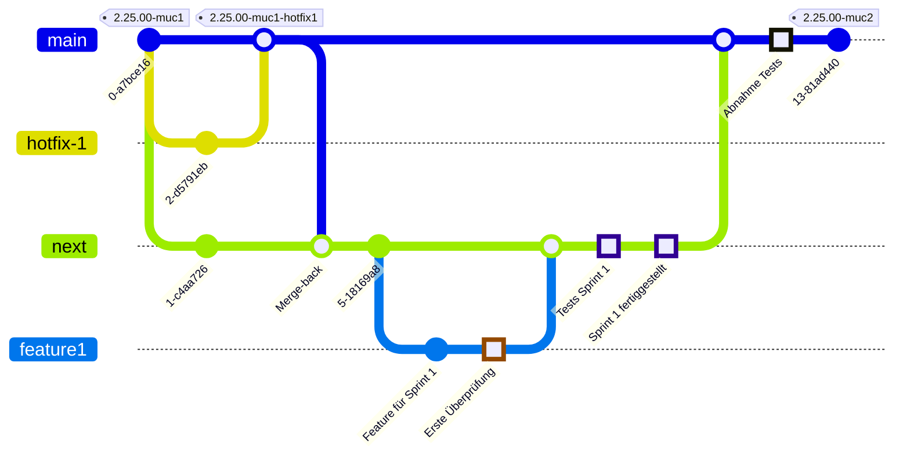
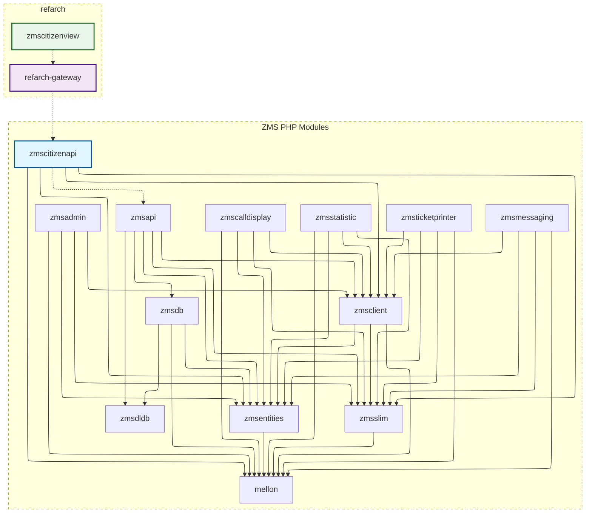

<div id="top"></div>

<!-- PROJECT SHIELDS -->
[![Contributors][contributors-shield]][contributors-url]
[![Forks][forks-shield]][forks-url]
[![Stargazers][stars-shield]][stars-url]
[![Issues][issues-shield]][issues-url]
<!-- [![EUPL License][license-shield]][license-url] -->

# E-Appointment
<!--  -->

This monorepo contains the Munich-specific adjustments to the original Berlin version. You can explore the original project here: https://gitlab.com/eappointment/eappointment

Public E-Appointment is a software for online booking of appointments and processing of queues such as calling appointment numbers and collecting statistics on services provided.

The software has been used in public administration in the German capital Berlin for more than 20 years and has been redeveloped under a new license since 2016. This allows the software to be re-released under the EUPL, an open source license recognized by OSI.

It is planned to release the software as open source in the course of 2022/2024. This requires a number of adjustments, so that step by step the individual components of the software will be published here.
On the one hand, the documentation of the software is published in this repository, on the other hand, new ideas and further developments are planned here, which apply across the board for the other repositories.

The ZMS system is intended to manage human waiting queues. It has the following features:

* make appointments via a calender and initiate a process to manage an appointment
* import requests (services) and providers (locations) from external sources
* manage scopes for appointments, including a four level hierarchy of owner->organisation->department->scope
* manage opening hours including closed days
* login-system with different access levels
* pickup for documents
* ticketprinter support for customers without appointments (authenticated, lockable, timeable)
* calldisplay support
* collecting statistics like waiting time or served clients per day
* emergency call for employees

[Code Coverage ZMSAPI and ZMSCITIZENAPI Documentation](https://it-at-m.github.io/eappointment/)

## Projects

### ZMS
The original project to replace commercial proprietary software with the open source Berlin solution ZMS and went live with each city agency/department. This foundational project established the core appointment management system infrastructure for Munich's municipal services.

### MPDZBS
The creation of the PHP zmscitizenapi and the replacement of the first open source Vue2 frontend ([eappointment-buergeransicht](https://github.com/it-at-m/eappointment-buergeransicht)) with the Vue3 zmscitizenview/[refarch](https://refarch.oss.muenchen.de/) citizen frontend, plus the creation of the city's Vue patternlab ([muc-patternlab-vue](https://github.com/it-at-m/muc-patternlab-vue)). This project modernized the citizen-facing components and established design system standards.

### ZMSKVR
To add still needed features and requirements for the city's agencies/departments and improve weaknesses in user experiences. This includes implementing features in zmscitizenview that were not completed by MPDZBS, ensuring comprehensive functionality for all municipal departments.

### MUXDBS
Builds on MPDZBS following the Reifegradmodell (Maturity Level Model) as an implementation framework for Onlinezugangsgesetz (OZG - Online Access Act) compliance ([digitale-verwaltung.de](https://www.digitale-verwaltung.de/Webs/DV/DE/onlinezugangsgesetz/ozg-grundlagen/info-reifegradmodell/info-reifegradmodell-node.html)) and adds additional components to zmscitizenview which will allow things such as login with BundID, BayernID and Elster for seamless online citizen appointments. This project represents the next maturity level of digital government services following federal implementation guidelines.

## Contact
[Overview](https://opensource.muenchen.de/software/zeitmanagementsystem.html)
BerlinOnline Stadtportal GmbH & Co KG Contact: 

Munich Contact: it@M - opensource@muenchen.de

BerlinOnline Stadtportal GmbH & Co KG and it@M.

<table border="0" cellpadding="0" cellspacing="0">
  <tr>
    <td></td>
    <td style="padding-right: 30px;"></td>
    <td></td>
    <td></td>
  </tr>
</table>

---

<!--  -->

Dieses Monorepo enthält die München-spezifischen Anpassungen der ursprünglichen Berliner Version. Das ursprüngliche Projekt kannst du hier erkunden: https://gitlab.com/eappointment/eappointment

Die Public E-Appointment-Software ist eine Software für die Online-Buchung von Terminen und die Bearbeitung von Warteschlangen, wie das Aufrufen von Terminnummern und das Sammeln von Statistiken über erbrachte Dienstleistungen.

Die Software wird seit mehr als 20 Jahren in der öffentlichen Verwaltung der deutschen Hauptstadt Berlin verwendet und wird seit 2016 unter einer neuen Lizenz weiterentwickelt. Dies ermöglicht eine Wiederveröffentlichung der Software unter der EUPL, einer von der OSI anerkannten Open-Source-Lizenz.

Es ist geplant, die Software im Laufe der Jahre 2022/2024 als Open Source zu veröffentlichen. Dafür sind einige Anpassungen erforderlich, sodass die einzelnen Komponenten der Software schrittweise hier veröffentlicht werden.

Einerseits wird die Dokumentation der Software in diesem Repository veröffentlicht, andererseits sind hier neue Ideen und Weiterentwicklungen geplant, die bereichsübergreifend für die anderen Repositories gelten.

Das ZMS-System dient zur Verwaltung von Warteschlangen für Menschen. Es bietet folgende Funktionen:

* Termine über einen Kalender vereinbaren und einen Prozess zur Verwaltung eines Termins initiieren
* Anfragen (Dienste) und Anbieter (Standorte) aus externen Quellen importieren
* Verwaltung von Terminbereichen, einschließlich einer vierstufigen Hierarchie von Eigentümer->Organisation->Abteilung->Bereich
* Verwaltung von Öffnungszeiten einschließlich geschlossener Tage
* Login-System mit verschiedenen Zugriffsebenen
* Abholung von Dokumenten
* Unterstützung für Ticketdrucker für Kunden ohne Termine (authentifiziert, abschließbar, zeitgesteuert)
* Unterstützung für Anzeigesysteme für Aufrufe
* Sammeln von Statistiken wie Wartezeiten oder bedienten Kunden pro Tag
* Notruf für Mitarbeiter

[Code-Abdeckung ZMSAPI und ZMSCITIZENAPI Dokumentation](https://it-at-m.github.io/eappointment/)

## Projekte

### ZMS
Das ursprüngliche Projekt zur Ersetzung kommerzieller proprietärer Software durch die Open-Source-Berlin-Lösung ZMS und ging mit jeder städtischen Behörde/Abteilung live. Dieses grundlegende Projekt etablierte die Kerninfrastruktur des Terminverwaltungssystems für Münchens kommunale Dienstleistungen.

### MPDZBS
Die Erstellung der PHP zmscitizenapi und der Ersatz des ersten Open-Source Vue2-Frontends ([eappointment-buergeransicht](https://github.com/it-at-m/eappointment-buergeransicht)) durch das Vue3 zmscitizenview/[refarch](https://refarch.oss.muenchen.de/) Bürger-Frontend, plus die Erstellung des städtischen Vue-Patternlabs ([muc-patternlab-vue](https://github.com/it-at-m/muc-patternlab-vue)). Dieses Projekt modernisierte die bürgerseitigen Komponenten und etablierte Design-System-Standards.

### ZMSKVR
Um noch benötigte Funktionen und Anforderungen für die städtischen Behörden/Abteilungen hinzuzufügen und Schwächen in der Benutzererfahrung zu verbessern. Dies umfasst die Implementierung von Funktionen in zmscitizenview, die von MPDZBS nicht abgeschlossen wurden, um umfassende Funktionalität für alle kommunalen Abteilungen sicherzustellen.

### MUXDBS
Baut auf MPDZBS auf und folgt dem Reifegradmodell (Reifegradmodell) als Implementierungsrahmen für Onlinezugangsgesetz (OZG) Compliance ([digitale-verwaltung.de](https://www.digitale-verwaltung.de/Webs/DV/DE/onlinezugangsgesetz/ozg-grundlagen/info-reifegradmodell/info-reifegradmodell-node.html)) und fügt zusätzliche Komponenten zu zmscitizenview hinzu, die Dinge wie Login mit BundID, BayernID und Elster für nahtlose Online-Bürgertermine ermöglichen werden. Dieses Projekt repräsentiert das nächste Reifegradniveau digitaler Regierungsdienstleistungen entsprechend den bundesweiten Implementierungsrichtlinien.

## Kontakt
BerlinOnline Stadtportal GmbH & Co KG Kontakt: 

Munich Kontakt: it@M - opensource@muenchen.de

BerlinOnline Stadtportal GmbH & Co KG und it@M.

<table border="0" cellpadding="0" cellspacing="0">
  <tr>
    <td></td>
    <td style="padding-right: 30px;"></td>
    <td></td>
    <td></td>
  </tr>
</table>

----

## Getting Started

### Using DDEV
- `ddev start`
- `ddev exec ./cli modules loop composer install`
- `ddev exec ./cli modules loop npm install`
- `ddev exec ./cli modules loop npm build`

### Using Podman (Devcontainer)
> **Note for macOS users:** You may need to add `export DOCKER_HOST=unix:///var/run/docker.sock` to your `~/.zshrc` or run it in your terminal before using devcontainer commands.
> ```
> source ~/.zshrc
> podman machine stop
> podman machine start
> devcontainer up --workspace-folder .
> ```

- `devcontainer up --workspace-folder .`
- `podman exec -it zms-web bash -lc "./cli modules loop composer install"`
- `podman exec -it zms-web bash -lc "./cli modules loop npm install"`
- `podman exec -it zms-web bash -lc "./cli modules loop npm build"`

<br>

- `cd zmscitizenview`
- `npm install`
- `npm run build`
- `npm run dev`
- `npm run test`

## Import Database

### Using DDEV
- `ddev import-db --file=.resources/zms.sql`
- `ddev exec zmsapi/vendor/bin/migrate --update`

### Using Podman
- `podman exec -i zms-db mysql -u root -proot db < .resources/zms.sql`
- `podman exec -it zms-web bash -lc "cd zmsapi && vendor/bin/migrate --update"`

Import Berlin or Munich DLDB data via the [hourly cronjob](#cronjobs).

## Dependency Check for PHP Upgrades
Pass the PHP version that you would want to upgrade to and recieve information about dependency changes patch, minor, or major for each module.
e.g.
- `ddev exec ./cli modules check-upgrade 8.1`
- `ddev exec ./cli modules check-upgrade 8.2`
- `ddev exec ./cli modules check-upgrade 8.3`

## Code Quality Checks
We use PHPCS (following PSR-12 standards) and PHPMD to maintain code quality and detect possible issues early. These checks run automatically in our GitHub Actions pipeline but can also be executed locally.

### Using DDEV
0. Run PHP code formatting all at once:
- `ddev exec "./cli modules loop 'vendor/bin/phpcs --standard=psr12 src/'" && ddev exec "./cli modules loop 'vendor/bin/phpcbf --standard=psr12 src'"`
1. Enter the container:
- `ddev ssh`
2. Go to the desired module directory:
- `cd zmsadmin`
3. Run PHPCS (PSR-12 standard):
- `vendor/bin/phpcs --standard=psr12 src/`
- ```
  You can automatically fix many PHPCS formatting issues by running:
  - vendor/bin/phpcbf --standard=psr12 src/
  or
  - phpcs --standard=psr12 --fix src/
  ```
4. Run PHPMD (using the phpmd.rules.xml in the project root):
- `vendor/bin/phpmd src/ text ../phpmd.rules.xml`

### Using Podman
0. Run PHP code formatting all at once:
- `podman exec -it zms-web bash -lc "./cli modules loop 'vendor/bin/phpcs --standard=psr12 src/'" && podman exec -it zms-web bash -lc "./cli modules loop 'vendor/bin/phpcbf --standard=psr12 src'"`
1. Enter the container:
- `podman exec -it zms-web bash`
2. Go to the desired module directory:
- `cd zmsadmin`
3. Run PHPCS (PSR-12 standard):
- `vendor/bin/phpcs --standard=psr12 src/`
- ```
  You can automatically fix many PHPCS formatting issues by running:
  - vendor/bin/phpcbf --standard=psr12 src/
  or
  - phpcs --standard=psr12 --fix src/
  ```
4. Run PHPMD (using the phpmd.rules.xml in the project root):
- `vendor/bin/phpmd src/ text ../phpmd.rules.xml`

We use `prettier-codeformat` for checking and formatting code style in zmscitizenview. You can use format function to fix 
code style (lint) problems:
1. Go to `zmscitizenview`
2. Run: `npm run format`

## Unit Testing
To run unit tests locally refer to the [Github Workflows](https://github.com/it-at-m/eappointment/blob/main/.github/workflows/unit-tests.yaml) and in your local docker container run:

### Using DDEV
- `ddev ssh`
- `cd {zmsadmin, zmscalldisplay, zmsdldb, zmsentities, zmsmessaging, zmsslim, zmsstatistic, zmsticketprinter}`
- `./vendor/bin/phpunit`

### Using Podman
- `podman exec -it zms-web bash`
- `cd {zmsadmin, zmscalldisplay, zmsdldb, zmsentities, zmsmessaging, zmsslim, zmsstatistic, zmsticketprinter}`
- `./vendor/bin/phpunit`

- Usefule flags for `./vendor/bin/phpunit`:
  * `--display-warnings`
  * `--display-deprecations`
  * `--display-notices`
  * `--display-errors`
  * `--display-failures`
  * `--debug` - Provides detailed test execution information including deprecation warnings and memory usage


### Special Cases (zmsapi zmsdb & zmsclient)

**zmsclient:**

For `zmsclient` you need the php base image which starts a local mock server. This json in the mocks must match the signature the entity returned in the requests (usually this is the issue whenever tests fail in `zmsclient`). 

**Using Docker:**

```bash
cd zmsclient
docker-compose down && docker-compose up -d && docker exec zmsclient-test-1 ./vendor/bin/phpunit
```

**Using Podman:**

```bash
cd zmsclient
./zmsclient-test
```

The `zmsclient-test` script automatically detects and uses Docker or Podman, restarts containers for clean state, and runs PHPUnit tests.

#### Traditional Method (overwrites local DB)
For the modules **zmsapi** and **zmsdb**, test data must be imported. Please note that this will overwrite your local database.

**zmsapi:**

Using DDEV:
```bash
cd zmsapi
rm -rf data
ln -s vendor/eappointment/zmsdb/tests/Zmsdb/fixtures data
ddev ssh
cd zmsapi
vendor/bin/importTestData --commit
./vendor/bin/phpunit
```

Using Podman:
```bash
cd zmsapi
rm -rf data
ln -s vendor/eappointment/zmsdb/tests/Zmsdb/fixtures data
podman exec -it zms-web bash
cd zmsapi
vendor/bin/importTestData --commit
./vendor/bin/phpunit
```

**zmsdb:**

Using DDEV:
```bash
ddev ssh
cd zmsdb
bin/importTestData --commit
./vendor/bin/phpunit
```

Using Podman:
```bash
podman exec -it zms-web bash
cd zmsdb
bin/importTestData --commit
./vendor/bin/phpunit
```

#### Containerized Testing (Recommended - isolated environment)
To run isolated, repeatable tests without touching your local database, use Docker Compose:

**Smart Testing Scripts (Recommended):**
```bash
# For zmsdb
cd zmsdb
./zmsdb-test                    # Run all tests
./zmsdb-test --filter="StatusTest::testBasic"  # Run specific test
./zmsdb-test --reset            # Reset all containers and volumes

# For zmsapi  
cd zmsapi
./zmsapi-test                   # Run all tests
./zmsapi-test --filter="StatusGetTest::testRendering"  # Run specific test
./zmsapi-test --reset           # Reset all containers and volumes
```

**Available PHPUnit Flags:**
```bash
# Test Selection
--filter="TestClass::testMethod"    # Run specific test method
--filter="TestClass"                # Run all tests in a class
--filter="testMethod"               # Run all tests with matching method name
--filter="pattern"                  # Run tests matching regex pattern

# Output & Verbosity
--verbose                           # More detailed output
--debug                            # Debug information
--stop-on-failure                  # Stop on first failure
--stop-on-error                    # Stop on first error
--stop-on-warning                  # Stop on first warning

# Coverage & Reports
--coverage-text                    # Text coverage report
--coverage-html=dir               # HTML coverage report
--coverage-clover=file.xml        # XML coverage report

# Test Execution
--group="groupName"                # Run tests in specific group
--exclude-group="groupName"        # Exclude tests in group
--testsuite="suiteName"            # Run specific test suite
```

**Examples:**
```bash
# Run specific test with verbose output
./zmsdb-test --filter="StatusTest::testBasic" --verbose

# Run all tests in a class and stop on first failure
./zmsapi-test --filter="StatusGetTest" --stop-on-failure

# Run tests with coverage report
./zmsdb-test --coverage-text

# Run tests excluding a specific group
./zmsapi-test --exclude-group="slow"
```

**How the Scripts Work:**
* **First run**: Automatically detects and does full setup (builds containers, installs dependencies)
* **Subsequent runs**: Reuses existing setup for fast test execution
* **Filter support**: Accepts all PHPUnit arguments for flexible test execution
* **DB startup**: Automatically starts MariaDB; if the host port is in use, adjust the compose ports mapping.

**Reset Functionality:**
* **`--reset`**: Completely removes all containers, volumes, and networks for a fresh start
* **Use when**: You want to clear all cached dependencies and start completely fresh
* **What it does**: Runs `docker-compose down -v` to remove everything
* **After reset**: Next run will be treated as a "first run" with full setup

### Common Errors

- If you encounter `Too many levels of symbolic links`, remove the `<exclude>` rule for the vendor directory in the module's phpunit.xml.
- If you get `No data path given in /var/www/html/zmsdb/src/Zmsdb/Source/Zmsdldb.php:29`, make sure your zmsdb/config.php contains the following line:
  ```php
  \BO\Zmsdb\Source\Zmsdldb::$importPath = realpath(dirname(__FILE__) . '/tests/Zmsdb/fixtures/');
  ```

## Cronjobs
To run cronjobs locally use ddev or podman

### Using DDEV

**Hourly cronjob with city-specific flags or default (which is also Berlin but compatible with dldb-mapper for now):**
```bash
ddev exec zmsapi/cron/cronjob.hourly
ddev exec zmsapi/cron/cronjob.hourly --city=berlin
ddev exec zmsapi/cron/cronjob.hourly --city=munich
```

**Other cronjobs:**
```bash
ddev exec zmsapi/cron/cronjob.minutly
ddev exec zmsapi/cron/cronjob.daily
```

### Using Podman

**Hourly cronjob with city-specific flags or default (which is also Berlin but compatible with dldb-mapper for now):**
```bash
podman exec -it zms-web bash -lc "zmsapi/cron/cronjob.hourly"
podman exec -it zms-web bash -lc "zmsapi/cron/cronjob.hourly --city=berlin"
podman exec -it zms-web bash -lc "zmsapi/cron/cronjob.hourly --city=munich"
```

**Other cronjobs:**
```bash
podman exec -it zms-web bash -lc "zmsapi/cron/cronjob.minutly"
podman exec -it zms-web bash -lc "zmsapi/cron/cronjob.daily"
```

## Branch Naming Convention
To keep our branch names organized and easily understandable, we follow a specific naming convention for all branches created in this repository. Please adhere to this convention when creating new branches:

1. **type**: The type of work the branch represents. This should be one of the following:
   - `feature`: For new features or enhancements.
   - `bugfix`: For bug fixes.
   - `hotfix`: For urgent fixes that need to be applied quickly.
   - `cleanup`: For code refactoring, or documentation updates.
   - `docs`: For updating documentation such as the README.md CODE_OF_CONDUCT.md LICENSE.md CHANGELOG.md CONTRIBUTING.md. Providing a ticket number or project for docs is optional.
   - `chore`: For maintaining and updating dependencies, libraries, PHP/Node/Twig Versions, or other maintenance work.

2. **project**: The project identifier. This should be:
   - `zms` for the ZMS project.
   - `zmskvr` for the ZMSKVR project.
   - `mpdzbs` for the MPDZBS project.
   - `muxdbs`for the MUXDBS project.

3. **issue number**: The ticket or issue number related to this branch (use digits only). This helps track the branch to a specific issue in the project management system.

4. **description**: A brief, lowercase description of the branch's purpose, using only lowercase letters, numbers, and hyphens (`-`).

- Always use lowercase letters and hyphens for the description.
- The issue number should be a numeric ID corresponding to the relevant ticket or task.
- Descriptions should be concise and informative, summarizing the branch's purpose.

#### Examples

- **Feature Branch**: `feature-zms-12345-this-is-a-feature-in-the-zms-project`
- **Bugfix Branch**: `bugfix-mpdzbs-67890-fix-crash-on-startup`
- **Hotfix Branch**: `hotfix-zmskvr-98765-critical-fix-for-login`
- **Cleanup Branch**: `cleanup-mpdzbs-11111-remove-unused-code`
- **Chore Branch**: `chore-zms-2964-composer-update`
- **Docs Branch**: `docs-zmskvr-0000-update-readme` `docs-zms-release-40-update-changelog`
- **Feature Branch**: `feature-muxdbs-54321-add-bundid-integration`

#### Regular Expression

The branch name must match the following regular expression:
`^(feature|hotfix|bugfix|cleanup|maintenance|docs)-(zms|zmskvr|mpdzbs|muxdbs)-[0-9]+-[a-z0-9-]+$`

**For further commit rules please refer to https://www.conventionalcommits.org/en/v1.0.0-beta.4/**
- **feat(ZMS-123): commit message**
- **fix(ZMSKVR-123): commit message**
- **clean(ZMS-123): commit message**
- **chore(ZMSKVR-123): commit message**
- **docs(ZMS-123): commit message**

Please only branch features and bugfixes from the integration branch `next`. Hotfixes may be branched from `main`.

## Dependency Graph
`zmscitizenview` and `refarch-gateway` are built on top of `zmscitizenapi`, but they do not directly pull dependencies from it. Similarly, while `zmscitizenapi` sends requests to `zmsapi`, `zmsapi` is not a direct dependency of `zmscitizenapi`.


## Screenshot


<p align="right">(<a href="#top">back to top</a>)</p>

<!-- MARKDOWN LINKS & IMAGES -->
<!-- https://www.markdownguide.org/basic-syntax/#reference-style-links -->
[contributors-shield]: https://img.shields.io/github/contributors/it-at-m/eappointment.svg?style=for-the-badge
[contributors-url]: https://github.com/it-at-m/eappointment/graphs/contributors
[forks-shield]: https://img.shields.io/github/forks/it-at-m/eappointment.svg?style=for-the-badge
[forks-url]: https://github.com/it-at-m/eappointment/network/members
[stars-shield]: https://img.shields.io/github/stars/it-at-m/eappointment.svg?style=for-the-badge
[stars-url]: https://github.com/it-at-m/eappointment/stargazers
[issues-shield]: https://img.shields.io/github/issues/it-at-m/eappointment.svg?style=for-the-badge
[issues-url]: https://github.com/it-at-m/eappointment/issues
[license-shield]: https://img.shields.io/github/license/it-at-m/eappointment.svg?style=for-the-badge
[license-url]: https://github.com/it-at-m/eappointment/blob/main/LICENSE
[product-screenshot]: images/screenshot.png
