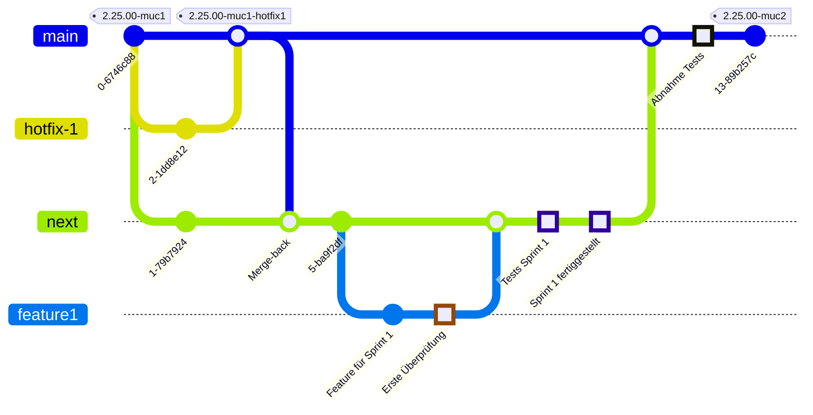

# Branching Strategy and Convention

This page describes how branches are created and maintained in eAppointment development.

## Branch Naming Convention
To keep our branch names organized and easily understandable, we follow a specific naming convention for all branches created in this repository. Please adhere to this convention when creating new branches:

1. **type**: The type of work the branch represents. This should be one of the following:
   - `feature`: For new features or enhancements.
   - `bugfix`: For bug fixes.
   - `hotfix`: For urgent fixes that need to be applied quickly.
   - `cleanup`: For code refactoring, or documentation updates.
   - `docs`: For updating documentation such as the README.md CODE_OF_CONDUCT.md LICENSE.md CHANGELOG.md CONTRIBUTING.md. Providing a ticket number or project for docs is optional.
   - `chore`: For maintaining and updating dependencies, libraries, PHP/Node/Twig Versions, or other maintenance work.

2. **project**: The project identifier. This should be:
   - `zms` for the ZMS project.
   - `zmskvr` for the ZMSKVR project.
   - `mpdzbs` for the MPDZBS project.
   - `muxdbs`for the MUXDBS project.
   - `gh` GitHub-only issue tracking.

3. **issue number**: The ticket or issue number related to this branch (use digits only). This helps track the branch to a specific issue in the project management system.

4. **description**: A brief, lowercase description of the branch's purpose, using only lowercase letters, numbers, and hyphens (`-`).

- Always use lowercase letters and hyphens for the description.
- The issue number should be a numeric ID corresponding to the relevant ticket or task.
- Descriptions should be concise and informative, summarizing the branch's purpose.

#### Examples

- **Feature Branch**: `feature-zms-12345-this-is-a-feature-in-the-zms-project`
- **Bugfix Branch**: `bugfix-mpdzbs-67890-fix-crash-on-startup`
- **Hotfix Branch**: `hotfix-zmskvr-98765-critical-fix-for-login`
- **Cleanup Branch**: `cleanup-mpdzbs-11111-remove-unused-code`
- **Chore Branch**: `chore-zms-2964-composer-update`
- **Docs Branch**: `docs-zmskvr-0000-update-readme` `docs-zms-release-40-update-changelog`
- **Feature Branch**: `feature-muxdbs-54321-add-bundid-integration`

#### Regular Expression

The branch name must match the following regular expression:
`^(feature|hotfix|bugfix|cleanup|maintenance|chore|docs)-(zms|zmskvr|mpdzbs|muxdbs)-[0-9]+-[a-z0-9-]+$`

Please only branch features and bugfixes from the integration branch `next`. Hotfixes and Documentations may be branched from `main`.

