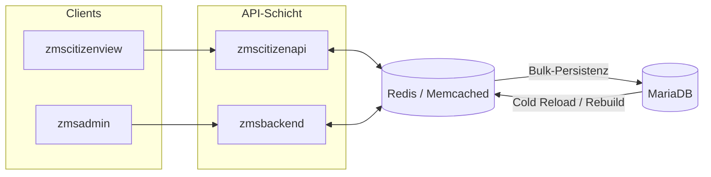

# Dynamische Cache-Schicht und Bulk-Queries für die ZMS-API

> **Status:** Zukunftskonzept — derzeit nicht implementiert.  
> **Ursprung:** [GitHub Issue #1203](https://github.com/it-at-m/eappointment/issues/1203)  
> **Bezug:** Teil des breiteren RefArch-Refactorings aus [Issue #730](https://github.com/it-at-m/eappointment/issues/730) und der [produktorientierten RefArch-Roadmap](./refarch-roadmap/product-oriented-refarch-roadmap.md).

## Ziel

Die Anzahl der API- und Datenbankzugriffe—insbesondere über `zmsbackend` und `zmscitizenapi`—deutlich reduzieren, indem terminrelevante Zustände in einem **gemeinsamen, dynamischen Cache** gehalten werden statt bei jeder Slot-Abfrage, Reservierung, Bestätigung oder Stornierung die Datenbank anzusprechen.

Heute werden nur wenige relativ statische `GET`-Endpunkte gecacht (z. B. `GET offices-and-services`). Kalenderdaten, Reservierungen, vorbestätigte/bestätigte Status und Löschungen werden weiterhin über wiederholte Einzelabfragen aufgelöst.

## Vorgeschlagener Ansatz

Eine **hochdynamische Cache-Schicht** einführen, die auf einem externen In-Memory-Store wie **Redis** oder **Memcached** (oder einem entsprechenden Managed-Cache-Dienst in Produktion) basiert. Anwendungsservices lesen und schreiben Hot-Path-Daten zuerst in dieser Schicht; die Datenbank erhält **gelegentliche Bulk-Writes** statt vieler kleiner synchroner Queries.

Innerhalb von `zmscitizenapi` würden mehrere zusammenhängende Updates—Kalenderansichten, Reservierungen, Übergänge vorbestätigt/bestätigt, Löschungen—wo möglich **gebündelt** und in Bulk-Operationen persistiert. Slot-Buchungen und -Stornierungen sowie der aktuelle Kalender-Snapshot leben im Cache, bis sie dauerhaft geschrieben werden.

## Herausforderung: gemeinsamer, aktueller Cache

Öffnungszeiten und Verfügbarkeit können zur Laufzeit ändern—z. B. wenn Mitarbeitende in `zmsadmin` Pläne bearbeiten oder **Cronjobs** Slots neu berechnen. `zmscitizenapi` und `zmsbackend` brauchen daher einen **gemeinsamen Cache**, der diese Änderungen konsistent und schnell widerspiegelt.

Mögliche Richtungen:

- **Einheitlicher Cache-Namespace** mit expliziter Invalidierung oder Versionierung bei Admin- oder Cron-Änderungen.
- **Event-gesteuerte Invalidierung** (Publish/Subscribe auf dem Cache-Bus oder Message Queue), damit alle API-Instanzen betroffene Keys gemeinsam verwerfen oder erneuern.
- **Langfristig:** Zusammenführung von `zmscitizenapi` und `zmsbackend` zu einer **einheitlichen API** hinter einem Gateway, um geteilte Cache-Verantwortung zu vermeiden (siehe [RefArch-Roadmap](./refarch-roadmap/product-oriented-refarch-roadmap.md)).

## Erwartete Vorteile

- **Weniger Datenbankqueries** auf dem Bürger-Buchungs-Hot-Path.
- **Schnellere Übernahme** von Admin-Änderungen, wenn Slot-Logik in der Cache-Schicht läuft und in einem Bulk-Write persistiert wird.
- **Bessere horizontale Skalierbarkeit** bei Buchungsspitzen, sofern Cache-Knoten passend dimensioniert und repliziert sind.
- **Grundlage für die RefArch-Migration**, in der Spring-Boot-Services häufig Redis oder vergleichbare Stores für Session-, Entity- und berechnete Zustände nutzen.

## Technologie-Hinweise

| Thema                         | Richtung                                                                                                                                                                                                                                 |
| ----------------------------- | ---------------------------------------------------------------------------------------------------------------------------------------------------------------------------------------------------------------------------------------- |
| **Cache-Backend**             | Redis oder Memcached (oder Managed-Equivalent) als gemeinsamer externer Store—nicht nur prozesslokale PHP-Datei-Caches.                                                                                                                  |
| **Konsistenz**                | TTLs, Invalidierungsregeln und Bulk-Write-Grenzen pro Domäne (Kalender, Reservierung, Standort) definieren.                                                                                                                              |
| **Ausfallverhalten**          | Fallback auf Datenbank-Lesepfad dokumentieren, wenn der Cache nicht erreichbar ist; keine stillen veralteten Reads für buchungskritische Daten.                                                                                          |
| **RefArch-Ausrichtung**       | Spring-Boot-Microservices nutzen oft Redis für verteiltes Caching; siehe z. B. [In-Memory-Caching für Spring-Boot-Microservices](https://medium.com/@sachin2713/in-memory-caching-solutions-for-spring-boot-microservices-4c14789abae3). |
| **Betrieb im großen Maßstab** | Große Systeme nutzen typischerweise eigene Cache-Tiers getrennt von Applikationsservern; ein ähnliches Muster gilt hier.                                                                                                                 |

## Nicht Gegenstand dieses Konzepts

- MariaDB als System of Record ersetzen.
- Bestehende Cronjobs entfernen ohne definierte Cache-Warm-up- und Invalidierungsstrategie.
- Die Wahl Redis vs. Memcached in Produktion—das gehört zu Infrastruktur-Dimensionierung, Ops-Tooling und RefArch-Ziellaufzeit.

## Nächste Schritte (bei Priorisierung)

1. Aktuelles Query-Volumen und Latenz von `zmsbackend` / `zmscitizenapi` auf repräsentativen Buchungsflows messen.
2. Cache-Key-Formate und Invalidierungs-Trigger identifizieren (Standortänderungen, Öffnungszeiten, Feiertage, Prozess-Updates).
3. Redis- (oder Memcached-)Integration an einem leseintensiven Pfad prototypen und Metriken sammeln, bevor der Scope erweitert wird.
4. Mit dem [Datenbank-Naming-Refactoring](./database-refactor/standardize-database-table-and-field-naming.md) und der RefArch-Backend-Konsolidierung abstimmen, damit Cache-Grenzen zu künftigen Service-Grenzen passen.
