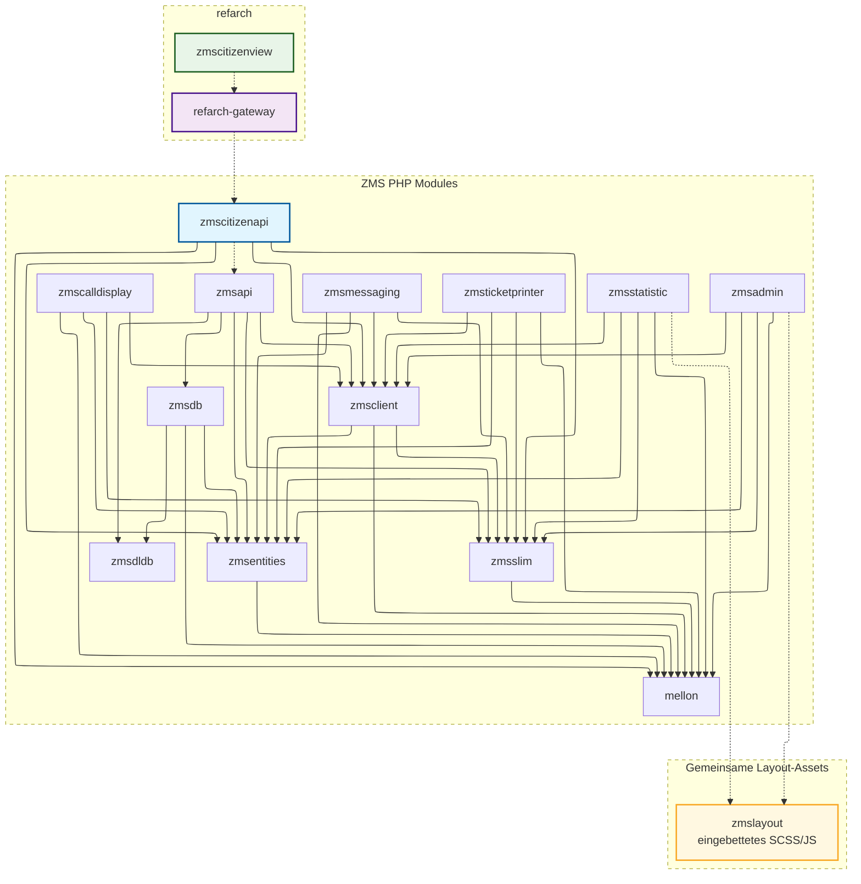
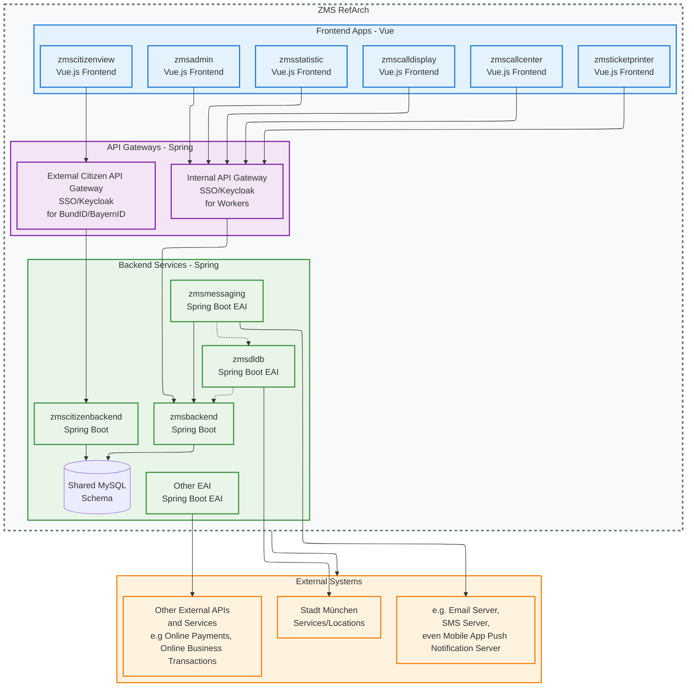

# Produktorientierte RefArch-Roadmap: ZMS-Architektur modernisieren (3–5-Jahresplan)

## Einführung

ZMS entwickelt sich von einem projektgetriebenen PHP-Stack zu einer langfristigen, produktorientierten Plattform. Für mehrjährige Wartbarkeit, schnellere Auslieferung und klarere Ownership schlagen wir eine Referenzarchitektur ([RefArch](https://refarch.oss.muenchen.de/)) vor, die Technologieentscheidungen, Laufzeit-Topologie und Integrationsmuster über alle Module hinweg standardisiert.

https://refarch.oss.muenchen.de/

https://github.com/it-at-m/refarch
https://github.com/it-at-m/refarch-templates

Diese Roadmap verbindet Geschäftsergebnisse mit technischer Umsetzung: Admin-Kernfähigkeiten in **`zmsbackend`**, die Bürger-API in **`zmscitizenbackend`** (jeweils eigener Spring-Boot-Dienst mit Repository-Schicht auf dem gemeinsamen MySQL-Schema), API-Gateways für klare Eingangsgrenzen, Modernisierung aller Frontends auf Vue.js sowie Isolation von EAI-Themen (Messaging, externe Datenflüsse) als eigene Dienste. Der Zielzustand reduziert kognitive Last, verbessert Sicherheit und Betrieb und ermöglicht Teams, Arbeit unabhängig zu skalieren ohne fragile Querkopplung.

Wichtige Treiber:

- Produktorientierung und Domain-Ownership
- Weniger Technologie-Schulden und konsistente Developer Experience
- Einheitliche UX über interne und bürgerorientierte Apps hinweg
- Stärkere Sicherheitsposition an Gateway-Grenzen
- Observability by default (Logs, Metriken, Traces, SLOs)
- Vorhersehbare Releases durch automatisierte Tests und CI/CD
- Klare Zuständigkeit (Kern vs. EAI-Integrationen)
- Langfristige Tragfähigkeit für 3–5 Jahre mit inkrementellen Migrationspfaden
- Wiederverwendbarkeit durch andere Städte und Behörden

## Aktueller Abhängigkeitsgraph

`zmscitizenview` und `refarch-gateway` setzen auf `zmscitizenapi` auf, ziehen aber keine direkten Abhängigkeiten von dort. Ebenso sendet `zmscitizenapi` Anfragen an `zmsapi`, doch `zmsapi` ist keine direkte Abhängigkeit von `zmscitizenapi`.

`zmsadmin` und `zmsstatistic` teilen eingebettete Layout-Assets in `zmslayout` (npm-`file:`-Abhängigkeiten). `zmscalldisplay` und `zmsticketprinter` nutzen eigene PHP/Twig-Stacks und hängen heute nicht von `zmslayout` ab. Ein Refactoring der internen PHP-Frontends auf Vue/Vuetify (Zielarchitektur unten) ersetzt `zmslayout` durch RefArch-UI-Muster, statt die Legacy-SCSS/JS-Bibliothek auszubauen.

## Zukünftige Architektur (3–5 Jahre)

Das folgende Diagramm zeigt die geplante Zielarchitektur nach Refactoring gemäß RefArch-Standards:

### Wesentliche Architekturänderungen

- **Frontend-Modernisierung**: Alle Frontend-Module werden zu Vue.js-Anwendungen. Refactoring von `zmsadmin`, `zmsstatistic`, `zmsticketprinter` und `zmscalldisplay` auf Vue/Vuetify ersetzt `zmslayout` (heute gemeinsame BO-SCSS/JS-Hülle für `zmsadmin` und `zmsstatistic`) durch RefArch/Vuetify-Komponenten — analog zu `zmscitizenview`.
- **API-Gateway-Muster**: Getrennte Gateways für interne und bürgerorientierte Anwendungen
- **Backend-Refactoring**: Admin-Kern nach Spring Boot (`zmsbackend`); Bürger-API nach **`zmscitizenbackend`** — beide mit eigener Repository-Schicht auf dem **gemeinsamen MySQL-Schema** (kein HTTP-Hop zwischen Bürger- und Admin-Backend)
- **EAI-Dienste**: `zmsmessaging` und `zmsdldb` als eigene Spring-Boot-EAI-Dienste
- **Externe Integration**: `zmsdldb` übernimmt Stadt-München-Leistungen/-Standorte-Mapping
- **Microservices-Architektur**: Klare Zuständigkeit durch dedizierte Dienste

### Wesentliche Architekturänderungen (Detail)

- **Frontend-Modernisierung**: Alle Frontend-Module werden zu Vue.js-Anwendungen; `zmsadmin` und `zmsstatistic` hängen nicht mehr von `zmslayout` ab
- **API-Gateway-Muster**: Getrennte Gateways für interne und bürgerorientierte Anwendungen
- **Backend-Refactoring**: Admin-Kern konsolidiert in Spring Boot: `zmsapi`, `zmsdb`, `zmsclient`, `zmsentities`, `zmsslim`, `mellon` → **`zmsbackend`**
- **Citizen-Backend**: `zmscitizenapi` → **`zmscitizenbackend`**; entfällt `ZmsApiClientService` / `ZmsApiFacadeService`-HTTP zu `zmsapi` zugunsten direkter JPA/SQL-Queries auf dem gemeinsamen Schema
- **zmsmessaging**: Dedizierter EAI-Dienst für Benachrichtigungen
- **zmsdldb**: EAI-Dienst für Stadt-München-Datenintegration mit `zmsdldbmapper`; weitere Mapper für andere Städte möglich
- **Microservices-Architektur**: Klare Zuständigkeit durch dedizierte Dienste

### Architektur-Transformationen

| **Aspekt**              | **Ist**                                                                   | **Soll**                                 | **Nutzen**                                                |
| ----------------------- | ------------------------------------------------------------------------- | ---------------------------------------- | --------------------------------------------------------- |
| **Frontend**            | Gemischte PHP/Twig-Templates; `zmslayout` für `zmsadmin` / `zmsstatistic` | Vue.js-SPA-Anwendungen (Vuetify/RefArch) | Moderne UX; `zmslayout` entfällt mit Frontend-Refactoring |
| **API-Schicht**         | Direkte Service-Aufrufe                                                   | RefArch-API-Gateways                     | Zentralisierte Sicherheit, Monitoring                     |
| **Backend**             | PHP-Monolith                                                              | Spring-Boot-Microservices                | Bessere Skalierbarkeit, Wartbarkeit                       |
| **EAI**                 | Integriertes Messaging                                                    | Dedizierte EAI-Dienste                   | Klare Trennung                                            |
| **Externe Integration** | Direkter DB-Zugriff                                                       | Serviceorientierte Integration           | Bessere Daten-Governance                                  |

### Aufwandsschätzung

| **Komponente**                                                     | **Aufgabe**                                                          | **Schätzung** | **Schwierigkeit** |
| ------------------------------------------------------------------ | -------------------------------------------------------------------- | ------------- | ----------------- |
| `zmsdldbmapper`                                                    | Open-Source-Stellung                                                 | 4 Wochen      | Mittel            |
| `zmsdldbmapper`, `zmsdldb`                                         | Ein Modul nach Spring Boot EAI                                       | 8 Wochen      | Mittel            |
| `zmsmessaging`                                                     | Nach Spring Boot EAI                                                 | 4 Wochen      | Einfach           |
| `zmsdeployment`                                                    | Open-Source-Stellung                                                 | 8 Wochen      | Schwer            |
| `zmscallcenter`                                                    | Neue Vue/Vuetify-UI + API-Gateway mit SSO                            | 8 Wochen      | Einfach           |
| `zmscalldisplay`                                                   | Refactoring zu Vue/Vuetify + API-Gateway                             | 4 Wochen      | Einfach           |
| `zmsticketprinter`                                                 | Refactoring zu Vue/Vuetify + API-Gateway                             | 4 Wochen      | Einfach           |
| `zmsstatistic`                                                     | Refactoring zu Vue/Vuetify + API-Gateway mit SSO                     | 8 Wochen      | Mittel            |
| `zmsadmin`                                                         | Refactoring zu Vue/Vuetify + API-Gateway mit SSO                     | 9–12 Monate   | Sehr schwer       |
| `zmsdb`, `zmsentities`, `zmsapi`, `mellon`, `zmsclient`, `zmsslim` | Admin-Backend-Refactoring → **`zmsbackend`** (Spring Boot / RefArch) | 12–18 Monate  | Sehr schwer       |
| `zmscitizenapi`                                                    | Citizen-Backend-Refactoring → **`zmscitizenbackend`** (Spring Boot)  | 6–12 Monate   | Schwer            |

\*Die Roh-Schätzung für die Entwicklung umfasst kein UI/UX, Planung, Testing usw.

#### Verwandte Issues

- [ZMSKVR-685](https://jira.muenchen.de/browse/ZMSKVR-685) – Testautomatisierung Einrichtung
- [ZMSKVR-686](https://jira.muenchen.de/browse/ZMSKVR-686) – Testautomatisierung Umsetzung
- [ZMSKVR-795](https://jira.muenchen.de/browse/ZMSKVR-795) – CalendarView-Refactoring
- [#1427](https://github.com/it-at-m/eappointment/issues/1427) – Datenbank-Standardisierung
