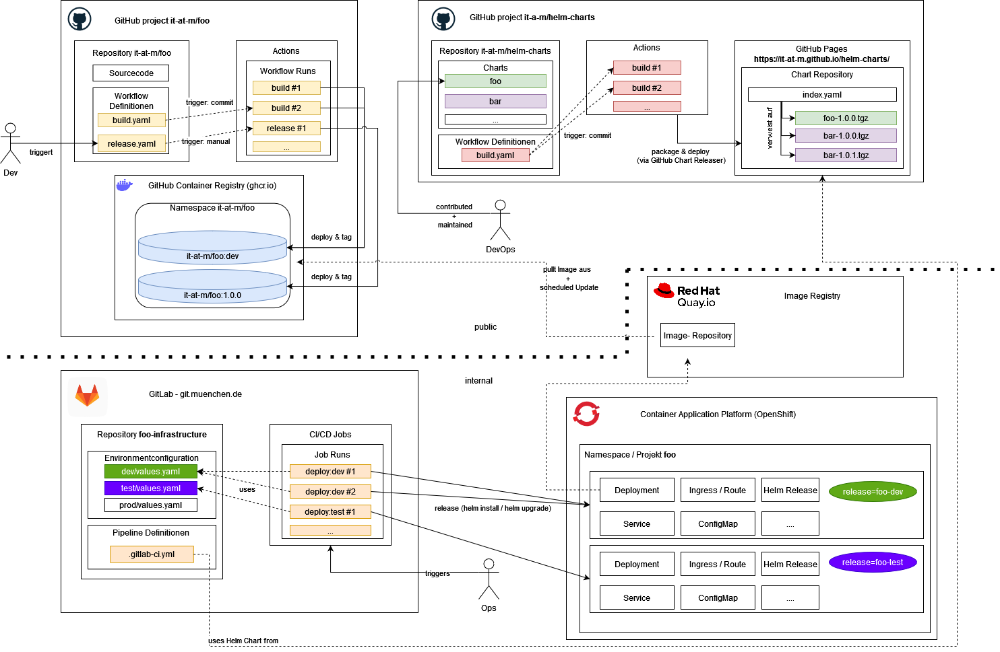

# CI/CD (GitHub nach OpenShift)

eAppointment folgt dem it@M-Muster der Landeshauptstadt München: **öffentliches GitHub** baut Container-Images, eine **interne GitLab**-Pipeline spielt sie nach **OpenShift** aus. Das Diagramm stammt aus [`lhm_actions`](https://github.com/it-at-m/lhm_actions); `foo` im Bild steht für dieses Repository.

Quelle: [`ci_cd_github_big_picture_public.drawio.png`](https://github.com/it-at-m/lhm_actions/blob/main/docs/images/ci_cd_github_big_picture_public.drawio.png) in [it-at-m/lhm_actions](https://github.com/it-at-m/lhm_actions).

## So liest man das für eAppointment

| Im Diagramm                                                 | Bei eAppointment                                                                                                                                                                                                                                |
| ----------------------------------------------------------- | ----------------------------------------------------------------------------------------------------------------------------------------------------------------------------------------------------------------------------------------------- |
| Öffentliches GitHub-App-Repo `it-at-m/foo`                  | [it-at-m/eappointment](https://github.com/it-at-m/eappointment)                                                                                                                                                                                 |
| GitHub Actions Build / Release → GHCR                       | Modul-Images über [`php-build-images.yaml`](https://github.com/it-at-m/eappointment/blob/next/.github/workflows/php-build-images.yaml) und [PHP-Basis-Images](../setup-and-development/php-base-images.md) nach `ghcr.io/it-at-m/eappointment/` |
| Öffentliches Helm-Repo `it-at-m/helm-charts` + GitHub Pages | **Noch nicht.** Charts liegen weiter in internem GitLab (`zms-deployment`). Siehe unten.                                                                                                                                                        |
| GitLab `foo-infrastructure` (`values.yaml`, Deploy-Jobs)    | Internes GitLab: Umgebungs-Values und Jobs für `helm install` / `helm upgrade`                                                                                                                                                                  |
| Quay.io                                                     | Interne Registry spiegelt GHCR; OpenShift zieht von Quay                                                                                                                                                                                        |
| OpenShift-Namespace `foo` (dev / test)                      | Helm-Release in die ZMS-Namespaces                                                                                                                                                                                                              |

## Helm-Charts bleiben vorerst intern

Die rechte öffentliche Box im Diagramm packt Helm-Charts nach GitHub Pages ([it-at-m/helm-charts](https://github.com/it-at-m/helm-charts)). eAppointment hält die Charts weiterhin in **internem GitLab** (`zms-deployment`). GitLab-CI nutzt diese Charts plus umgebungsspezifische `values.yaml` für das Release nach OpenShift.

Die Veröffentlichung in `it-at-m/helm-charts` ist geplant ([Roadmap: Open-Source-Stellung `zmsdeployment`](../on-the-future/refarch-roadmap/product-oriented-refarch-roadmap.md)). Ein Termin steht noch nicht fest.

## Verwandt

- [PHP-Basis-Images](../setup-and-development/php-base-images.md) — GHCR-Tags für `zmsbase` und Modul-Images
- [Zero-Downtime-Deployments und Migrationen](../on-the-future/database-refactor/zero-downtime-deployments-and-migrations.md) — Expand / Provision / Contract innerhalb eines Helm-Releases
- [Monitoring und Status](./monitoring-and-status.md)
