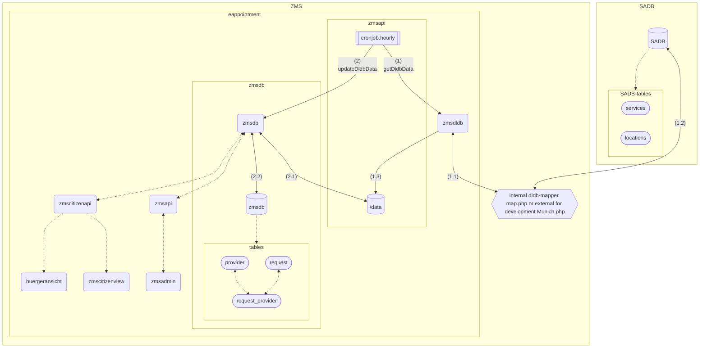
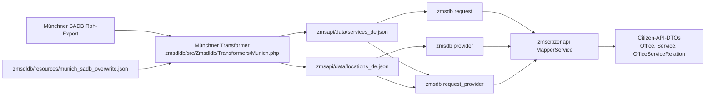
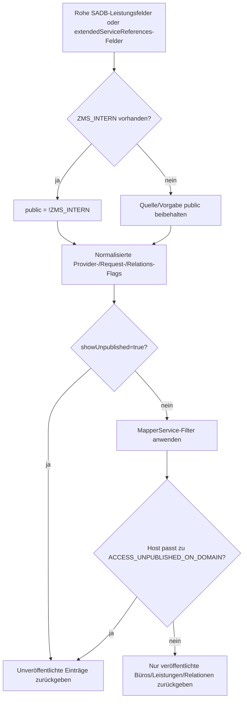

# DLDB-Schnittstellendokumentation

Diese Seite enthält die Münchner DLDB-/SADB-Mappings-Dokumentation für `zmsdldb`.

Das Modul zmsdldb ist ein PHP-basierter Dienst, der SADB-Exporte in strukturiertes JSON für die ZMS-Terminbuchungsplattform transformiert. Es ruft Daten vom SADB-Export-Endpoint ab, validiert und überschreibt Einträge optional und stellt REST-Endpunkte für Leistungen, Standorte und Behörden bereit.

```
DLDB = Dienstleistungsdatenbank
SADB = Servicedatenbank
```

## Grundüberblick des Systems



## Lokales Mapping-Parity

Für die lokale Entwicklung und automatisierte Tests mit `zmsautomation` liefert `zmsdldb/src/Zmsdldb/Transformers/Munich.php` dasselbe Münchner SADB-Mapping-Verhalten wie die interne `dldb-mapper`-Pipeline.

Der Transformer wendet insbesondere dasselbe Überschreibkonzept wie der interne Mapper an, sodass lokale Imports und Test-Fixtures mit produktionsnahen Mapping-Ergebnissen übereinstimmen.

## Daten überschreiben

Überschreib-JSON-Dateien können genutzt werden, um originale SADB-Exporte vor dem finalen Mapping anzupassen.
Für Munich-Parity in `zmsdldb` wendet der Transformer-Schritt die externe Überschreibdatei `zmsdldb/resources/munich_sadb_overwrite.json` an.
Einträge werden per `id` zusammengeführt (einschließlich Service-Referenz-Arrays), sodass gezielte Standort-/Leistungskorrekturen ohne Änderung der upstream-SADB-Exporte ausgeliefert werden können.

## Schema-Validierung

`zmsdldb` konzentriert sich auf Abruf/Transformation und die Anwendung von Überschreibungen.
Bei Problemen mit fehlerhaften SADB-Payloads das Quell-JSON vor dem Import validieren und die Überschreibstruktur in `zmsdldb/resources/munich_sadb_overwrite.json` prüfen.

## Zwei lokale DLDB-Quellen

Die lokale Einrichtung unterstützt zwei Quell-Endpunkte in `.devcontainer/.env.template`:

- `ZMS_SOURCE_DLDB_BERLIN=https://service.berlin.de`
- `ZMS_SOURCE_DLDB_MUNICH=https://stadt.muenchen.de/service/info/zms/index/`

Damit können Importe während der Entwicklung gegen Berlin- oder München-Format-Exporte laufen.

## Beispiel-Payloads des Münchner SADB

Dieser Abschnitt ersetzt die alten Berlin-lastigen Formatbeispiele durch München-orientierte Beispiele auf Basis von:

- Roh-Export: `https://stadt.muenchen.de/service/doc/-/zms/20260428-145500-zms-export.json`
- lokales Überschreib-Payload-Schema: `zmsdldb/resources/munich_sadb_overwrite.json`

### Leistungsbeispiel (roher München-Export)

```json
{
  "name": "Gewerbe-Anmeldung",
  "fields": [
    {
      "name": "GEBUEHRENRAHMEN",
      "type": "TEXT",
      "value": "<p>50 bis 60 Euro ...</p>"
    },
    {
      "name": "TERMINVEREINBARUNG",
      "id": "sf30",
      "type": "BOOLEAN",
      "value": true
    },
    { "name": "ZMS_DAUER", "id": "sf31", "type": "INTEGER", "value": 20 },
    { "name": "ZMS_MAX_ANZAHL", "id": "sf32", "type": "INTEGER", "value": 3 }
  ],
  "id": "1063423",
  "leikaId": "99050012104000",
  "public": true
}
```

### Leistungsbeispiel mit Formular-Links (roher München-Export)

```json
{
  "name": "Anmeldung fabrikneues Fahrzeug oder Tageszulassung",
  "fields": [
    {
      "name": "FORMULARE_INFORMATIONEN",
      "type": "LINK",
      "values": [
        {
          "label": "Vollmacht",
          "uri": "https://stadt.muenchen.de/.../Zulassungsvollmacht"
        },
        {
          "label": "Datenschutzgrundverordnung",
          "uri": "https://stadt.muenchen.de/infos/dsgvo-datenschutzgrundverordnung.html"
        }
      ],
      "multiValue": true
    }
  ],
  "id": "1063425",
  "public": true
}
```

### Standort + Beziehungssichtbarkeit (Struktur der München-Überschreibung)

```json
{
  "id": "10502",
  "altname1": "KVR-II/221",
  "altname2": "Bürgerbüro Ruppertstraße",
  "organisation": "Landeshauptstadt München",
  "orgUnit": "Kreisverwaltungsreferat",
  "public": true,
  "extendedServiceReferences": [
    {
      "refId": "1063453",
      "public": true,
      "fields": [{ "name": "ZMS_INTERN", "type": "BOOLEAN", "value": false }]
    }
  ]
}
```

Diese Beispiele zeigen die zentralen SADB-Eingabevariablen, die der München-Transformer (`ZMS_DAUER`, `ZMS_MAX_ANZAHL`, `ZMS_INTERN`, `TERMINVEREINBARUNG`, `FORMULARE_INFORMATIONEN`) vor der Normalisierung in `zmsapi/data` und `zmsdb` verarbeitet.

## Gemappte Ausgabe in `zmsapi/data`

Nach Import und Transformation (interner Mapper und/oder München-Transformer-Pfad) wird die normalisierte Ausgabe geschrieben nach:

- `zmsapi/data/locations_de.json`
- `zmsapi/data/services_de.json`

Von dort schreibt der Update-/Import-Schritt die normalisierten Entitäten in `zmsdb`, vorrangig in diese Tabellen:

- `provider`: Büros/Standorte (z. B. Bürgerbüros oder Abteilungsstandorte, inkl. Standortsichtbarkeit und Metadaten)
- `request`: Leistungen/Anliegen (z. B. Leistungsname und zusätzliche Daten auf Leistungsebene)
- `request_provider`: Verknüpfungstabelle zwischen Leistungen und Standorten (Beziehungsdaten zur Buchbarkeit wie Slots, Sichtbarkeit und Maximalmenge)

Betrieblich werden Provider auch mit einem Bereich (`Standort`) verknüpft, wenn Superuser:innen/Admins neue Bereiche aus DLDB-Daten in zmsadmin anlegen.

Repräsentative Beispiele:

- In `locations_de.json` enthalten Standorteinträge normalisierte Adresse/Kontakt/Meta und eingebettete Service-Referenzen, z. B. Standort `10546` mit Service-Link-Einträgen wie `1063423` und Terminfeldern (`link`, `slots`, `allowed`, `external`).
- In `services_de.json` enthalten Leistungseinträge normalisierte Metadaten und Buchungseigenschaften, z. B. Leistung `1063423` (`name`, `meta`, `appointment.link`, `maxQuantity`, `duration`, `fees`) sowie optionale Kombinierbarkeits-Arrays bei anderen Leistungen.

Zusammen sind diese beiden erzeugten Dateien die lokalen kanonischen Snapshots für API/UI/Tests und die Quelle für die Datenbanksynchronisation.

## Konstanten in `dldb-mapper/map.php` (intern) und `Munich.php` (extern)

`zmsdldb/src/Zmsdldb/Transformers/Munich.php` enthält mehrere Regelkonstanten, die die Normalisierung der Münchner SADB-Daten steuern:

- `EXCLUSIVE_LOCATIONS`: Liste von Standort-IDs, bei denen `showAlternativeLocations` auf `false` erzwungen wird (Standort gilt in UI-Flows als exklusiv).
- `LOCATION_PRIO_BY_DISPLAY_NAME`: Zuordnung von Büro-Anzeigenamen zu numerischer Priorität (`prio`) zum Sortieren/Rangfolge bestimmter Büros (z. B. Bürgerbüros und Feuerwachen).
- `DONT_SHOW_LOCATION_BY_SERVICES`: Blacklist-Regeln pro Standort für Leistungen, die nach `dontShowByServices` geschrieben werden, sodass bestimmte Leistungen an ausgewählten Büros verborgen sind.
- `LOCATIONS_ALLOW_DISABLED_MIX`: Gruppen äquivalenter Büro-IDs, die `allowDisabledServicesMix` erhalten und das Verhalten „exklusiv vs. gemischt“ bei deaktivierten Leistungen über verknüpfte Büros ermöglichen (JumpIn-Auto-Auswahl-Parity).
- `DONT_SHOW_SERVICE_ON_START_PAGE`: Liste von Leistungs-IDs, die beim Mapping `showOnStartPage=false` setzen.
- `SERVICE_COMBINATIONS`: Buchungs-Kombinationsmatrix; jede Zeile beginnt mit einer Basis-Leistungs-ID und definiert, welche Leistungen zusammen gebucht werden können. Wird von `getServiceCombinations()` genutzt, um `combinable` zu füllen.

Diese Konstanten gehören zur München-Parity-Schicht und spiegeln die fachliche Regelabsicht des internen Mapper-Setups wider.

## Wie `zmscitizenapi` das Mapping nutzt

`zmscitizenapi/src/Zmscitizenapi/Services/Core/MapperService.php` ist der API-seitige Mapper, der die normalisierten Provider-/Request-Daten aus DLDB-Importen (einschließlich München-Transformer-Ausgabe) konsumiert.

### Büro-Mapping (`mapOfficesWithScope`)

Der Büro-Mapper liest Provider-Daten und übergibt München-spezifische normalisierte Felder in API-Büros:

- `provider->data['showAlternativeLocations']` → `Office.showAlternativeLocations`
- `provider->data['dontShowByServices']` → `Office.disabledByServices`
- `provider->data['allowDisabledServicesMix']` → `Office.allowDisabledServicesMix` (normalisiert zu Int-Array)
- `provider->data['prio']` → `Office.priority`
- `provider->data['slotTimeInMinutes']` → `Office.slotTimeInMinutes`

### Leistungs-Mapping (`mapServicesWithCombinations`)

Der Leistungs-Mapper liest zusätzliche Request-Daten und Schnittpunkte Relation/Provider:

- `request.additionalData['showOnStartPage']` → `Service.showOnStartPage`
- `request.additionalData['combinable']` wird genutzt, um `Service.combinable` zu bilden (Schnitt mit Providern, die beide Leistungen anbieten)
- `request.additionalData['maxQuantity']` → `Service.maxQuantity`

### Konstanten-zu-API-Feldfluss

Die Konstanten in `zmsdldb/src/Zmsdldb/Transformers/Munich.php` sind nicht nur interne Regeln; sie formen direkt Felder, die `MapperService.php` nutzt:

- `EXCLUSIVE_LOCATIONS` → `showAlternativeLocations` → `Office.showAlternativeLocations`
- `LOCATION_PRIO_BY_DISPLAY_NAME` → `prio` → `Office.priority`
- `DONT_SHOW_LOCATION_BY_SERVICES` → `dontShowByServices` → `Office.disabledByServices`
- `LOCATIONS_ALLOW_DISABLED_MIX` → `allowDisabledServicesMix` → `Office.allowDisabledServicesMix`
- `DONT_SHOW_SERVICE_ON_START_PAGE` → `showOnStartPage` → `Service.showOnStartPage`
- `SERVICE_COMBINATIONS` → `combinable` → `Service.combinable`

Das ist der End-to-End-Mapping-Vertrag für lokale Entwicklung, UI-Verhalten und automatisierte Tests.

## ZMS-spezifische SADB-Export-Variablen

Münchner SADB-Exporte enthalten in den `fields`-Einträgen von Leistungen/Referenzen ZMS-relevante Variablen.
In `zmsdldb/src/Zmsdldb/Transformers/Munich.php` werden diese per `field['name']` gelesen und in eine normalisierte Ausgabe gemappt, die downstream genutzt wird.

### `ZMS_MAX_ANZAHL`

- **Quelle im SADB-Export:** `service.fields[].name = "ZMS_MAX_ANZAHL"` und `extendedServiceReferences[].fields[].name = "ZMS_MAX_ANZAHL"`
- **Transformer-Mapping (`Munich.php`):**
  - auf Leistungsebene → `mappedService.maxQuantity`
  - auf Standort-Service-Ref-Ebene → `serviceRef.maxQuantity`
- **Fluss zu `zmscitizenapi`:**
  - wird als zusätzliche Request-Daten geführt → `MapperService::mapServicesWithCombinations()` → `Service.maxQuantity`
  - relationale Maximalmenge auch über `MapperService::mapRelations()` → `OfficeServiceRelation.maxQuantity`

### `ZMS_DAUER`

- **Quelle im SADB-Export:** `service.fields[].name = "ZMS_DAUER"` und `extendedServiceReferences[].fields[].name = "ZMS_DAUER"`
- **Transformer-Mapping (`Munich.php`):**
  - auf Leistungsebene → `mappedService.duration`
  - auf Standort-Service-Ref-Ebene → `serviceRef.duration`
  - Standortebene Slot-Ableitung → `appointment.slots` und `slotTimeInMinutes` (über gemeinsamen Teiler)
- **Fluss zu `zmscitizenapi`:**
  - Slot-Timing wirkt über Provider-/Request-Relationen (Buchungsverhalten)
  - `slotTimeInMinutes` wird in `MapperService::mapOfficesWithScope()` gelesen → `Office.slotTimeInMinutes`

#### Berechnung von `slotTimeInMinutes` (pro Büro/Provider)

In `zmsdldb/src/Zmsdldb/Transformers/Munich.php` erfolgt die Berechnung pro gemapptem Standort:

1. Start mit allen gemappten Leistungsdauern an diesem Standort (`serviceRef.duration`, primär aus `ZMS_DAUER`).
2. Inkrementeller gemeinsamer Teiler mit `getSlotTime($a, $b)`.
3. `getSlotTime()` nutzt keinen beliebigen ggT; es wählt die größte erlaubte Slot-Größe aus:

- `[1, 2, 3, 4, 5, 6, 10, 12, 15, 20, 25, 30, 60]`
- die beide verglichenen Dauern teilt.

4. Der finale gemeinsame Teiler wird geschrieben als:

- `mappedLocation.slotTimeInMinutes`

5. Jede Leistung-am-Standort erhält:

- `appointment.slots = serviceDuration / slotTimeInMinutes`

Damit ist `slotTimeInMinutes` das Büro-basierte Slot-Raster aus allen gemappten Leistungsdauern dieses Büros.

### `ZMS_INTERN`

- **Wo das Feld in den Daten vorkommt:**
  - **Leistungsdefinition:** `services[].fields[].name = "ZMS_INTERN"` — so erscheint es im veröffentlichten Leistungs-Export (z. B. [20260504-105500-zms-export.json](https://stadt.muenchen.de/service/doc/-/zms/20260504-105500-zms-export.json)): jede Leistung hat eigene `fields[]` und top-level `public`; `ZMS_INTERN` ist **nicht** als separates „Standort-Felder“-Liste definiert.
  - **Büro–Leistungs-Relation:** wenn ein Standort-Payload `extendedServiceReferences[]` enthält, kann jede Referenz **dieselben** Feldnamen in `extendedServiceReferences[].fields[]` tragen (pro Leistung–Büro-Paar). Das ist weiterhin das ZMS-Leistungsfeldschema, angehängt am **Relations**-Objekt unter dem Standort, nicht ein dritter Ort auf der Standortwurzel. München führt solche Blöcke aus `zmsdldb/resources/munich_sadb_overwrite.json` zusammen, falls vorhanden.
- **Transformer-Mapping (`Munich.php`):**
  - invertiert zu Public-Flag (`public = !ZMS_INTERN`) auf der gemappten Leistung und auf jedem gemappten `serviceRef`, wenn das Feld auf dieser Referenz vorhanden ist
- **Fluss zu `zmscitizenapi`:**
  - Filter für unveröffentlicht/privat in `MapperService` (`showUnpublished`-Zugänge, Relations-Sichtbarkeit, Public-Prüfungen für Leistung/Provider)
  - Ergebnis: interne Leistungen/Büros werden aus öffentlichen API-Payloads ausgeschlossen, sofern nicht explizit angefordert

### `GEBUEHRENRAHMEN`

- **Quelle im SADB-Export:** `service.fields[].name = "GEBUEHRENRAHMEN"`
- **Transformer-Mapping (`Munich.php`):**
  - auf Leistungsebene → `mappedService.fees`
- **Fluss zu `zmscitizenapi`:**
  - in normalisierten Leistungsdaten erhalten, derzeit aber nicht vom schlanken `Service`-Mapping in `MapperService::mapServicesWithCombinations()` exponiert

### `FORMULARE_INFORMATIONEN`

- **Quelle im SADB-Export:** `service.fields[].name = "FORMULARE_INFORMATIONEN"`
- **Transformer-Mapping (`Munich.php`):**
  - Einträge gemappt nach `mappedService.forms[]` und `mappedService.links[]`
- **Fluss zu `zmscitizenapi`:**
  - in normalisierten Leistungs-Payloads erhalten, derzeit nicht vom schlanken `Service`-DTO-Mapping in `MapperService` ausgegeben

### `TERMINVEREINBARUNG` (Beispiel-id `sf30`, Typ `BOOLEAN`)

- **Quelle im SADB-Export:** `fields[].name = "TERMINVEREINBARUNG"` mit booleschem Wert (z. B. `true`).
- **Aktuelle Transformer-Behandlung (`Munich.php`):**
  - dieses Feld wird derzeit **nicht explizit gelesen**.
  - Termin-Flags in Leistungs-/Standort-Referenzen werden durch Standardlogik gesetzt (`allowed=true`, `external=false`) statt aus `TERMINVEREINBARUNG` abgeleitet.
- **Fluss zu `zmscitizenapi`:**
  - kein dediziertes direktes Mapping für `TERMINVEREINBARUNG` derzeit.
  - nachgelagertes Verhalten wird durch normalisierte Termin-/Public-/Relationsdaten des Transformers und Relations-Sichtbarkeitsfilter in `MapperService` gesteuert.

Wenn eine explizite Behandlung von `TERMINVEREINBARUNG` erforderlich ist, sollte sie in `Munich.php` ergänzt werden, wo Leistungsfelder geparst und auf Termin-Sichtbarkeitsfelder gemappt werden.

Kurz: Diese SADB-Variablen werden zuerst im München-Transformer interpretiert und dann selektiv in `zmscitizenapi` exponiert, je nachdem was `MapperService` in die DTOs `Office`, `Service` und Relationen aufnimmt.

## Öffentlich vs. intern (effektiver Regelpfad)

Das ist der wirksame Entscheidungspfad für die Sichtbarkeit im München-Flow.

### 1) Sichtbarkeit auf Leistungsebene

Der Roh-SADB-Export enthält beides:

- top-level Leistungsflag: `service.public`
- ZMS-Feld: `fields[].name = "ZMS_INTERN"` (boolean)

In `Munich.php` wird die Leistungssichtbarkeit aus `ZMS_INTERN` abgeleitet, wenn vorhanden:

- `ZMS_INTERN = true` → `mappedService.public = false`
- `ZMS_INTERN = false` → `mappedService.public = true`
- fehlt `ZMS_INTERN`, bleibt die Vorgabe öffentlich

Für Leistungen ist `ZMS_INTERN` damit der maßgebliche intern/öffentlich-Schalter in der Transformer-Logik.

### 2) Sichtbarkeit auf Standortebene

In `Munich.php` wird die **Büro-/Standort-Veröffentlichung** nur aus dem Standort-Flag des Exports übernommen:

- `mappedLocation.public = location.public ?? true`

Es gibt **kein** Auslesen von `ZMS_INTERN` aus einer hypothetischen `location.fields[]` im Transformer — Standorte in typischen Exporten zeigen nur dieses top-level `public` neben Adresse und Metadaten.

Das steuert die Provider-Veröffentlichung nachgelagert.

### 3) Sichtbarkeit Leistung-am-Standort (Relation)

Für jeden Eintrag in `extendedServiceReferences` (im **Import**-Format unter einem Standort eingebettet):

- initialer Relations-/Public-Wert kommt von Referenz `public`, falls gesetzt
- wenn die `fields[]` dieser Referenz `ZMS_INTERN` enthalten (gleicher Feldname wie bei der Leistung), überschreibt das mit:
  - `serviceRef.public = !ZMS_INTERN`

Ein **relationsbezogenes** internes Flag kann also ein Büro–Leistungs-Paar ausblenden, auch wenn die globale Leistungszeile und der Standort jeweils `public: true` sind. Das ist nicht „`ZMS_INTERN` am Standort“ im Sinne eines reinen Standortfelds; es ist dasselbe DLDB-Feld am **Referenz**-Objekt unter `extendedServiceReferences`.

### 4) Was `zmscitizenapi` tatsächlich filtert

`MapperService.php` wendet Veröffentlichungsfilter an, sofern nicht `showUnpublished=true`:

- Büros: verwirft Provider mit `provider->data['public'] === false`
- Relationen: verwirft Zeilen mit `relation->isPublic() === false`
- Leistungen: verwirft Leistungen mit `additionalData['public'] === false`

Netto: Öffentliche API-Payloads enthalten nur Einträge, die Provider-, Leistungs- und Relationsprüfungen überstehen.

### 5) Beobachtung am Roh-Export (`20260428-145500-zms-export`)

- mehrere Leistungen enthalten `ZMS_INTERN=true`, während top-level `public` noch `true` ist
- daher reicht allein das Roh-`public` für die Leistungssichtbarkeit nicht aus
- in der aktuellen Transformer-Logik markiert `ZMS_INTERN` diese Leistungen/internen Relationen als nicht öffentlich

### 6) Lokaler/Domain-Override für unveröffentlichte Daten

In `.devcontainer/.env.template` steuert `ACCESS_UNPUBLISHED_ON_DOMAIN` einen domain-basierten Override in `zmscitizenapi`:

- wenn `HTTP_HOST` oder `X-Forwarded-Host` die konfigurierte Teilzeichenkette enthält, können unveröffentlichte Leistungen/Relationen dennoch zurückgegeben werden
- Standard in der Vorlage: `ACCESS_UNPUBLISHED_ON_DOMAIN=localhost`
- nützlich für lokalen/Debug-Zugriff auf Einträge, die nach dem Import nicht mehr öffentlich sind (z. B. `ZMS_INTERN=true`)

Betriebshinweise aus der Vorlage:

- nur eine Teilzeichenkette (keine kommagetrennte Liste)
- bei öffentlichen Gateway-Domains vorsichtig sein, sonst können unveröffentlichte/interne Daten unbeabsichtigt sichtbar werden

## Feld-Mapping-Matrix (Quelle → Transformer → API)

Schnellreferenz, wo zentrale SADB-Felder landen:

- `ZMS_MAX_ANZAHL`
  - Quelle: `services[].fields[].name="ZMS_MAX_ANZAHL"` und `extendedServiceReferences[].fields[]`
  - Transformer: `mappedService.maxQuantity`, `serviceRef.maxQuantity`
  - DB/API-Pfad: zusätzliche Request-Daten → `MapperService::mapServicesWithCombinations()` → `Service.maxQuantity`; Relations-Payload → `OfficeServiceRelation.maxQuantity`
- `ZMS_DAUER`
  - Quelle: `services[].fields[].name="ZMS_DAUER"` und `extendedServiceReferences[].fields[]`
  - Transformer: `mappedService.duration`, `serviceRef.duration`, Büroebene `slotTimeInMinutes`
  - DB/API-Pfad: Provider-/Request-Relations-Timing → `MapperService::mapOfficesWithScope()` → `Office.slotTimeInMinutes`
- `ZMS_INTERN`
  - Quelle: `services[].fields[].name="ZMS_INTERN"` (primär im öffentlichen Leistungs-Export); optional dasselbe Feld auf `locations[].extendedServiceReferences[].fields[]` für Büro-Overrides
  - Transformer: Sichtbarkeitsinversion (`public = !ZMS_INTERN`) auf gemappter Leistung und auf jedem `serviceRef`, wenn das Feld auf dieser Referenz vorhanden ist
  - DB/API-Pfad: Veröffentlichungsflags → `MapperService`-Sichtbarkeitsfilter (`showUnpublished`, `relation->isPublic()`, `additionalData['public']`)
- `FORMULARE_INFORMATIONEN`
  - Quelle: `services[].fields[].name="FORMULARE_INFORMATIONEN"` (LINK-Werte)
  - Transformer: `mappedService.forms[]`, `mappedService.links[]`
  - DB/API-Pfad: in normalisierten Leistungsdaten erhalten; derzeit nicht im schlanken `Service`-DTO exponiert
- `GEBUEHRENRAHMEN`
  - Quelle: `services[].fields[].name="GEBUEHRENRAHMEN"`
  - Transformer: `mappedService.fees`
  - DB/API-Pfad: in normalisierten Leistungsdaten erhalten; derzeit nicht im schlanken `Service`-DTO exponiert
- `TERMINVEREINBARUNG` (`sf30`)
  - Quelle: `services[].fields[].name="TERMINVEREINBARUNG"`
  - Transformer: derzeit nicht explizit gemappt
  - DB/API-Pfad: keine dedizierte Weitergabe; Buchungsflags folgen Transformer-Defaults + Sichtbarkeits-/Relationsprüfungen

## Datenherkunft



## Entscheidungsfluss Sichtbarkeit



## Fehleranalyse (fehlende Leistung/Büro)

Gehe in dieser Reihenfolge vor, wenn in `zmscitizenapi` etwas fehlt:

1. Prüfen, ob Leistung/Standort im Roh-München-Export existiert (`id`, `public`, `fields`).
2. Prüfen, ob `ZMS_INTERN` auf `services[].fields` oder auf `locations[].extendedServiceReferences[].fields` steht (nach Merge mit `munich_sadb_overwrite.json` falls genutzt).
3. Transformer-Ausgabe in `zmsapi/data/services_de.json` und `zmsapi/data/locations_de.json` prüfen.
4. Prüfen, ob die Relation zwischen Leistung und Standort existiert (Join-Erwartung für `request_provider`).
5. Veröffentlichungszustand über Provider/Leistung/Relation nach Import validieren.
6. `showUnpublished`-Verhalten und Host-Override via `ACCESS_UNPUBLISHED_ON_DOMAIN` prüfen.
7. Bei München-Sonderfall: Merge-Ergebnis von `zmsdldb/resources/munich_sadb_overwrite.json` prüfen.
8. Import-Pipeline erneut ausführen und vorher/nachher JSON-Hashes oder Zeitstempel vergleichen.
9. Bekanntes Problem: wirken Ergebnisse nach erfolgreichem Import veraltet, Cache-Artefakte im Repo-Ordner `cache/` leeren und Import-/Lesepfad erneut ausführen.

## Bekannte Lücken / noch nicht genutzt

- `GEBUEHRENRAHMEN`: auf normalisierte Leistung `fees` gemappt, aber nicht vom schlanken `Service`-DTO in `MapperService` exponiert.
- `FORMULARE_INFORMATIONEN`: auf normalisierte `forms`/`links` gemappt, aber nicht vom schlanken `Service`-DTO in `MapperService` exponiert.

Implementierungspunkt für explizites Feldverhalten bleiben die Leistungsfeld-Parsing-Blöcke in `Munich.php`.

## Was steht im Roh-ZMS-Export?

- `TERMINVEREINBARUNG`: im [ZMS-Roh-Export](https://stadt.muenchen.de/service/info/zms/index/) immer vorhanden, derzeit in `Munich.php` oder `map.php` nicht explizit ausgewertet. Jede Leistung, die im Roh-ZMS-Export erscheint, hat jedoch `TERMINVEREINBARUNG` auf true.

## Vorher/Nachher-Beispiel

### Roh-SADB-Ausschnitt (Leistungseingabe)

```json
{
  "id": "1063423",
  "fields": [
    { "name": "ZMS_DAUER", "value": 20 },
    { "name": "ZMS_MAX_ANZAHL", "value": 3 },
    { "name": "TERMINVEREINBARUNG", "value": true }
  ],
  "public": true
}
```

### Normalisierte Ausgabe (`services_de.json`)

```json
{
  "id": "1063423",
  "appointment": {
    "link": "https://stadt.muenchen.de/.../services/{serviceId}"
  },
  "maxQuantity": 3,
  "duration": 20,
  "public": true
}
```

### API-seitig geschlankte Leistung (`MapperService`)

```json
{
  "id": 1063423,
  "maxQuantity": 3,
  "showOnStartPage": true,
  "combinable": {}
}
```

### Beispiel: `ZMS_INTERN` auf Leistungsebene (interne Leistung)

Der Roh-SADB kann weiterhin top-level `"public": true` zeigen, während `ZMS_INTERN: true` die Leistung als intern kennzeichnet. In `Munich.php` gilt **`mappedService.public = !ZMS_INTERN`**, die normalisierte Leistung ist also unabhängig vom Roh-`public`-Flag nicht öffentlich (siehe **Öffentlich vs. intern** oben).

#### Roh-SADB-Ausschnitt (Leistungseingabe)

```json
{
  "id": "1065001",
  "fields": [
    { "name": "ZMS_DAUER", "value": 15 },
    { "name": "ZMS_MAX_ANZAHL", "value": 1 },
    { "name": "ZMS_INTERN", "type": "BOOLEAN", "value": true }
  ],
  "public": true
}
```

#### Normalisierte Ausgabe (`services_de.json`)

```json
{
  "id": "1065001",
  "appointment": {
    "link": "https://stadt.muenchen.de/.../services/{serviceId}"
  },
  "maxQuantity": 1,
  "duration": 15,
  "public": false
}
```

#### API-seitig (`MapperService`)

Bei Standard **`showUnpublished=false`** verwirft `MapperService` Leistungen mit `public === false` in den zusätzlichen Daten; diese Leistung **erscheint nicht** in öffentlichen Citizen-API-Payloads. Sie kann lokal weiterhin über `services_de.json`, `showUnpublished` oder `ACCESS_UNPUBLISHED_ON_DOMAIN` inspiziert werden (siehe **Lokaler/Domain-Override für unveröffentlichte Daten** oben).

### Beispiel: `ZMS_INTERN` auf einer Büro–Leistungs-Referenz (ein Paar ausblenden)

Im **veröffentlichten Leistungs-JSON** erscheint `ZMS_INTERN` normalerweise nur unter **`services[].fields[]`**, nicht als eigenes Feld auf der Standortwurzel (Standorte nutzen für das Büro nur top-level `public`).

Der folgende Ausschnitt zeigt das **Standort-Import**-Format: `ZMS_INTERN` sitzt auf einem **`extendedServiceReferences[]`**-Eintrag — gleicher Feldname wie bei der Leistung, aber für diese Büro–Leistungs-Verknüpfung. `Munich.php` setzt **`serviceRef.public = !ZMS_INTERN`** nur für diese Referenz, sodass die Leistung woanders buchbar bleiben kann, **aber nicht** an diesem Büro (siehe **Sichtbarkeit Leistung-am-Standort** oben). Diese Struktur kommt in zusammengeführten Eingaben wie `munich_sadb_overwrite.json` vor; der Roh-Export kann `extendedServiceReferences` ganz weglassen.

Angenommen, Leistung `1063423` ist in `services_de.json` weiterhin öffentlich (kein `ZMS_INTERN` in der Leistungszeile).

#### Roh-SADB-Ausschnitt (Standort-Payload mit `extendedServiceReferences`, gekürzt)

```json
{
  "id": "10502",
  "public": true,
  "extendedServiceReferences": [
    {
      "refId": "1063423",
      "public": true,
      "fields": [{ "name": "ZMS_INTERN", "type": "BOOLEAN", "value": true }]
    }
  ]
}
```

#### Normalisierte Ausgabe (`locations_de.json`, gekürzt)

Die eingebettete Büro–Leistungs-Referenz trägt `public: false`, obwohl Standort und Roh-Referenz-Default öffentlich wirkten:

```json
{
  "id": "10502",
  "public": true,
  "services": [
    {
      "service": "1063423",
      "public": false,
      "duration": 20,
      "appointment": {
        "link": "https://stadt.muenchen.de/.../services/1063423/locations/10502",
        "slots": "1",
        "external": false,
        "allowed": true
      }
    }
  ]
}
```

#### API-seitig (`MapperService`)

`MapperService` filtert Relationszeilen mit **`relation->isPublic() === false`**, wenn `showUnpublished` aus ist; diese **Standort–Leistungs-Kombination** fehlt in öffentlichen Antworten, auch wenn Leistung und Büro jeweils für sich veröffentlicht sind.

## SADB-Index-Proxy (`/sadb-index/`)

Browser können Cross-Origin-Zugriffe auf SADB-Index-Hosts blockieren.
Der Mapper stellt `/sadb-index/` bereit: er lädt serverseitig `SADB_INDEX_URL` und liefert denselben Klartext zurück wie die Index-Seite.
