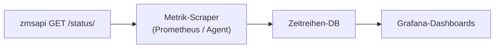

# Monitoring und Status-Endpunkt

Betriebsteams überwachen ZMS in Produktion mit **Open-Source-Observability-Tools**. Die Landeshauptstadt München führt [Grafana](https://opensource.muenchen.de/software/grafana.html) im OSS-Portfolio für die Visualisierung von Metriken in Echtzeit; in der Praxis wird Grafana meist mit einem Metrik-Backend (z. B. Prometheus) und optionaler Log-Aggregation für JSON-Anwendungslogs kombiniert.

Diese Seite beschreibt, was ZMS dafür bereitstellt und wie es mit [Monolog-Logging](./monolog-logging.md) zusammenspielt.

## Status-Endpunkt (`GET /status/`)

`zmsapi` liefert Betriebsmetriken unter:

```http
GET /terminvereinbarung/api/2/status/
```

(Host und API-Basispfad je nach Umgebung anpassen.)

Die Antwort folgt [`status.json`](https://github.com/it-at-m/eappointment/blob/main/zmsentities/schema/status.json). ReDoc: [zmsapi API-Referenz](./api-reference.md).

### Query-Parameter: `includeProcessStats`

| Wert           | Verhalten                                                                                                   |
| -------------- | ----------------------------------------------------------------------------------------------------------- |
| `1` (Standard) | Vollständige Antwort inkl. `processes`-Aggregationen (zusätzliche DB-Last)                                  |
| `0`            | Ohne Prozess-Aggregate — schneller für einfache **Health Checks** (DB-Cluster, Mail-Warteschlange, Version) |

Für häufige Liveness-Probes `includeProcessStats=0`; für Dashboards zu Terminmengen `1`.

Um die `processes`-Aggregationen in der Antwort zu erhalten, den Endpunkt mit `includeProcessStats=1` (Standard) aufrufen. Die Aggregationen sind unter `.data.processes` verfügbar.

### Metriken unter `processes` (Überblick)

Zählungen gelten für Nicht-Folgetermin-Zeilen in `buerger` (`istFolgeterminvon` leer), analog zur Status-SQL.

| Feld                                                                                   | Bedeutung                                                                                                               |
| -------------------------------------------------------------------------------------- | ----------------------------------------------------------------------------------------------------------------------- |
| `confirmed`, `reserved`, `called`, `parked`, `missed`, `deleted`, `blocked`, `pending` | Anzahl pro `buerger.status`                                                                                             |
| `withExternalUserId`                                                                   | Prozesse mit gesetztem OIDC-/Bürger-`external_user_id` (beliebiger Status)                                              |
| `confirmedWithExternalUserId`                                                          | Bestätigte Termine mit externem Nutzer (wird in `zmscitizenapi` beim Appointment-Update gesetzt, nach der Reservierung) |
| `sinceMidnight`, `last7days`, `lastInsert`                                             | Buchungsaktivität (kein Gesamtbestand aller Prozesse)                                                                   |
| `outdated`, `outdatedOldest`, `freeSlots`, `lastCalculate`                             | Slot-Wartung (wenn Statistik aktiv)                                                                                     |

Die OIDC-Zähler unterstützen die Beobachtung von Bürgerlogin und „Meine Termine“ (`zmscitizenapi`).

### Weitere Abschnitte

| Abschnitt                                                              | Monitoring-Nutzen                            |
| ---------------------------------------------------------------------- | -------------------------------------------- |
| `database.nodeConnections`, `database.locks`, `database.clusterStatus` | DB-Auslastung und Cluster                    |
| `database.problems`                                                    | Konfigurationshinweise (nicht-leerer String) |
| `mail.queueCount`, `mail.oldestSeconds`                                | Mail-Backlog                                 |
| `sources.dldb.last`                                                    | Letzter DLDB-Import                          |
| `useraccounts.activeSessions`                                          | Aktive Admin-Sitzungen (falls vorhanden)     |
| `version`                                                              | Ausgerollte API-Version                      |

## Grafana und Echtzeit-Dashboards

Typisches Setup:

1. **`GET /status/`** in Intervallen abfragen (Prometheus `json_exporter`, Skript oder Agent mit JSON-Parsing).
2. Numerische Felder als Zeitreihen exportieren (z. B. `zms_processes_confirmed`, `zms_mail_queue_oldest_seconds`).
3. In [Grafana](https://opensource.muenchen.de/software/grafana.html) visualisieren und Schwellwerte alarmieren (Mail-Backlog, `nodeConnections`, `clusterStatus`, …).

Fertige Grafana-Dashboards liegen nicht in diesem Repository; Zielsysteme definieren Scraping, Intervalle und Alerts selbst. Die Status-JSON-Antwort ist für diese Integration gedacht.



## Logs vs. Metriken

| Signal                                       | Quelle                             | Typisches Tool               |
| -------------------------------------------- | ---------------------------------- | ---------------------------- |
| **Metriken** (Zähler, Queues, DB-Last)       | `GET /status/`                     | Grafana + Prometheus (o. Ä.) |
| **Strukturierte Logs** (Fehler, Audit, Cron) | `App::$log` JSON auf stderr/stdout | Loki, ELK, Plattform-Log     |

Siehe [Monolog-Logging](./monolog-logging.md) für Log-Level, `DEBUGLEVEL` und das Log-Inventar.

## Verwandtes

- [API-Referenz](./api-reference.md) — ReDoc für `zmsapi` und `zmscitizenapi`
- [Monolog-Logging](./monolog-logging.md) — Anwendungslogging
- Implementierung: `zmsapi/src/Zmsapi/StatusGet.php`, `zmsdb/src/Zmsdb/Status.php`
