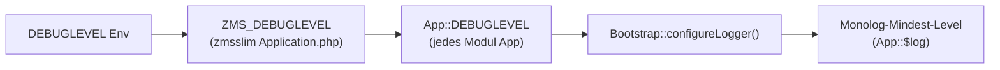

# Monolog-Logging (zmsslim)

ZMS-Anwendungen nutzen einen gemeinsamen PSR-3-Logger auf der globalen `App`-Klasse: **`App::$log`**. Konfiguriert wird er in [`zmsslim`](https://github.com/it-at-m/eappointment/tree/main/zmsslim) durch `BO\Slim\Bootstrap` und von allen Slim-Modulen (`zmsapi`, `zmsadmin`, `zmscitizenapi`, …) geteilt.

Das **Mindest-Log-Level** wird ebenfalls in zmsslim zentral gesetzt: **`DEBUGLEVEL`** in der Umgebung → **`ZMS_DEBUGLEVEL`** in zmsslim → **`App::DEBUGLEVEL`** in jedem Modul für `Bootstrap::configureLogger()`.

## Kurzreferenz

| Thema                    | Detail                                                                               |
| ------------------------ | ------------------------------------------------------------------------------------ |
| Logger-Property          | `App::$log` (`Monolog\Logger`, vor Bootstrap `null`)                                 |
| Umgebungsvariable        | `DEBUGLEVEL` (z. B. in `.env`, DDEV, Deployment) — Standard `INFO`                   |
| zmsslim-Define           | `ZMS_DEBUGLEVEL` — in `Application.php` aus `getenv('DEBUGLEVEL')` gesetzt           |
| App-Konstante            | `App::DEBUGLEVEL` — jedes Modul erbt `ZMS_DEBUGLEVEL` von `\BO\Slim\Application`     |
| Effektives Mindest-Level | Was nach dem Bootstrap gilt (`App::DEBUGLEVEL` zur Laufzeit)                         |
| Web-Bootstrap            | `\BO\Slim\Bootstrap::init()`                                                         |
| CLI / Cron               | `\BO\Slim\Bootstrap::ensureLogger()` oder `initForCli()` über `script_bootstrap.php` |
| Ausgabe                  | JSON-Zeilen auf **stderr** (Web) oder **stdout** (CLI/Cron)                          |
| Nicht verwenden          | PHP `error_log()`, `print_r()`, `echo` für Anwendungs-Logs                           |

## Zentrales Debug-Level (`ZMS_DEBUGLEVEL`)

zmsslim steuert das Debug-Level für **alle** Slim-Module. In Produktion gibt es kein separates Log-Level pro Modul; eine Umgebungsvariable gilt überall, wo über `\BO\Slim\Bootstrap` gebootstrapped wird.



1. **Betrieb** setzt `DEBUGLEVEL` (z. B. `INFO` oder `WARNING`) in `.env`, DDEV oder Deployment.
2. Beim Laden von `zmsslim/src/Slim/Application.php` wird **`ZMS_DEBUGLEVEL`** aus dieser Env-Variable definiert (Standard `INFO`, falls nicht gesetzt).
3. `\BO\Slim\Application` deklariert **`const DEBUGLEVEL = ZMS_DEBUGLEVEL`**. Jedes Modul mit `class App extends \BO\Zmsapi\Application` (usw.) erbt dieselbe Konstante, sofern nicht lokal überschrieben.
4. Beim Bootstrap rufen **`Bootstrap::init()`** / **`ensureLogger()`** / **`initForCli()`** **`configureLogger(App::DEBUGLEVEL, App::IDENTIFIER)`** auf. Das Level ist gemeinsam; in den JSON-Logs unterscheiden sich nur **`App::IDENTIFIER`** und **`App::MODULE_NAME`** pro Modul.

**`ZMS_DEBUGLEVEL` ist damit die zentrale zmsslim-Vorgabe**, wie ausführlich zmsapi, zmsadmin, zmscitizenapi, zmsmessaging, Cron-Skripte und die anderen Slim-Apps loggen.

**Konfiguration:** `DEBUGLEVEL` in der Umgebung (kein separates Env `ZMS_DEBUGLEVEL`).

**Zur Laufzeit im Code:** `App::DEBUGLEVEL` (basierend auf `ZMS_DEBUGLEVEL`).

**Seltene Ausnahme:** `const DEBUGLEVEL = 'WARNING';` in einem Modul-`config.php` nur für lokale Tests — nicht in gemeinsamen Deployment-Configs.

**CLI-Fallback:** ist `App::DEBUGLEVEL` noch nicht definiert, liest `Bootstrap::initForCli()` direkt `getenv('DEBUGLEVEL')`.

## Log-Level

`App::DEBUGLEVEL` (aus `ZMS_DEBUGLEVEL`) legt das **Mindest-Level** für Monolog fest. Nachrichten darunter werden verworfen.

| `DEBUGLEVEL` Env / Konstante | Monolog-Konstante   | Typische Nutzung in ZMS                                   |
| ---------------------------- | ------------------- | --------------------------------------------------------- |
| `DEBUG`                      | `Logger::DEBUG`     | Ausführliche Diagnose (Mail-Payloads, Cache)              |
| `INFO`                       | `Logger::INFO`      | Normaler Betrieb (Login, Cron-Fortschritt, Cache-Treffer) |
| `NOTICE`                     | `Logger::NOTICE`    | Beachtenswert, aber erwartbar                             |
| `WARNING`                    | `Logger::WARNING`   | Behebbare Probleme (Rate Limits, übersprungene Entitäten) |
| `ERROR`                      | `Logger::ERROR`     | Fehler mit Handlungsbedarf                                |
| `CRITICAL`                   | `Logger::CRITICAL`  | Schwere Fehler (z. B. Twig-Exception-Handler)             |
| `ALERT`                      | `Logger::ALERT`     | Selten; Monolog-Skala                                     |
| `EMERGENCY`                  | `Logger::EMERGENCY` | Selten; Monolog-Skala                                     |

Die Zuordnung steht in `zmsslim/src/Slim/Bootstrap.php` (`$debuglevels`, `parseDebugLevel()`).

### Beispiel-Konfiguration

```bash
# .env / DDEV / Deployment — gilt für alle Slim-Module über zmsslim
DEBUGLEVEL=INFO
```

Definition in `zmsslim/src/Slim/Application.php`:

```php
define('ZMS_DEBUGLEVEL', getenv('DEBUGLEVEL') ? getenv('DEBUGLEVEL') : 'INFO');
const DEBUGLEVEL = ZMS_DEBUGLEVEL;
```

Ungültige Werte fallen in `Bootstrap::parseDebugLevel()` auf **DEBUG** zurück.

## HTTP-Request-Logging pro Modul

Anders als **`DEBUGLEVEL`** (ein Wert für alle Slim-Module) wird **HTTP-Request-/Response-Logging** **pro Modul** über `ZMS_<MODUL>_LOGGER_*`-Umgebungsvariablen konfiguriert — dasselbe Namensschema wie `ZMS_ADMIN_TWIG_CACHE`, `ZMS_API_TWIG_CACHE` usw.

Module mit `RequestLoggingMiddleware` (über `BO\Slim\Helper\ModuleLoggerInitializer` oder eigenes Bootstrap) schreiben pro verarbeitetem Request eine strukturierte **`HTTP Request`**-Zeile über `BO\Slim\LoggerService::logRequest()` → `App::$log`.

| Modul            | Env-Präfix                   | Typischer Traffic                 |
| ---------------- | ---------------------------- | --------------------------------- |
| zmscitizenapi    | `ZMS_CITIZENAPI_LOGGER_*`    | Öffentliche Buchungs-API          |
| zmsapi           | `ZMS_API_LOGGER_*`           | Interne REST-API                  |
| zmsadmin         | `ZMS_ADMIN_LOGGER_*`         | Mitarbeiter-UI                    |
| zmscalldisplay   | `ZMS_CALLDISPLAY_LOGGER_*`   | Aufrufmonitore (häufiges Polling) |
| zmsstatistic     | `ZMS_STATISTIC_LOGGER_*`     | Statistik-UI                      |
| zmsticketprinter | `ZMS_TICKETPRINTER_LOGGER_*` | Ticketdrucker (häufiges Polling)  |

### LoggerService-Variablen

| Variable                                        | Standard       | Rolle                                                                                                                                       |
| ----------------------------------------------- | -------------- | ------------------------------------------------------------------------------------------------------------------------------------------- |
| `…_LOGGER_MAX_REQUESTS`                         | `1000`         | Gemeinsames LoggerService-Rate-Limit pro Fenster (`CACHE_TTL`); zählt `logRequest()`, `logError()`, `logWarning()` und `logInfo()` zusammen |
| `…_LOGGER_RESPONSE_LENGTH`                      | `1048576`      | Max. Response-Body-Bytes bei Fehler-Logs                                                                                                    |
| `…_LOGGER_STACK_LINES`                          | `20`           | Stacktrace-Zeilen bei geloggten Exceptions                                                                                                  |
| `…_LOGGER_MESSAGE_SIZE`                         | `8192`         | Max. Größe einer einzelnen Log-Nachricht                                                                                                    |
| `…_LOGGER_CACHE_TTL`                            | `60`           | Rate-Limit-Fenster in Sekunden (nutzt `CACHE_DIR`)                                                                                          |
| `…_LOGGER_MAX_RETRIES`                          | `3`            | Cache-Lock-Wiederholungen für Rate Limiting                                                                                                 |
| `…_LOGGER_BACKOFF_MIN` / `…_LOGGER_BACKOFF_MAX` | `100` / `1000` | Backoff zwischen Wiederholungen (ms)                                                                                                        |
| `…_LOGGER_LOCK_TIMEOUT`                         | `5`            | Cache-Lock-Timeout (Sekunden)                                                                                                               |

Vollständige Beispiele stehen in `.ddev/.env.template` bzw. `.devcontainer/.env.template`.

### Feinabstimmung bei hoher Request-Frequenz

**zmscalldisplay** und **zmsticketprinter** sind Besonderheiten: Jeder Monitor bzw. Ticketdrucker pollt typischerweise **alle paar Sekunden** den Server. Mit Standard `LOGGER_MAX_REQUESTS=1000` erzeugen schon wenige Geräte viel repetitive Log-Menge — auch bei `DEBUGLEVEL=INFO`.

Für diese Module empfiehlt sich ein **niedrigerer** Wert für `ZMS_CALLDISPLAY_LOGGER_MAX_REQUESTS` und/oder `ZMS_TICKETPRINTER_LOGGER_MAX_REQUESTS`, damit Routine-Polls den Logstrom nicht dominieren. Admin-, API- und Citizen-Module können meist bei den Defaults bleiben.

```bash
# Beispiel: Poll-Logging für Display/Drucker begrenzen, andere Module unverändert
ZMS_CALLDISPLAY_LOGGER_MAX_REQUESTS=120
ZMS_TICKETPRINTER_LOGGER_MAX_REQUESTS=120

# Andere Module weiterhin mit Template-Default (1000)
ZMS_ADMIN_LOGGER_MAX_REQUESTS=1000
ZMS_API_LOGGER_MAX_REQUESTS=1000
```

Ein niedrigeres `…_LOGGER_MAX_REQUESTS` drosselt **alle** `LoggerService`-Ausgaben des Moduls — HTTP-Request-Zeilen **und** Meldungen über `LoggerService::logError()`, `logWarning()` oder `logInfo()` (z. B. Exceptions in `RequestLoggingMiddleware`). Ist das Fenster-Budget aufgebraucht, werden weitere `LoggerService`-Schreibvorgänge bis zum Ablauf des Cache-Eintrags verworfen.

Es ändert **nicht** `DEBUGLEVEL` und unterdrückt keine direkten `App::$log->…`-Aufrufe im restlichen Anwendungscode. Diese umgehen `LoggerService::checkRateLimit()` vollständig.

Weil das Limit gemeinsam ist, kann hoher HTTP-Traffic (z. B. Calldisplay- oder Ticketdrucker-Polling) `LoggerService`-Fehlerlogs verdrängen. Bei hochfrequenten Modulen `…_LOGGER_MAX_REQUESTS` senken; eine spätere Verbesserung wäre getrennte Budgets für Access- und Fehler-Logs.

## Logging im Code

Nach `bootstrap.php` oder `script_bootstrap.php`:

```php
\App::$log->info('Login successful', ['account' => $accountName]);
\App::$log->warning('Could not remove availability', ['availabilityId' => $id]);
\App::$log->error('SQL import failed', ['exception' => $e->getMessage()]);
```

PSR-3-Methoden in **Kleinbuchstaben**: `debug`, `info`, `notice`, `warning`, `error`, `critical`, `alert`, `emergency`.

### Kontext-Arrays

Strukturierten Kontext (zweites Argument) bevorzugen. Zusätzliche Felder u. a.: `application`, `module`, bei Cron `cron` / `cron_name` (`ZMS_CRON_LOG`, `ZMS_CRON_NAME`).

### Bibliotheken ohne Bootstrap

Optional nur mit Prüfung:

```php
if (class_exists('\App', false) && isset(\App::$log)) {
    \App::$log->error('…', ['context' => $value]);
}
```

## Log-Inventar im Repository

Die folgende Tabelle wird **automatisch** aus `App::$log->…` in Modul-PHP-Quellen erzeugt (ohne `vendor/` und `tests/`). Lokal aktualisieren:

```bash
cd docs && npm run docs:log-inventory
```

Aktualisierung auch bei `npm run docs:dev` / `docs:build`. Nutze die Filter, die Suche oder **Klick auf eine Spaltenüberschrift** zum Sortieren (auf-/absteigend umschalten).

<LogInventory />

## Verwandtes

- [Monitoring und Status](./monitoring-and-status.md) — `GET /status/`-Metriken und Grafana

## Verwandter Code

- `zmsslim/src/Slim/Application.php` — `ZMS_DEBUGLEVEL`, `DEBUGLEVEL`, `public static $log`
- `zmsslim/src/Slim/Bootstrap.php` — Logger-Konfiguration
- `zmsslim/src/Slim/LoggerService.php` — HTTP-Request-Logging, Rate Limiting
- `zmsslim/src/Slim/Helper/ModuleLoggerInitializer.php` — Logger-Env und Middleware pro Modul
- `zmsslim/README.md` — Slim-Bootstrap-Übersicht
