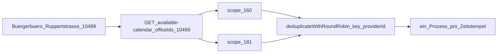
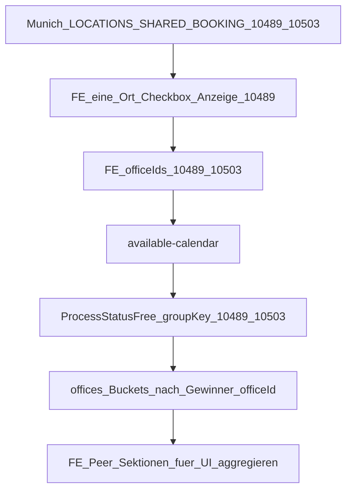
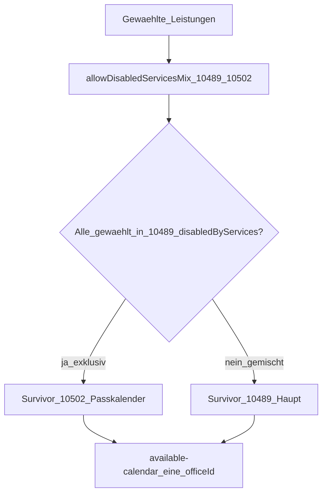
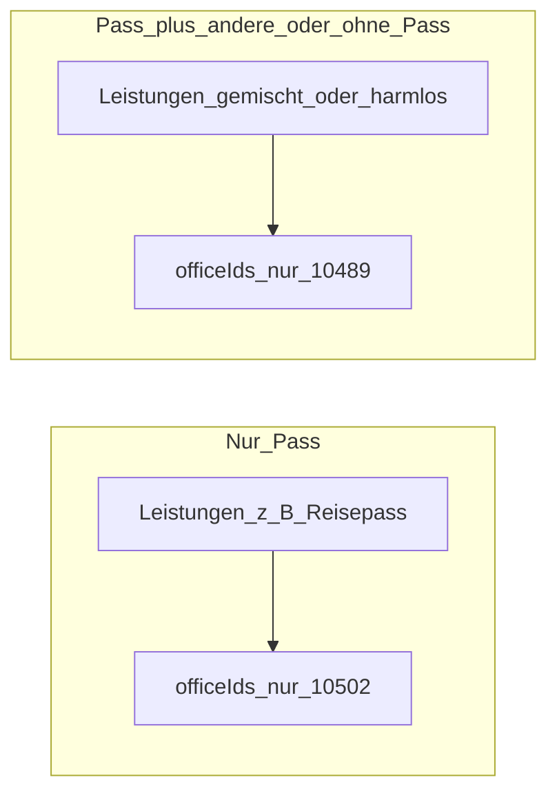
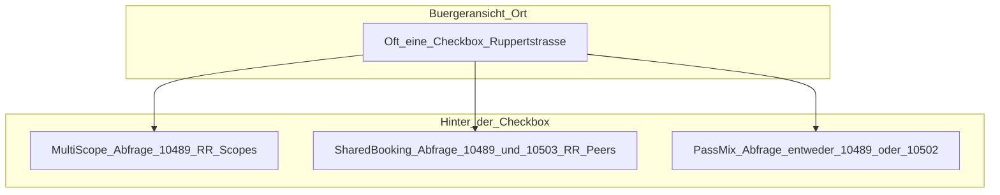

# Terminvarianten Ruppertstraße (ZMSKVR-1046)

Die Bürgerterminbuchung am Bürgerbüro Ruppertstraße kennt drei Modelle. In der UI wirkt das oft wie **ein Ort-Checkbox**, dahinter unterscheiden sich aber **welche OfficeIDs** abgefragt werden und **wie freie Slots** gewählt werden.

| Variante                    | OfficeIDs         | Ort-UI  | Calendar `officeIds`       | Slot-Auswahl                                                                                                        |
| --------------------------- | ----------------- | ------- | -------------------------- | ------------------------------------------------------------------------------------------------------------------- |
| Mehrere Scopes (ein Büro)   | `10489`           | Ein Ort | Nur diese OfficeID         | Backend-RR über **Scopes** desselben Providers                                                                      |
| Shared Booking (Ausbildung) | `10489` + `10503` | Ein Ort | **Beide** Peer-OfficeIDs   | Backend-RR über Scopes **aller Peers** bei gleicher Uhrzeit (`sharedBookingOfficeIds`)                              |
| Pass exklusiv/gemischt      | `10489` + `10502` | Ein Ort | **Eine** Survivor-OfficeID | FE wählt exklusiv (`10502`) vs. gemischt (`10489`) über `allowDisabledServicesMix` — **keine** gemeinsame Kapazität |

Konfiguration in [`zmsdldb/.../Munich.php`](https://github.com/it-at-m/eappointment/blob/main/zmsdldb/src/Zmsdldb/Transformers/Munich.php):

- `DONT_SHOW_LOCATION_BY_SERVICES` → `disabledByServices` (Pass-Leistungen am Haupt `10489` ausgeblendet)
- `LOCATIONS_ALLOW_DISABLED_MIX` → `allowDisabledServicesMix` (`[10489, 10502]`)
- `LOCATIONS_SHARED_BOOKING` → `sharedBookingOfficeIds` (`[10489, 10503]`)

Lokale Testdaten: Flyway `V19` (Öffnungszeiten Ruppertstraße), `V24` (Ausbildung-Standort `372` / OfficeID `10503`), SADB-Overwrite für `10503`.

---

## Überblick

```mermaid
flowchart TB
  subgraph multiScope [MultiScope_einBuero]
    MS_Ort[Ort_10489]
    MS_Cal[available-calendar_officeIds_10489]
    MS_RR[ProcessStatusFree_RR_nach_providerId]
    MS_Ort --> MS_Cal --> MS_RR
  end

  subgraph sharedBooking [SharedBooking_zweiBueros]
    SB_Ort[Ort_Anzeige_10489]
    SB_Cal[available-calendar_officeIds_10489_und_10503]
    SB_RR[ProcessStatusFree_RR_nach_sharedBookingOfficeIds]
    SB_UI[FE_Peer_Buckets_fuer_Anzeige_mergen]
    SB_Ort --> SB_Cal --> SB_RR --> SB_UI
  end

  subgraph passMix [PassExklusivGemischt]
    PM_Ort[Ort_ein_Survivor]
    PM_Pick[FE_exklusiv_10502_oder_gemischt_10489]
    PM_Cal[available-calendar_eine_officeId]
    PM_Ort --> PM_Pick --> PM_Cal
  end
```

---

## 1. Mehrere Scopes an einem Büro (`10489`)

Das Hauptbüro `10489` hat mehrere Scopes (z. B. WB04 `160`, WB03 `181`). Die Bürgerin wählt **einen** Ort. Der Kalender fragt diese OfficeID ab. Freie Prozesse mehrerer Scopes zur gleichen Uhrzeit werden im Backend per Round-Robin auf **einen** Prozess reduziert — Schlüssel **`providerId + timestamp`**.

**Fairness:** RR läuft über **Scopes** (sortiert nach Scope-ID). Mehr Scopes unter demselben Büro → größerer Anteil in der Rotation.

---

## 2. Shared Booking / gemeinsamer Kalender (`10489` + `10503`)

Ausbildung-OfficeID `10503` (lokaler Test-Standort `372`) überschneidet sich bei Hauptleistungen (z. B. Wohnsitzanmeldung). Ziel: **ein Ort**, **gemeinsame Kapazität**.

1. DLDB setzt `sharedBookingOfficeIds: [10489, 10503]` auf beiden Providern.
2. Bürgeransicht klappt Peers zu einer Checkbox zusammen (Anzeige = kleinste ID, `10489`).
3. Aktivierte Checkbox expandiert **beide** IDs in `available-calendar`.
4. Backend-RR nutzt sortierte Peer-IDs (`10489,10503`) + Zeitstempel, wenn das Flag an den Provider-Daten hängt — bei Überlappung bleibt **ein** Gewinner-Office/Scope.
5. Nicht überlappende Zeiten liegen weiter in getrennten `offices[]`-Buckets; die UI merged sie für die Anzeige. Gebucht wird die OfficeID, der der Slot gehört.

**Nicht Pass-Mix:** beide OfficeIDs bleiben in der Calendar-Anfrage; Kapazität wird gepoolt, nicht exklusiv geroutet.

---

## 3. Pass-Kalender exklusiv vs. gemischt (`10489` + `10502`)

Passkalender `10502` und Haupt `10489` teilen den Ortsnamen, nutzen aber **`allowDisabledServicesMix`**. Pass-Leistungen stehen bei `10489` in `disabledByServices`. Die UI behält Mix-Peers und wählt **einen** Survivor:

- **Exklusiv** (nur Pass-gesperrte Leistungen) → `10502`
- **Gemischt** (sonst / harmlose Kombination) → `10489`

Kalender und Reserve nutzen **nur diese** OfficeID. Das andere Büro liefert für diese Buchung keine Slots.

---

## Vergleich: was die Bürgerin sieht vs. was abgefragt wird

| Frage                                    | Multi-Scope             | Shared Booking                | Pass-Mix                     |
| ---------------------------------------- | ----------------------- | ----------------------------- | ---------------------------- |
| Gleiche Uhrzeit auf zwei Scopes/Büros?   | RR behält einen Scope   | RR behält ein Peer-Büro/Scope | N/A — nur ein Büro abgefragt |
| Beide OfficeIDs in `available-calendar`? | Nein                    | Ja                            | Nein                         |
| FE merged `offices[]` für Anzeige?       | Meist ein Office-Bucket | Ja (Peer-Buckets)             | Nicht nötig                  |

---

## Verwandter Code

- DLDB: `zmsdldb/src/Zmsdldb/Transformers/Munich.php`
- Backend-RR: `zmsbackend/.../ProcessStatusFree.php` (`resolveRoundRobinGroupKey`, `deduplicateWithRoundRobin`)
- Bürgeransicht Ort / Expand / Merge: `zmscitizenview/.../AppointmentSelection.vue`
- Mapping: `zmscitizenapi/.../MapperService.php`
- Vertrag: [DLDB-Schnittstellendokumentation](./dldb-interface-documentation.md)
