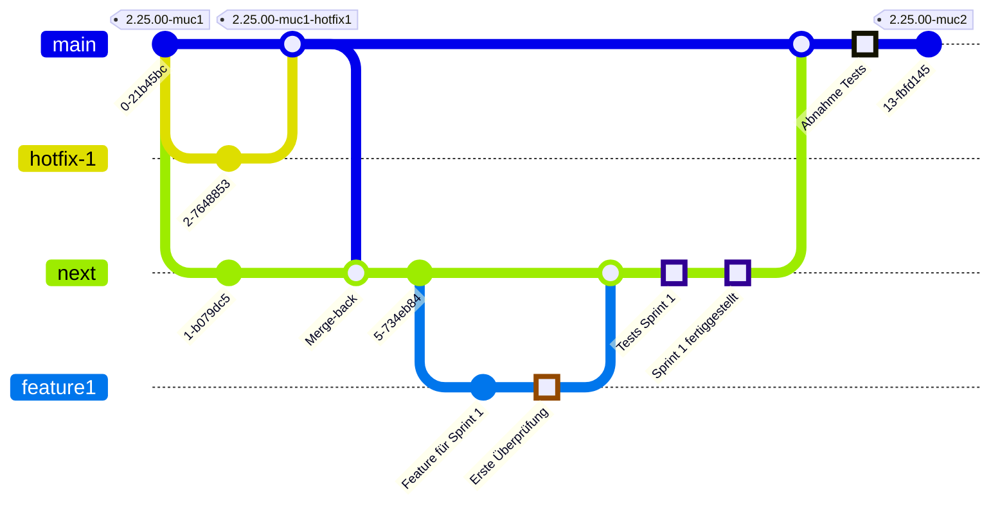

# Branching-Strategie und -Konvention

Diese Seite beschreibt, wie Branches in der eAppointment-Entwicklung erstellt und gepflegt werden.

## Branch-Namenskonvention

Damit unsere Branch-Namen geordnet und gut verständlich bleiben, gilt für alle Branches in diesem Repository eine festgelegte Namenskonvention. Bitte halte dich beim Anlegen neuer Branches an diese Konvention:

1. **type**: Die Art der Arbeit, die der Branch repräsentiert. Erlaubt sind:
   - `feature`: Für neue Funktionen oder Erweiterungen.
   - `bugfix`: Für Fehlerbehebungen.
   - `hotfix`: Für dringende Fixes, die schnell ausgespielt werden müssen.
   - `cleanup`: Für Code-Refactoring oder Dokumentations-Updates.
   - `docs`: Für die Aktualisierung von Dokumentation wie README.md, CODE_OF_CONDUCT.md, LICENSE.md, CHANGELOG.md, CONTRIBUTING.md. Eine Ticketnummer oder ein Projektkürzel ist für `docs` optional.
   - `chore`: Für die Pflege und Aktualisierung von Abhängigkeiten, Bibliotheken, PHP-/Node-/Twig-Versionen oder andere Wartungsaufgaben.

2. **project**: Der Projektkürzel. Erlaubt sind:
   - `zms` für das ZMS-Projekt.
   - `zmskvr` für das ZMSKVR-Projekt.
   - `mpdzbs` für das MPDZBS-Projekt.
   - `muxdbs` für das MUXDBS-Projekt.
   - `gh` ausschließliche Issue-Nachverfolgung in GitHub.

3. **issue number**: Die Ticket- oder Issue-Nummer zu diesem Branch (nur Ziffern). So lässt sich der Branch einem Eintrag im Projekt-Management-System zuordnen.

4. **description**: Eine kurze, kleingeschriebene Beschreibung des Branch-Zwecks – nur Kleinbuchstaben, Ziffern und Bindestriche (`-`).

- Verwende für die Beschreibung stets Kleinbuchstaben und Bindestriche.
- Die Issue-Nummer ist eine numerische ID des zugehörigen Tickets oder der Aufgabe.
- Beschreibungen sollen knapp und aussagekräftig sein und den Zweck des Branches zusammenfassen.

#### Beispiele

- **Feature-Branch**: `feature-zms-12345-this-is-a-feature-in-the-zms-project`
- **Bugfix-Branch**: `bugfix-mpdzbs-67890-fix-crash-on-startup`
- **Hotfix-Branch**: `hotfix-zmskvr-98765-critical-fix-for-login`
- **Cleanup-Branch**: `cleanup-mpdzbs-11111-remove-unused-code`
- **Chore-Branch**: `chore-zms-2964-composer-update`
- **Docs-Branch**: `docs-zmskvr-0000-update-readme` `docs-zms-release-40-update-changelog`
- **Feature-Branch**: `feature-muxdbs-54321-add-bundid-integration`

#### Regulärer Ausdruck

Der Branch-Name muss diesem regulären Ausdruck entsprechen:
`^(feature|hotfix|bugfix|cleanup|maintenance|chore|docs)-(zms|zmskvr|mpdzbs|muxdbs)-[0-9]+-[a-z0-9-]+$`

Bitte zweige Features und Bugfixes ausschließlich vom Integrations-Branch `next` ab. Hotfixes und Dokumentationen dürfen von `main` abgezweigt werden.

