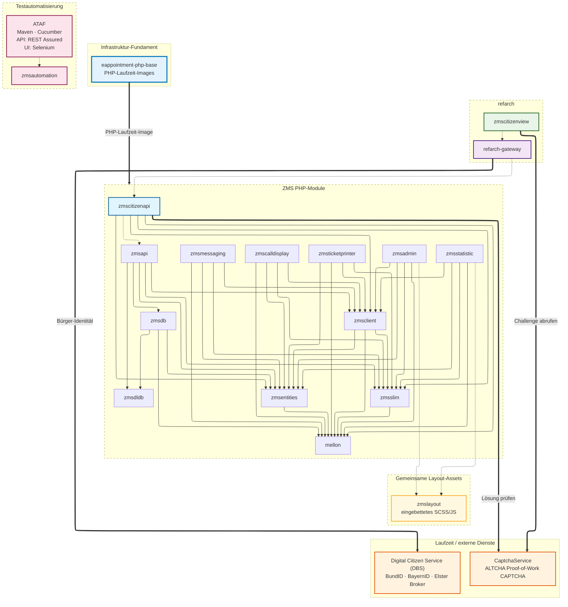

# Abhängigkeitsgraph

`zmscitizenview` und `refarch-gateway` setzen auf `zmscitizenapi` auf, ziehen aber keine direkten Abhängigkeiten von dort. Ebenso sendet `zmscitizenapi` Anfragen an `zmsapi`, doch `zmsapi` ist keine direkte Abhängigkeit von `zmscitizenapi`.

Der Graph zeigt zusätzlich die zur Laufzeit benötigten Dienste jedes Deployments:

- `eappointment-php-base` – vorgefertigte PHP-Laufzeit-Images für alle PHP-Module (siehe [PHP-Basis-Images](../php-base-images)).
- `Digital Citizen Service (DBS)` – Münchens Open-Source-Identitätsbroker für Bürger:innen für BundID, BayernID und Elster, eingebunden auf der `refarch-gateway`-Ebene (siehe [it-at-m/dbs](https://it-at-m.github.io/dbs/)).
- `CaptchaService` – Münchens quelloffener ALTCHA-Proof-of-Work-CAPTCHA-Dienst, der den Bürger-Buchungsfluss vor Bot-Scraping schützt. `zmscitizenview` bezieht die Challenge, `zmscitizenapi` prüft die Lösung vor der Verarbeitung einer Buchung (siehe [it-at-m/captchaservice](https://it-at-m.github.io/captchaservice/)).
- `zmsautomation` – Maven-basierte Akzeptanztests auf **[ATAF](https://it-at-m.github.io/agile-test-automation-framework/)** (Agile Test Automation Framework; Artefakte `de.muenchen.ataf`): Cucumber-Szenarien mit **REST Assured** für API-Tests und **Selenium** (über [ATAF](https://it-at-m.github.io/agile-test-automation-framework/) Web) für UI-Tests. Keine Composer-Abhängigkeit der PHP-Module; die Tests spielen HTTP-/Browser-Flows gegen laufende Instanzen ein (siehe [`zmsautomation/README.md`](https://github.com/it-at-m/eappointment/blob/main/zmsautomation/README.md)).

**Lesart der Kanten**

- Durchgezogener Pfeil (`A --> B`): A hat B als Code-Abhängigkeit (Composer).
- Gestrichelter Pfeil (`A -.-> B`): Build-/Integrationsabhängigkeit oder npm-`file:`-Abhängigkeit (z. B. `zmsadmin` → `zmslayout`). A wird auf B aufgebaut und gegen B deployt, zieht es aber nicht als Composer-Abhängigkeit.
- Dicker Pfeil (`A ==> B`): Laufzeit-/Infrastruktur-Abhängigkeit. A spricht zur Laufzeit mit B, oder B stellt die Laufzeitumgebung von A bereit.

Nur im Subgraph **Testautomatisierung**: Der gestrichelte Pfeil **`ataf -.-> zmsautomation`** bedeutet _Framework → Nutzer_ ([ATAF](https://it-at-m.github.io/agile-test-automation-framework/) liefert Cucumber sowie REST Assured für API und Selenium für UI an `zmsautomation`), nicht die Composer-Lesart „A auf B aufgebaut“ von oben.

## Frontend- vs. Backend-Module

### Frontend

- `zmscitizenview`: Vue3-Buchungsfrontend für Bürger:innen, basierend auf [RefArch](https://refarch.oss.muenchen.de).
- `refarch-gateway`: Frontend-Gateway-/BFF-Schicht, von `zmscitizenview` genutzt.
- `zmsadmin`: Verwaltungs-UI-Modul (mit Backend-/API-Anbindung).
- `zmsstatistic`: Statistik-/Reporting-UI-Modul (mit Backend-/API-Anbindung).
- `zmscalldisplay`: UI-Modul für die Aufrufanzeige.
- `zmsticketprinter`: UI-/Laufzeit-Modul für den Ticketdrucker.

### Gemeinsame Layout-Assets

- `zmslayout`: eingebettetes Berlin-Online-Layout-SCSS und -JavaScript (`bo-zms-layout-js`, `bo-zms-layout-scss`), von `zmsadmin` und `zmsstatistic` per npm-`file:`-Abhängigkeit genutzt. `zmscalldisplay` und `zmsticketprinter` haben eigene PHP/Twig-UI-Stacks und hängen heute nicht von `zmslayout` ab. Ein RefArch-/Vue-Refactoring von `zmsadmin`, `zmsstatistic` und den übrigen internen PHP-Frontends (siehe [Produktorientierte RefArch-Roadmap](/on-the-future/product-oriented-refarch-roadmap)) würde `zmslayout` durch Vue/Vuetify ersetzen, statt es auszubauen.

`zmscitizenview` folgt den RefArch-Referenzarchitekturmustern und nutzt `refarch-gateway` als Gateway-Schicht.
Das bedeutet, Anfragen aus `zmscitizenview` werden zunächst über `refarch-gateway` geleitet, bevor sie `zmscitizenapi` erreichen.
Hinweise zu Gateway-Verhalten sowie Sicherheits-/Routing-Details siehe RefArch-API-Gateway-Dokumentation: [RefArch API Gateway](https://refarch.oss.muenchen.de/gateway.html).

### Backend-APIs und Kerndienste

- `zmscitizenapi`: API-Schicht für Bürgerbuchungs-Flows; bildet Backend-Entitäten auf schlanke Frontend-DTOs ab.
- `zmsapi`: Kern-Backend-API für Vorgangs-, Warteschlangen-, Termin- und Verwaltungs-Flows.
- `zmsdb`: Datenbankzugriffs-/Abfrageschicht für Anbieter/Anliegen/Vorgänge.
- `zmsdldb`: Importer/Transformer für externe DLDB-/SADB-Quellen.
- `zmsclient`: HTTP-/API-Client-Abstraktionen, modulübergreifend genutzt.
- `zmsslim`: Gemeinsame Slim-Framework-Schicht/-Helfer.
- `zmsmessaging`: Backend-Modul für Nachrichten/Benachrichtigungen.
- `mellon`: Gemeinsame Basis-/Bibliotheks-Abhängigkeit, von mehreren Backend-Modulen genutzt.

### Geteilt zwischen frontendnahen und Backend-PHP-Modulen

- `zmsentities`: Gemeinsames Domänen-/Entitätsmodell, das sowohl frontendnahe als auch Backend-PHP-Module nutzen.

### Testautomatisierung

- `zmsautomation`: Maven-Modul; **REST Assured** für API-Tests und **Selenium** ([ATAF](https://it-at-m.github.io/agile-test-automation-framework/) Web) für UI-Tests, angebunden über Cucumber unter **[ATAF](https://it-at-m.github.io/agile-test-automation-framework/)** (`de.muenchen.ataf`). Kein Teil des Composer-Graphen — es prüft laufende Deployments (CI [`zmsautomation-workflow`](https://github.com/it-at-m/eappointment/blob/main/.github/workflows/zmsautomation-workflow.yaml), lokal [`zmsautomation-test`](https://github.com/it-at-m/eappointment/blob/main/zmsautomation/zmsautomation-test)). Typische Ziele sind `zmsapi`, `zmscitizenapi` sowie Browser-Flows gegen `zmsadmin`, `zmscitizenview`, `zmsstatistic` und `refarch-gateway`.

### Laufzeitdienste und Infrastruktur

Diese werden nicht als Code-Abhängigkeiten gezogen, sind aber zur Build-/Laufzeit erforderlich.

- `eappointment-php-base`: Vorgefertigte PHP-Laufzeit-Images, auf denen jedes PHP-Modul läuft. Detaillierte Abhängigkeitsansicht: [PHP-Basis-Images](../php-base-images).
- `Digital Citizen Service (DBS)`: Münchens Open-Source-Identitätsbroker für Bürger:innen für BundID, BayernID und Elster, eingebunden auf der `refarch-gateway`-Ebene vor `zmscitizenapi` für den Bürger-Buchungsfluss. Siehe [it-at-m/dbs](https://it-at-m.github.io/dbs/).
- `CaptchaService`: Münchens quelloffener ALTCHA-Proof-of-Work-CAPTCHA-Dienst. Schützt den Bürger-Buchungsfluss vor Bot-Scraping — `zmscitizenview` bezieht die Challenge, `zmscitizenapi` prüft die Lösung vor der Verarbeitung einer Buchung. DSGVO-konform by design (keine Cookies, kein Tracking, keine Aufrufe an Drittanbieter). Siehe [it-at-m/captchaservice](https://it-at-m.github.io/captchaservice/).
