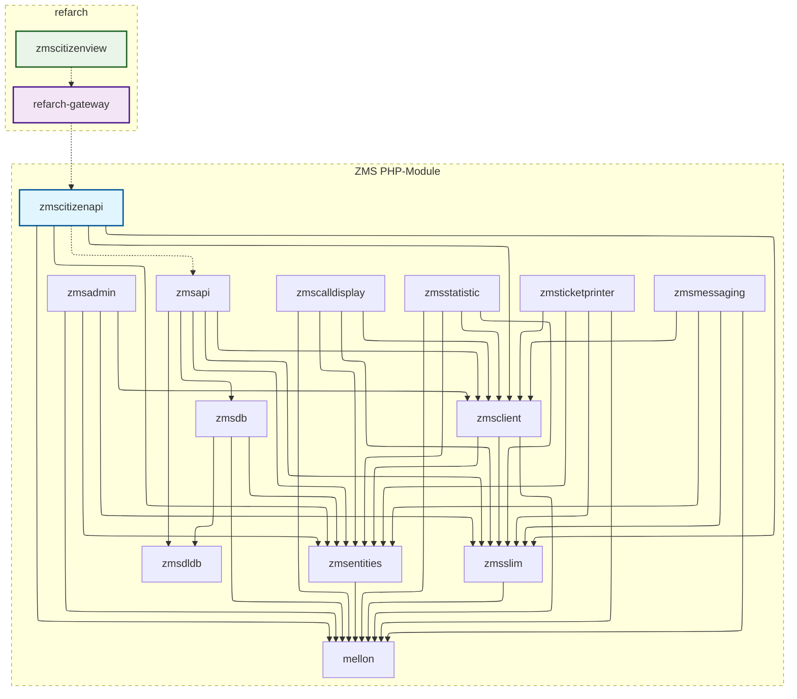

# Abhängigkeitsgraph

`zmscitizenview` und `refarch-gateway` setzen auf `zmscitizenapi` auf, ziehen aber keine direkten Abhängigkeiten von dort. Ebenso sendet `zmscitizenapi` Anfragen an `zmsapi`, doch `zmsapi` ist keine direkte Abhängigkeit von `zmscitizenapi`.

## Frontend- vs. Backend-Module

### Frontend

- `zmscitizenview`: Vue3-Buchungsfrontend für Bürger:innen, basierend auf [RefArch](https://refarch.oss.muenchen.de).
- `refarch-gateway`: Frontend-Gateway-/BFF-Schicht, von `zmscitizenview` genutzt.
- `zmsadmin`: Verwaltungs-UI-Modul (mit Backend-/API-Anbindung).
- `zmsstatistic`: Statistik-/Reporting-UI-Modul (mit Backend-/API-Anbindung).
- `zmscalldisplay`: UI-Modul für die Aufrufanzeige.
- `zmsticketprinter`: UI-/Laufzeit-Modul für den Ticketdrucker.

`zmscitizenview` folgt den RefArch-Referenzarchitekturmustern und nutzt `refarch-gateway` als Gateway-Schicht.
Das bedeutet, Anfragen aus `zmscitizenview` werden zunächst über `refarch-gateway` geleitet, bevor sie `zmscitizenapi` erreichen.
Hinweise zu Gateway-Verhalten sowie Sicherheits-/Routing-Details siehe RefArch-API-Gateway-Dokumentation: [RefArch API Gateway](https://refarch.oss.muenchen.de/gateway.html).

### Backend-APIs und Kerndienste

- `zmscitizenapi`: API-Schicht für Bürgerbuchungs-Flows; bildet Backend-Entitäten auf schlanke Frontend-DTOs ab.
- `zmsapi`: Kern-Backend-API für Vorgangs-, Warteschlangen-, Termin- und Verwaltungs-Flows.
- `zmsdb`: Datenbankzugriffs-/Abfrageschicht für Anbieter/Anliegen/Vorgänge.
- `zmsdldb`: Importer/Transformer für externe DLDB-/SADB-Quellen.
- `zmsclient`: HTTP-/API-Client-Abstraktionen, modulübergreifend genutzt.
- `zmsslim`: Gemeinsame Slim-Framework-Schicht/-Helfer.
- `zmsmessaging`: Backend-Modul für Nachrichten/Benachrichtigungen.
- `mellon`: Gemeinsame Basis-/Bibliotheks-Abhängigkeit, von mehreren Backend-Modulen genutzt.

### Geteilt zwischen frontendnahen und Backend-PHP-Modulen

- `zmsentities`: Gemeinsames Domänen-/Entitätsmodell, das sowohl frontendnahe als auch Backend-PHP-Module nutzen.
