# Wie setze ich eine User Story in ZMS um?

In jedem Stack — auch in ZMS — beginnst du am **unteren Ende des Stacks** und arbeitest dich nach oben. In ZMS ist das die Backend-Schicht **`zmsbackend`**.

Bevor du Bürgeransicht, Admin-UI oder reine Durchreich-APIs anfasst, stelle die Frage, ob die Story überhaupt eine Backend-Änderung braucht. Wenn ja, setze so nah wie möglich an der **Datenbankschicht** an.

## Entscheidungsbaum

```mermaid
flowchart TD
  start([Start der User Story]) --> backend{"Müssen wir etwas im<br/>Backend ändern<br/><code>zmsbackend</code>?"}
  backend -->|Nein| frontendFork
  backend -->|Ja| dbLayer

  subgraph databaseLayer ["Datenbankschicht — am nächsten an den Daten"]
    direction TB
    dbLayer[So nah wie möglich an der<br/>Datenbankschicht starten]
    dbLayer --> migrations{"Brauchen wir<br/>Migrationen?"}
    migrations -->|Nein| repos
    migrations -->|Ja| migTypes[Alltägliche Migrationstypen]
    migTypes --> schema{"Datenbankstruktur ändern?<br/>neue Spalten / Tabellen"}
    migTypes --> data{"Daten in bestehende<br/>Strukturen einfügen?"}
    schema -->|Ja| expandContract[Schema-Migration<br/>Expand / Contract]
    data -->|Ja| dataMig[Daten-Migration<br/>im bestehenden Schema]
    expandContract --> bothNote[Eine Story kann beides brauchen]
    dataMig --> bothNote
    bothNote --> repos
    repos[Als Nächstes: Repository-Conditions<br/><code>Repository</code>-Ordner in <code>zmsbackend</code>]
    repos --> conditions{"Brauche ich neue Conditions<br/>im Repository, damit ich<br/>Queries in der Service-Schicht<br/>ändern oder bauen kann?"}
    conditions -->|Struktur-Migration| alwaysCond[Immer ja — Conditions anlegen oder anpassen]
    conditions -->|Nur Daten-Migration| maybeDataCond[Ja oder nein]
    conditions -->|Keine Migration| maybeNoMigCond[Ja oder nein]
    alwaysCond --> serviceLayer[Dann Queries in<br/><code>Service</code>-Ordnern zusammensetzen]
    maybeDataCond --> serviceLayer
    maybeNoMigCond --> serviceLayer
  end

  serviceLayer --> entitiesQ

  subgraph entitiesLayer ["Entities und API — Schema, dann Controller"]
    direction TB
    entitiesQ{"Muss ich das JSON-Schema / Modell<br/>in <code>zmsentities</code> ändern oder<br/>ergänzen, damit ich die Änderung<br/>in der API-Controller-Response<br/>propagieren kann?"}
    entitiesQ -->|Ja| schemaModel[Schema in <code>zmsentities</code> anpassen<br/>wird später zum Modell]
    entitiesQ -->|Nein| maybeController[Controller kann sich auch ohne<br/>Schema-Änderung ändern]
    schemaModel --> apiController[In API-Controller propagieren<br/><code>Api</code>-Ordner in <code>zmsbackend</code>]
    maybeController --> apiController
    apiController --> apiElse{"Muss ich sonst noch etwas<br/>in der <code>zmsbackend</code>-<br/>API-Schicht ändern?"}
    apiElse -->|Ja| apiMore[Neuer Controller → in<br/><code>zmsbackend/routing.php</code> eintragen<br/>plus Request-Handling, Statuscodes, …]
    apiElse -->|Nein| apiDone[API-Schicht für diese Story fertig]
    apiMore --> apiDone
  end

  apiDone --> frontendFork

  subgraph clientsLayer ["Oberhalb der API — welcher Client-Pfad?"]
    direction TB
    frontendFork{"Legacy-Frontend-Module<br/>oder Citizen-Stack?"}
    frontendFork -->|Legacy| legacyMods["zmsadmin · zmsstatistic<br/>zmsticketprinter · zmscalldisplay<br/>zmsmessaging"]
    frontendFork -->|Citizen| citizenStack["zmscitizenapi → zmscitizenview"]
  end

  legacyMods --> laterClients[Client-Details<br/>— folgt in späteren Schritten]
  citizenStack --> laterClients

  style databaseLayer fill:#e3f2fd,stroke:#0277bd,stroke-width:2px,color:#01579b
  style entitiesLayer fill:#e0f2f1,stroke:#00897b,stroke-width:2px,color:#00695c
  style clientsLayer fill:#fff3e0,stroke:#ef6c00,stroke-width:2px,color:#e65100
  classDef dbNode fill:#bbdefb,stroke:#0277bd,stroke-width:1px,color:#0d47a1
  classDef entitiesNode fill:#b2dfdb,stroke:#00897b,stroke-width:1px,color:#004d40
  classDef clientsNode fill:#ffe0b2,stroke:#ef6c00,stroke-width:1px,color:#e65100
  class dbLayer,migrations,migTypes,schema,data,expandContract,dataMig,bothNote,repos,conditions,alwaysCond,maybeDataCond,maybeNoMigCond,serviceLayer dbNode
  class entitiesQ,schemaModel,maybeController,apiController,apiElse,apiMore,apiDone entitiesNode
  class frontendFork,legacyMods,citizenStack,laterClients clientsNode
```

## Datenbankschicht

Dieser Abschnitt deckt alles an oder nahe den Daten ab: Migrationen, Repository-Conditions und die Service-Methoden, die diese Conditions zu Queries zusammensetzen. Höhere Schichten folgen als Nächstes auf dieser Seite.

### Zuerst das Backend

**Frage 1: Müssen wir etwas im Backend ändern?**

- **Nein** — hier verlässt du `zmsbackend`. Der Backend-Ja/Nein-Pfad **schließt**, und du gehst weiter unter [Oberhalb der API](#oberhalb-der-api).
- **Ja** — bleib in `zmsbackend` und starte nahe an den Daten: Schema und Persistenz vor Services, APIs oder Frontends, die davon abhängen.

### Als Nächstes Migrationen

**Frage 2: Brauchen wir Migrationen?**

Wenn die Story ändert, wie Daten gespeichert, strukturiert oder initial befüllt werden, beginne mit Datenbank-Migration(en), bevor du abhängigen Code schreibst.

Wie du Migrationen lokal ausführst, steht unter [Datenbank-Migrationen](/de/setup-and-development/database-migrations).

#### Alltägliche Migrationstypen

Für den Alltag gibt es zwei Arten von Migrationen. Eine Story kann **eine oder beide** brauchen.

1. **Strukturänderungen** — Tabellen und Spalten anlegen oder ändern (neue Tabellen, neue Spalten, Umbenennungen, Drops und Ähnliches). Das sind die Schema-Migrationen, die du bei rolloutsicheren Änderungen in **Expand** und **Contract** aufteilst. Details: [Expand und Contract](/de/setup-and-development/database-migrations#expand-und-contract).

2. **Daten in bestehenden Strukturen** — Zeilen in bereits vorhandenen Tabellen einfügen oder aktualisieren (Stammdaten, Flags, Seed-Zeilen, Backfills ohne neue Spalte). Das Schema bleibt gleich; nur der Inhalt ändert sich.

Stelle bei jeder Story mit Migrationen beide Fragen: _Ändern wir die Struktur?_ und _Fügen wir Daten in bestehende Strukturen ein oder ändern wir sie?_ Schreibe danach die passenden Migrationsdatei(en), bevor du im Stack nach oben gehst.

### Dann Repositories, dann Services

Repositories sind die **Bausteine**: kleine wiederverwendbare Teile (vor allem `addCondition…`-Methoden, Mappings und Joins), die wissen, wie man mit Tabellen spricht. Services liegen eine Schicht darüber in den zugehörigen `Service`-Ordnern und **setzen** diese Bausteine zu den Queries zusammen, die die Story braucht.

Typisches Layout:

- `zmsbackend/src/Zmsbackend/.../Repository/` — Conditions und Mapping-Bausteine
- `zmsbackend/src/Zmsbackend/.../Service/` — baut oder ändert Queries, indem Repository-Conditions verkettet werden

**Frage 3: Brauche ich neue Conditions im Repository, damit ich Queries in der Service-Schicht ändern oder neu bauen kann?**

| Was die Story an der DB gemacht hat                                   | Neue / geänderte Repository-Conditions?                                                                                     |
| --------------------------------------------------------------------- | --------------------------------------------------------------------------------------------------------------------------- |
| Struktur-Migration (neue/geänderte Spalten oder Tabellen)             | **Immer ja** — der Service kann die neue Form nicht selektieren, filtern oder schreiben ohne passende Repository-Bausteine. |
| Nur Daten-Migration (neue/geänderte Zeilen in bestehenden Strukturen) | **Ja oder nein** — ja, wenn der Service diese Daten anders filtern oder joinen muss; sonst reichen vorhandene Conditions.   |
| Gar keine Migration                                                   | **Ja oder nein** — die Story kann trotzdem einen neuen Filter, Join oder Lesepfad brauchen, den der Service zusammensetzt.  |

Lege bei Bedarf zuerst Repository-Conditions an oder passe sie an, und ändere oder ergänze danach die Service-Methoden, die die Query aus diesen Conditions bauen. Weiter mit Entities und der API.

## Entities und API

Nachdem die Datenbankschicht die Daten laden und formen kann, entscheide, ob der **gemeinsame Contract** geändert werden muss, damit Controller ihn ausliefern können. In ZMS liegt dieser Contract in **`zmsentities`** als JSON Schema (und dem typisierten Modell, das daraus entsteht). Controller in `zmsbackend` setzen diese Form dann in die API-Response.

Typisches Layout:

- `zmsentities/schema/` — JSON Schema für Entities (und zugehörige Citizen-API-Schemas)
- `zmsentities` PHP-Entity-Klassen — die Modelle zu diesen Schemas
- `zmsbackend/src/Zmsbackend/.../Api/` — API-Controller, die diese Entities in Responses zurückgeben
- `zmsbackend/routing.php` — Slim-Routen, die URL-Pfade an diese Controller binden

**Frage 4: Muss ich das JSON-Schema / Modell in `zmsentities` ändern oder ergänzen, damit ich die Änderung in der API-Controller-Response propagieren kann?**

- **Ja** — zuerst Schema in `zmsentities` anpassen oder anlegen (daraus wird später das Modell), danach den API-Controller so anpassen, dass die Response die neuen oder geänderten Felder trägt.
- **Nein** — du kannst trotzdem einen API-Controller anfassen (Routing, Statuscodes, anderer Service-Aufruf), ohne das Entity-Schema zu ändern.

**Frage 5: Muss ich sonst noch etwas in der `zmsbackend`-API-Schicht ändern?**

Wenn die Response-Form stimmt, mache einen letzten Check der API-Oberfläche in `zmsbackend` (typisch unter `.../Api/`):

- **neuer Controller** → du **musst** ihn in [`zmsbackend/routing.php`](https://github.com/it-at-m/eappointment/blob/main/zmsbackend/routing.php) registrieren (Slim-Route → Controller-Klasse); die Controller-Datei allein reicht nicht
- neue oder geänderte Routen / Endpunkte für bestehende Controller (ebenfalls in `routing.php`)
- Request-Parsing oder Validierung
- welcher Service-Aufruf im Controller
- HTTP-Statuscodes, Fehler oder Auth-/Rechteprüfungen
- verwandte Controller, die denselben Contract einhalten müssen

- **Ja** — schließe diese API-Schicht-Änderungen ab (inkl. `routing.php`, wenn du einen Controller hinzugefügt hast), bevor du `zmsbackend` verlässt.
- **Nein** — die API-Schicht ist für diese Story fertig.

Beide Antworten **schließen** den Backend-Pfad für diese Story. Weiter unter [Oberhalb der API](#oberhalb-der-api).

## Oberhalb der API

Hier treffen sich Frage 1 (**Backend ja/nein**) und Frage 5 (**API fertig**). Ab hier wählst du nur noch, welchen **Client-Pfad** die Story braucht — ob etwas in `zmsbackend` geändert werden muss, ist hier abgeschlossen.

**Frage 6: Legacy-Frontend-Module oder Citizen-Stack?**

| Pfad                 | Module                                                                           | Wann                                                                                         |
| -------------------- | -------------------------------------------------------------------------------- | -------------------------------------------------------------------------------------------- |
| **Legacy-Frontends** | `zmsadmin`, `zmsstatistic`, `zmsticketprinter`, `zmscalldisplay`, `zmsmessaging` | Mitarbeiter-/Betriebs-UIs und zugehörige Legacy-PHP-Frontends, die mit `zmsbackend` sprechen |
| **Citizen-Stack**    | `zmscitizenapi` → `zmscitizenview`                                               | Öffentlicher Buchungsflow: zuerst Citizen-API, dann Bürger-UI                                |

Eine Story kann einen Pfad, beide oder keinen (nur Backend) betreffen. Details zu jedem Pfad folgen in späteren Schritten auf dieser Seite.

