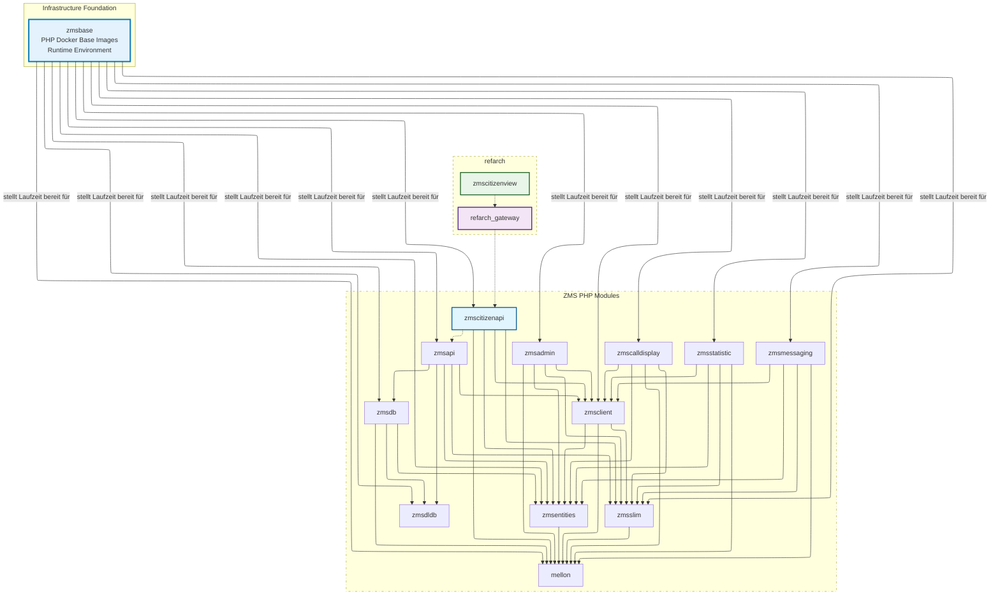

# E-Appointment PHP-Basis-Images (`zmsbase`)

Infrastrukturgrundlage: Das Verzeichnis [`zmsbase`](https://github.com/it-at-m/eappointment/tree/main/zmsbase) in diesem Monorepo stellt standardisierte, vorgebaute PHP-Laufzeit-Images für eappointment-[Modul-Builds](https://github.com/it-at-m/eappointment/blob/main/.github/workflows/php-build-images.yaml) über das [Containerfile](https://github.com/it-at-m/eappointment/blob/main/.resources/Containerfile) bereit.

- Quellcode: [`zmsbase/`](https://github.com/it-at-m/eappointment/tree/main/zmsbase) in [it-at-m/eappointment](https://github.com/it-at-m/eappointment)
- Früheres Standalone-Repository: [it-at-m/eappointment-php-base](https://github.com/it-at-m/eappointment-php-base) (ersetzt durch `zmsbase`)
- Ursprüngliches Berliner Repository: [gitlab.com/eappointment/php-base](https://gitlab.com/eappointment/php-base)

## Image-Varianten und Verwendung

Basierend auf [`.github/workflows/zmsbase-build-images.yaml`](https://github.com/it-at-m/eappointment/blob/main/.github/workflows/zmsbase-build-images.yaml) veröffentlicht das Projekt drei Gruppen von Images:

- `8.4-base` und `8.4-dev` aus `zmsbase/php84/Dockerfile`
- `8.3-base` und `8.3-dev` aus `zmsbase/php83/Dockerfile`
- `8.3-local-amd64` und `8.3-local-arm64` aus `zmsbase/php83-local/Dockerfile`

Die Rollenaufteilung:

- Lokale Images (`8.3-local-amd64`, `8.3-local-arm64`) sind für lokale Entwicklung und `zmsautomation` gedacht.
- Nicht-lokale Images (`8.3-*`, `8.4-*`) sind für produktionsnahe/laufzeitorientierte Umgebungen gedacht.

Diese duale lokale Architektur unterstützt die Entwicklung auf macOS Apple Silicon und anderen Nicht-amd64-Umgebungen und bietet zugleich linux/amd64-Kompatibilität.

## Lokale Architekturunterstützung

Der Job `php_v8_3_local` baut Single-Architecture-Tags in einer Matrix:

- `linux/amd64` auf `ubuntu-latest` → `8.3-local-amd64`
- `linux/arm64` auf `ubuntu-24.04-arm` → `8.3-local-arm64`

Devcontainer und DDEV setzen `ZMS_PHP_BASE_TAG` über [`.devcontainer/scripts/sync-php-base-tag.sh`](https://github.com/it-at-m/eappointment/blob/main/.devcontainer/scripts/sync-php-base-tag.sh).

## Verhalten des Build- und Veröffentlichungs-Workflows

Workflow: [🐳 Build ZMS base images](https://github.com/it-at-m/eappointment/blob/main/.github/workflows/zmsbase-build-images.yaml) (`zmsbase-build-images.yaml`).

Er läuft bei:

- Pushes, die `zmsbase/**` oder die Workflow-Datei ändern (alle Branches und Tags)
- monatlichem Zeitplan (`0 0 1 * *`)
- manuellem `workflow_dispatch`

Jeder Image-Job meldet sich bei GHCR an, baut die Image-Targets, validiert den PHP-Start (`php-fpm -t` oder `php -v`) und pusht die resultierenden Tags nach:

- `ghcr.io/it-at-m/eappointment/zmsbase`

## Modul-Abhängigkeitskontext

