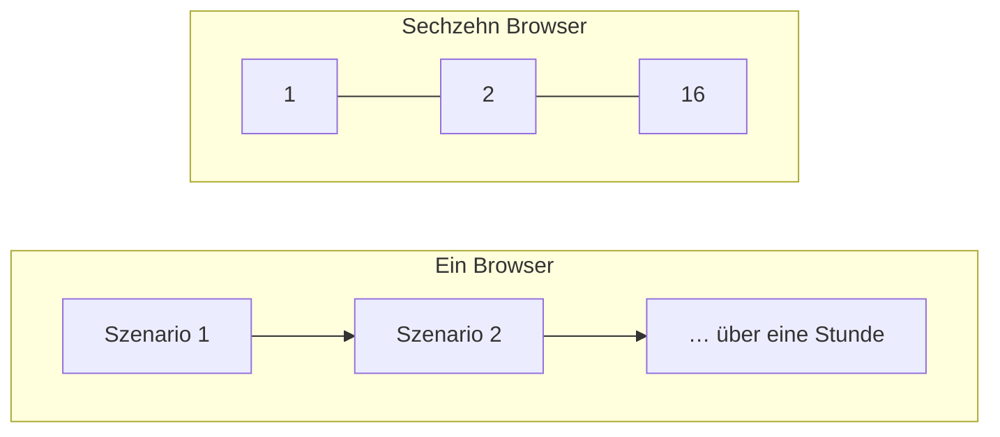
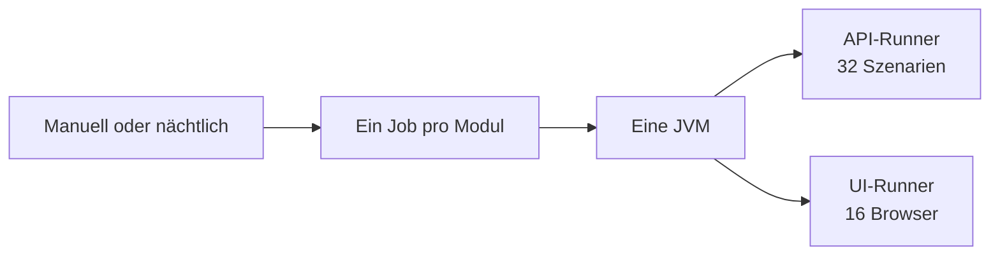
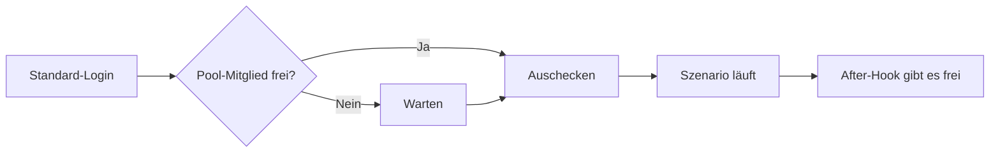
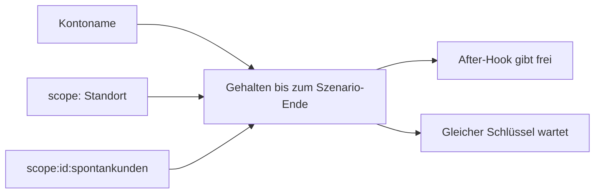
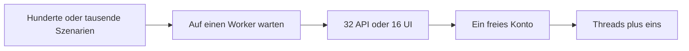
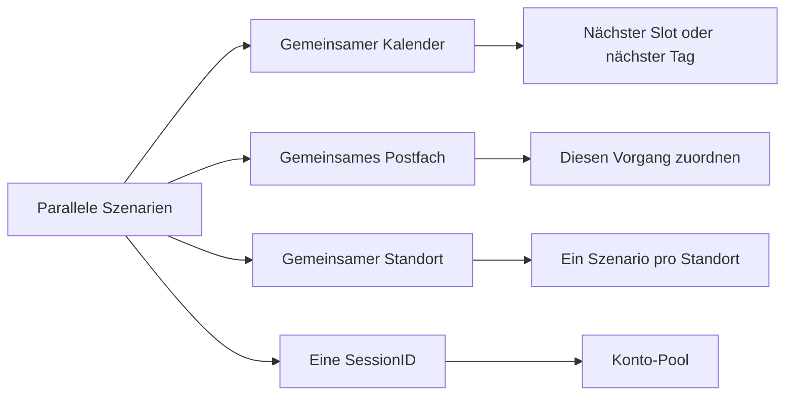

# Wie wir zmsautomation parallelisiert haben

25. September 2026

Szenarien in einem Modul-Job laufen jetzt gleichzeitig. Ein API-Job führt 32 Szenarien auf einmal aus. Ein UI-Job startet 16 Browser auf einmal. Befehle und das Log-Format stehen in der [zmsautomation-Dokumentation](./zmsautomation.md).

Ein voller UI-Lauf dauerte früher über eine Stunde, weil ein Browser jedes Szenario nacheinander abgearbeitet hat. Sechzehn Browser verkürzen denselben Lauf deutlich. Der parallele Lauf liegt auch näher an den Schaltern: mehrere Personen buchen, rufen den nächsten Kunden auf und melden sich gleichzeitig an. Ein Lauf Schritt für Schritt trifft diese Kollisionen nie. Er bleibt grün, während Kalender, Warteschlange und Anmeldung sich schon in die Quere kommen.



## ATAF konnte das bereits

[ATAF](https://it-at-m.github.io/agile-test-automation-framework/) 0.3.4 liefert `ParallelTestNGRunner`. `ApiTestRunner` und `UiTestRunner` erweitern diese Klasse. Cucumber-Szenarien sind TestNG-Datenzeilen, und Surefires `dataproviderthreadcount` legt fest, wie viele davon gleichzeitig starten. Das Profil `ataf-api` setzt 32. Das Profil `ataf-ui` setzt 16. Ein `-Ddataproviderthreadcount` auf der Kommandozeile ersetzt den Profilwert. Fehlt die Property, gilt der TestNG-Standard 10.

ATAF wurde dafür nicht geforkt. Die Arbeit bestand darin, die ZMS-Szenarien für eine gemeinsame JVM tauglich zu machen.

Ein lokaler UI-Befehl ist eine JVM über alle UI-Module, weiter auf 16 Browser begrenzt. In GitHub Actions ist jeder Modul-Shard eine eigene JVM mit derselben Grenze. Die Job-Parallelität des Workflows ist ein eigener Schalter: sie legt fest, wie viele Modul-Stacks gleichzeitig laufen, und jeder Stack nutzt weiterhin die Cucumber-Threadzahl von oben. `-Pataf-api` und `-Pataf-ui` sind zwei Maven-Läufe nacheinander.



## Eine Anmeldung ließ sich nicht teilen

Ein ZMS-Arbeitsplatz hat eine `SessionID`. Die Anmeldung führt `UPDATE nutzer SET SessionID = SHA2(?, 256) WHERE Name = ?` aus. Die nächste Anfrage der vorherigen Sitzung ist `401 UserAccountMissingLogin`. Superuser, Admin, Statistik und das Mailkonto `_system_messenger` folgen derselben Regel. Zwei Szenarien, die sich gleichzeitig als `ataf` anmelden, werfen sich gegenseitig hinaus.

Die Bürger-Anmeldung ist ein Bearer-Token. Ein zweites Token ersetzt das erste nicht. Termine werden trotzdem über die externe Benutzer-ID geladen. Zwei Szenarien als `citizen` sehen und ändern deshalb dieselben Buchungen.

`AccountCheckout` nimmt beim Login eine faire Sperre auf das Konto und hält sie bis zum Ende des Szenarios. Die Freigabe läuft in einem `@After`-Hook. Ein zweites Szenario, das dasselbe Konto braucht, wartet an seinem Login.



Die Standardnamen nehmen ein freies Mitglied aus einem Pool. Der Pool ist die Threadzahl plus ein Ersatz, damit ein Szenario sein Logout beenden kann, während das nächste schon ein Konto braucht:

| Pool         | Konten                             | Ausgelegt für  |
| ------------ | ---------------------------------- | -------------- |
| Superuser    | `ataf` bis `ataf_17`               | 16 UI-Browser  |
| Arbeitsplatz | `agent_queue` bis `agent_queue_33` | 32 API-Threads |
| Messenger    | `_system_messenger` bis `_33`      | 32 API-Threads |
| Bürger       | `citizen` bis `citizen_33`         | 32 API-Threads |

Ein ausdrücklich anderer Name bleibt an diesem Namen hängen und wartet darauf. Die Ersatzbenutzer stehen in der bestehenden Keycloak-Migration `.resources/keycloak/migration/11_add-parallel-test-users.yml` und in Flyway `V28__GH-3281_parallel_login_pool.sql`. Bürger gibt es nur in Keycloak. Der Mail-Login sendet die rohe ID `_system_messenger`. Das ist eine andere `nutzer`-Zeile als `_system_messenger@keycloak`.

Der Pool besteht heute aus Kopien derselben Rollen: Superuser, Arbeitsplatz, Messenger und Bürger. Eine spätere Suite kann einen Pool von Benutzern in verschiedenen Rollen brauchen, genauso bemessen, sobald zwei Szenarien gleichzeitig zwei verschiedene Berechtigungen halten müssen.

Aufruf- und Warteschlangen-Szenarien tippen einen Schalter. Ein Ersatz-Superuser addiert das `100`-fache seines Pool-Index auf diesen Schalter. `ataf` behält die Nummer aus dem Feature, `ataf_2` sitzt 100 höher. Die Warteliste selbst gehört zum Standort. Ein anderer Platz teilt die Schlange nicht.

Jede Sperre ist ein Schlüssel, der bis zum Ende des Szenarios gehalten wird. Der `@After`-Hook gibt ihn frei. Ein zweites Szenario, das denselben Schlüssel verlangt, wartet. Die Anmeldung sperrt den Kontonamen. Das Betreten eines Standorts, das Öffnen seiner Öffnungszeiten oder das Weiterleiten eines Termins dorthin sperrt `scope:` plus den Standortnamen. Anlegen oder Löschen von Spontankunden-Öffnungszeiten sperrt `scope:` plus die Scope-ID plus `:spontankunden`. Das ist ein anderer Schlüssel als der Standortname.

Die Sperre ist `AccountCheckout` in `zmsautomation/src/test/java/zms/ataf/helpers/AccountCheckout.java`. `AccountCheckoutHook` gibt jeden Schlüssel frei, den das Szenario hält. Den Standort-Schlüssel nehmen `AdminPage.selectLocation`, `AuthoritiesAndLocationsPage.clickOnOpeningHoursEntryBy` und `ProcessingStationSection.selectLocationForAppointmentForwarding`. Den Spontankunden-Schlüssel nimmt `ZmsApiSteps`, wenn diese Öffnungszeiten angelegt oder gelöscht werden.



## Hunderte oder tausende Szenarien

Die Suite kann auf dieselben 32 API-Threads und 16 Browser auf hunderte oder tausende Szenarien wachsen. Ein Szenario wartet auf einen freien Worker und nimmt beim Login ein freies Konto. Der Pool deckt die Threads ab, die wirklich laufen, plus einen Ersatz. Er wächst nicht mit der Zahl der Szenarien. Die Laufzeit folgt der Szenarienzahl geteilt durch die Anzahl, die gleichzeitig läuft. Ein Browser machte daraus die Summe aller Szenarien, und der UI-Lauf lag damit schon über einer Stunde.

Wie viele gleichzeitig laufen, ist ein eigener Schritt: `dataproviderthreadcount` setzen und die zusätzlichen Benutzer in denselben Keycloak- und Flyway-Dateien ergänzen.



## Weitere Wettläufe

Sie sind aufgetreten, sobald mehr als ein Szenario gleichzeitig lief. Jeder davon bestand, solange die Suite ein Szenario nach dem anderen ausgeführt hat.



- **Ein Kalender.** Buchungstests haben den ersten freien Slot genommen, und ein Nachbar hatte ihn gerade belegt. Citizen API, Bürgeransicht und die interne Admin-Reservierung gehen zum nächsten freien Slot oder Vorgang. **Später** im Bürgerkalender bewegt sich nur innerhalb des offenen Tages. Ein leeres Abendraster nutzt den nächsten Kalendertag. Ein Slot, der sich nicht mehr hervorheben lässt, wird übersprungen, damit dieselbe Schleife weiterlaufen kann.
- **Ein Postfach.** Die neueste Vorab-Bestätigungsmail gehörte zu einem anderen Szenario. Der Abruf vergleicht jetzt die Vorgangs-ID, oder die Kontakt-E-Mail, wenn die Vorgangs-ID noch fehlt. Jede Buchung bekommt außerdem eine eigene Mailinator-Adresse aus dem erzeugten Kontaktnamen. Dutzende lebender Termine auf einer Adresse liefern `406 tooManyAppointmentsWithSameMail`.
- **Eine Standort-Warteschlange.** „Aufruf nächster Kunde“ nimmt die älteste wartende Person an diesem Standort. Die Standort-Sperre verhindert, dass zwei Szenarien gleichzeitig in der Schlange stehen. Das vorherige Szenario kann trotzdem Personen zurücklassen. Der Parken-Test schließt diese Reste als nicht erschienen ab, bevor er seinen eigenen Kunden aufruft.
- **Ticketdrucker-Standort 127.** Ein Szenario hat Spontankunden-Öffnungszeiten eingeschaltet, während ein anderes den Button deaktiviert erwartet hat. Dieser Standort wird für das Szenario gesperrt. Die Zeiten laufen von `00:05` bis `23:55`: die API lehnt einen Start um Mitternacht ab, ein Start um `01:00` ließ den Standort kurz nach Mitternacht geschlossen, und ein Ende um `23:00` lag bei einem späten Lauf schon in der Vergangenheit.
- **Ein kurzes Öffnungszeiten-Fenster.** Blieben weniger als drei Stunden am Tag, hatte der gemeinsame Ruppertstraße-Kalender nur noch einen Zeitstempel an einem Amt. Die Migrationen V19 und V24 schieben dieses Fenster auf den nächsten Tag, `00:05`–`03:05`.
- **Der Hinweis „Sie sind angemeldet.“** Die Kontaktseite zeigte den Text bereits. Er war über den Shadow-Baum verteilt, und die Suche lieferte false. Der Walker umfasst jetzt auch Slots, zugewiesene Knoten und Frames derselben Origin.
- **Öffnungszeiten speichern.** Der erste `button-save` blendet nur das Formular aus. Der Bestätigungsdialog öffnet sich nach dem Footer-Button **Alle Änderungen aktivieren**.
- **Zustand am falschen Thread.** Die letzte API-Antwort, die Buchung und der gecachte Mail-Schlüssel müssen am Szenario-Thread bleiben. TestNG verwendet den Worker wieder, deshalb wird dieser Cache vor dem nächsten Szenario geleert.

Logzeilen dieser Threads stehen durcheinander. Jede Zeile beginnt mit dem Worker in eckigen Klammern, zum Beispiel `[29]`. Zeilen mit derselben Nummer gehören zu einem Szenario, bis dieser Thread `Starting scenario` protokolliert.

## Die Workflow-Option

Der manuelle Lauf von [`.github/workflows/zmsautomation-workflow.yaml`](https://github.com/it-at-m/eappointment/blob/next/.github/workflows/zmsautomation-workflow.yaml) hat die Checkbox **Don't run scenarios in parallel** (`serial_scenarios`). Sie ist standardmäßig aus. Ist sie an, hängt jeder Job `-Ddataproviderthreadcount=1` an, und der Laufname endet mit `| serial scenarios`. Der nächtliche Zeitplan lässt die Eingabe leer, deshalb bleibt der Nachtlauf bei 32 API-Threads und 16 UI-Browsern.

**Run the full suite in one sequential job** (`run_all_in_one_job`) ist ein anderer Schalter. Er legt die angehakten Module in einen Job. Er ändert nicht, wie viele Szenarien dieser Job gleichzeitig ausführt.

## Ein Szenario nach dem anderen

Lokal übergibst du die Property. Sie gewinnt gegen den Profil-Standard:

```bash
./zmsautomation/zmsautomation-test -Pataf-ui -Ddataproviderthreadcount=1
./zmsautomation/zmsautomation-test -Pataf-api -Ddataproviderthreadcount=1
```

In GitHub Actions hakst du beim manuellen Lauf **Don't run scenarios in parallel** an. Ein Lauf, der schon gestartet ist, behält die Threadzahl, mit der er begonnen hat.

## Was die Läufe zeigen

Parallele Läufe und das Entfernen des fehlerhaften Hooks haben die Zeit zusammengedrückt. Der Hook ist `CitizenViewSteps.captureBookingProcessBeforeCleanup`. Er lief nach jedem UI-Szenario und wartete bis zu drei Minuten auf ein Bürgeransicht-Fenster, auch in Modulen, die dieses Fenster nie öffnen. Er läuft jetzt nur noch für `@zmscitizenview`. Die linke Tabelle ist der nächtliche Lauf auf `next`, ein Szenario nach dem anderen. Die rechte Tabelle ist der letzte Lauf dieses Branches. Die Zeiten sind der Chrome-Job, auf die nächste Minute gerundet. Firefox in jener Nacht lag innerhalb von etwa zwei Minuten bei Chrome.

<div class="duration-compare">
<div>
<h3>Vorher</h3>
<table>
<thead><tr><th>Shard</th><th>Schicht</th><th>Typische Dauer</th></tr></thead>
<tbody>
<tr><td>zmsadmin</td><td>UI</td><td>1 h 50 min</td></tr>
<tr><td>zmscitizenview</td><td>UI</td><td>31 min</td></tr>
<tr><td>zmsstatistic</td><td>UI</td><td>10 min</td></tr>
<tr><td>zmsticketprinter</td><td>UI</td><td>11 min</td></tr>
<tr><td>zmsapi</td><td>API</td><td>7 min</td></tr>
<tr><td>zmscitizenapi</td><td>API</td><td>18 min</td></tr>
</tbody>
</table>
</div>
<div>
<h3>Nachher</h3>
<table>
<thead><tr><th>Shard</th><th>Schicht</th><th>Typische Dauer</th></tr></thead>
<tbody>
<tr><td>zmsadmin</td><td>UI</td><td>16 min</td></tr>
<tr><td>zmscitizenview</td><td>UI</td><td>12 min</td></tr>
<tr><td>zmsstatistic</td><td>UI</td><td>8 min</td></tr>
<tr><td>zmsticketprinter</td><td>UI</td><td>4 min</td></tr>
<tr><td>zmsapi</td><td>API</td><td>6 min</td></tr>
<tr><td>zmscitizenapi</td><td>API</td><td>9 min</td></tr>
</tbody>
</table>
</div>
</div>
