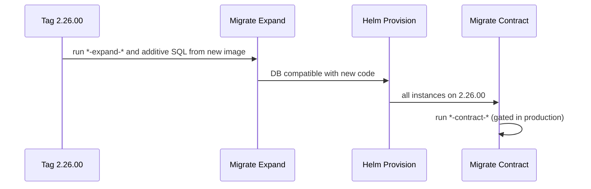
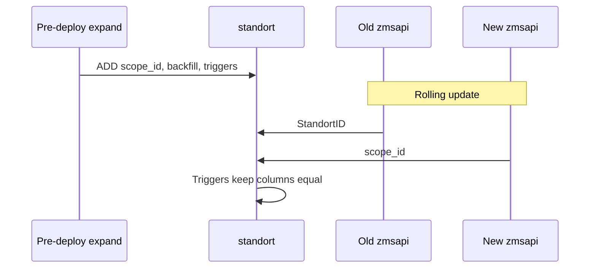

# Zero-downtime deployments and database migrations

> **Status:** draft  
> **Related:** [standardize-database-table-and-field-naming.md](./standardize-database-table-and-field-naming.md)

This document describes **how we will migrate the database** as part of the [schema standardization plan](./standardize-database-table-and-field-naming.md): pipeline ordering, SQL file naming, and MariaDB patterns for additive changes, column renames, and table renames.

Application releases and schema changes ship in **one tagged version** where needed, but the deployment pipeline runs migrations in the right order — **expand (and additive SQL) before new code**, **contract (cleanup) after new code** — so old and new application instances can run side by side during rollout without broken queries or unnecessary downtime.

---

## Industry standard: Expand–Contract (Parallel Change)

Reference: [Martin Fowler — Parallel Change](https://martinfowler.com/bliki/ParallelChange.html)

Never ship a change where code and schema must flip at the same instant. During rollout, old and new application instances run side by side (rolling update). The schema must satisfy all combinations:

| Old code                      | New code                    |
| ----------------------------- | --------------------------- |
| old schema                    | new schema                  |
| old schema ✓                  | new schema ✓ (after expand) |
| old schema ✓ (until contract) | new schema ✓                |

A breaking `RENAME COLUMN` violates this. Decompose into:

1. **Expand migration** — additive, backward-compatible (add column, backfill, sync)
2. **Deploy code** — release that uses new names
3. **Contract migration** — destructive cleanup (drop old column), only when new code is everywhere

---

## One eAppointment version, one deployment

**Yes.** A single tagged release (e.g. `2.26.00`) can bundle:

- `*-expand-*.sql`
- application code changes (Query classes, etc.)
- `*-contract-*.sql`

One merge → one container image build → one deployment tag bump.

**What is not safe**

- Expand + contract in one SQL file that runs after code
- Bare `RENAME COLUMN` with no dual-column / view layer
- Running contract before all instances (and scheduled jobs) are on the new tag

### Target pipeline (single tag)

```text
Tag Images
  → Migrate Expand     (pre-deploy; expand + additive SQL)
  → Provision            (Helm rolling update)
  → Migrate Contract     (post-deploy; contract SQL; manual gate in production)
  → Tools
```



**Caveat:** contract in the same pipeline run is safe only when no old instances or scheduled jobs still reference old column names. After Helm `--wait` that is usually true; in **production**, gate **Migrate Contract** manually (still same tag — the job can be run later).

### Pipeline gap today

Current migrate runs inside the **live** `zmsapi` deployment:

```bash
bin/migrate --update   # inside running zmsapi container
```

At expand time that container is still the **old image** — it does not contain the new migration files.

**Required change:** **Migrate Expand** must run from the **new tagged image** before Provision, e.g. a one-off migration job:

```bash
bin/migrate --update --phase=pre
# executed in a container started from the new zmsapi image, before Helm upgrade
```

Contract can use the same job pattern after Provision, or run migrate inside the updated deployment once it carries the new tag.

---

## Migration file convention

Keep one folder: `zmsdb/migrations/`. Differentiate by **filename prefix** (or `--phase` filter in `bin/migrate`).

### Which pipeline job runs which migration?

**Recommendation: replace the single post-deploy `Migrate` job with two jobs. Do not keep a third “normal migrate” job after Provision.**

| Migration type                                                         | Filename       | Pipeline job         | When                                           |
| ---------------------------------------------------------------------- | -------------- | -------------------- | ---------------------------------------------- |
| **Expand** (rename prep, dual columns, backfill, triggers)             | `*-expand-*`   | **Migrate Expand**   | Pre-deploy (new image job)                     |
| **Normal / additive** (new table, `ADD COLUMN`, indexes, config seeds) | no prefix      | **Migrate Expand**   | Pre-deploy (same job as expand)                |
| **Contract** (drop column, drop trigger, drop view)                    | `*-contract-*` | **Migrate Contract** | Post-deploy (after Helm; manual in production) |

**Why normal migrations belong in Expand, not a separate job**

- Additive migrations are **backward-compatible**: old code ignores new columns/tables; new code may **require** them on first request.
- Running them **after** Provision repeats the incident: new instances start before the schema they need exists.
- Running them in **Contract** would be wrong — contract is for destructive cleanup only.

**`bin/migrate` filtering (proposal)**

```bash
# Pre-deploy job (from new tagged image, before Helm)
bin/migrate --update --phase=pre
# Applies: *-expand-* AND unprefixed *.sql (additive only)

# Post-deploy job (after Helm --wait)
bin/migrate --update --phase=post
# Applies: *-contract-* only
```

New unprefixed files must pass CI **additive-only** lint (no `DROP`, `RENAME`, `CHANGE` on existing columns). Breaking changes must use `-expand-` / `-contract-` pair.

Track applied files in the existing `migrations` table (unchanged).

### Example: additive only — `custom_text_field3` (no contract)

Adding a third custom text field on `standort` / `buerger` is a **normal additive** change. Same pattern as [`91744880189-add-standort-custom-text-field2.sql`](../../../../zmsdb/migrations/91744880189-add-standort-custom-text-field2.sql).

|               | Rename (`StandortID` → `scope_id`) | Add `custom_text_field3`   |
| ------------- | ---------------------------------- | -------------------------- |
| Expand job    | Yes — dual column + triggers       | Yes — `ADD COLUMN`         |
| Contract job  | Yes — drop `StandortID`            | **No** — nothing to remove |
| Filename      | `*-expand-*` + `*-contract-*`      | Unprefixed                 |
| Old instances | Old column until contract          | Ignore new columns         |
| New instances | New column after expand            | Read/write new columns     |

`zmsdb/migrations/20260702-add-standort-custom-text-field3.sql` (unprefixed):

```sql
ALTER TABLE buerger
  ADD COLUMN custom_text_field3 VARCHAR(255)
    CHARACTER SET utf8mb4 COLLATE utf8mb4_unicode_ci DEFAULT NULL;

ALTER TABLE standort
  ADD COLUMN custom_text_field3_label VARCHAR(255)
    CHARACTER SET utf8mb4 COLLATE utf8mb4_unicode_ci DEFAULT NULL,
  ADD COLUMN custom_text_field3_active INT(5) NOT NULL DEFAULT 0,
  ADD COLUMN custom_text_field3_required INT(5) NOT NULL DEFAULT 0;
```

Pipeline:

```text
Migrate Expand  →  applies additive migration
Provision         →  new code uses custom_text_field3_*
(no Migrate Contract job for this release)
```

### Example: deleting code and columns (contract only — not unprefixed)

**Drops are never unprefixed.**

`zmsdb/migrations/20260702-contract-drop-standort-custom-text-field2.sql`:

```sql
ALTER TABLE buerger DROP COLUMN custom_text_field2;

ALTER TABLE standort
  DROP COLUMN custom_text_field2_label,
  DROP COLUMN custom_text_field2_active,
  DROP COLUMN custom_text_field2_required;
```

Pipeline: **Migrate Expand** (nothing) → **Provision** (code removed) → **Migrate Contract**.

### Naming summary

|                        | Unprefixed | `*-expand-*`             | `*-contract-*`   |
| ---------------------- | ---------- | ------------------------ | ---------------- |
| `ADD COLUMN`           | ✓          | optional (paired rename) | ✗                |
| `DROP COLUMN`          | ✗          | ✗                        | ✓                |
| Dual column + triggers | ✗          | ✓                        | drop in contract |

---

## MariaDB: syncing two columns during rollout

MariaDB cannot give one table two native names. For **column renames**, use **two physical columns + triggers** during the transition.

- Old instances read/write `StandortID`
- New instances read/write `scope_id`
- Triggers keep values equal



---

## Table renames (`standort` → `scope`, `buerger` → `citizen`, …)

For **table** renames the compatibility layer is a **VIEW** on the old name.

After expand there is only **one** physical table (`scope`). The name `standort` is a view pointing at it — not a second copy of the data. Old code that reads or writes `standort` operates on rows in `scope` underneath. New code uses `scope` directly. Both codebases see the same rows during rollout. Users can create, edit, and delete scopes from either version as long as writes through the view work — verify on staging before production contract.

### Pattern

| Phase        | SQL                                                                                | Who uses what          |
| ------------ | ---------------------------------------------------------------------------------- | ---------------------- |
| **Expand**   | `RENAME TABLE standort TO scope;` + `CREATE VIEW standort AS SELECT * FROM scope;` | Old: view. New: table. |
| **Code**     | `const TABLE = 'scope'` in Query classes                                           | New code only.         |
| **Contract** | `DROP VIEW standort;`                                                              | Only `scope` remains.  |

### Table only, columns unchanged

```sql
RENAME TABLE standort TO scope;
CREATE VIEW standort AS SELECT * FROM scope;
```

New code: [`Scope.php`](../../../../zmsdb/src/Zmsdb/Query/Scope.php) `const TABLE = 'scope';`

Contract: `DROP VIEW standort;`

### Table + column renames together

If columns are already renamed on `scope`, the view must alias every column back to old names — unwieldy for large tables. **Split into two releases:** (A) table rename only, (B) column renames with dual columns + triggers.

### Writes through the view

Test `INSERT`, `UPDATE`, `DELETE`, `SELECT … FOR UPDATE`, and `AUTO_INCREMENT` paths on staging before production contract.

Table renames are **never unprefixed**.

---

## Worked example: `standort.StandortID` → `scope_id`

### 1. Expand (pre-deploy)

```sql
ALTER TABLE standort
  ADD COLUMN scope_id INT(5) UNSIGNED NULL AFTER StandortID;

UPDATE standort SET scope_id = StandortID WHERE scope_id IS NULL;

ALTER TABLE standort
  MODIFY scope_id INT(5) UNSIGNED NOT NULL,
  ADD UNIQUE KEY uk_standort_scope_id (scope_id);

-- triggers to keep StandortID and scope_id in sync (see spike in repo for full SQL)
```

### 2. Code (same tag)

```php
// before: 'id' => 'scope.StandortID'
// after:  'id' => 'scope.scope_id'
```

### 3. Contract (post-deploy)

```sql
DROP TRIGGER standort_scope_sync_ai;
DROP TRIGGER standort_scope_sync_bu;
ALTER TABLE standort DROP PRIMARY KEY, DROP COLUMN StandortID, ADD PRIMARY KEY (scope_id);
```

---

## Post-mortem: failed rename migration

[`91775568666`](../../../../zmsdb/migrations/91775568666-rename-waiting-way-processing-columns.sql) + [`91775568667`](../../../../zmsdb/migrations/91775568667-convert-way-time-to-seconds-double.sql) should have been expand → code → contract, not bare `RENAME COLUMN`.
