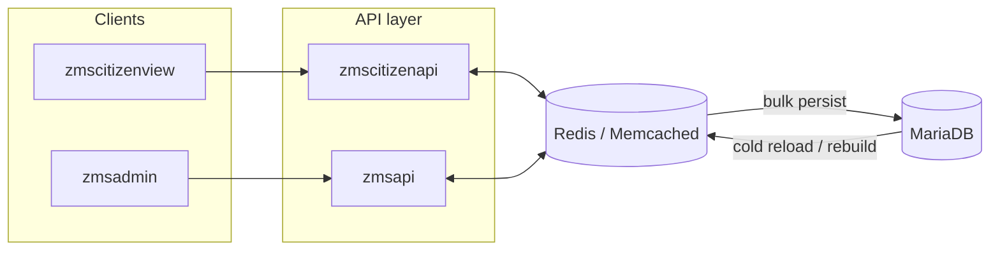

# Dynamic Cache Layer and Bulk Queries for ZMS API

> **Status:** Future concept — not implemented today.  
> **Origin:** [GitHub issue #1203](https://github.com/it-at-m/eappointment/issues/1203)  
> **Related:** Part of the broader RefArch refactor discussed in [issue #730](https://github.com/it-at-m/eappointment/issues/730) and the [product-oriented RefArch roadmap](./product-oriented-refarch-roadmap.md).

## Goal

Reduce the number of API and database round-trips—especially through `zmsapi` and `zmscitizenapi`—by holding appointment-relevant state in a **shared, dynamic cache** instead of querying the database for every slot lookup, reservation, confirmation, or cancellation.

Today, only a few relatively static `GET` endpoints are cached (for example `GET offices-and-services`). Calendar data, reservations, preconfirmed/confirmed statuses, and deletions are still resolved through repeated per-request database access.

## Proposed approach

Introduce a **highly dynamic cache layer** backed by an external in-memory store such as **Redis** or **Memcached** (or an equivalent managed cache service in production). Application services read and write hot path data in that layer first; the database receives **occasional bulk writes** rather than many small, synchronous queries.

Within `zmscitizenapi`, multiple related updates—calendar views, reservations, preconfirmed/confirmed transitions, deletions—would be grouped and flushed in **bulk operations** where possible. Slot bookings and cancellations, as well as the current calendar snapshot, would live in the cache until persisted.

## Challenge: shared, up-to-date cache

Opening hours and availability can change at runtime—for example when staff edit schedules in `zmsadmin` or when **cronjobs** recalculate slots. `zmscitizenapi` and `zmsapi` therefore need a **shared cache** that reflects those changes consistently and quickly.

Possible directions:

- **Unified cache namespace** with explicit invalidation or versioning when admin or cron-driven changes occur.
- **Event-driven invalidation** (publish/subscribe on the cache bus or message queue) so all API instances drop or refresh affected keys together.
- **Longer term:** merge `zmscitizenapi` and `zmsapi` into a **single unified API** behind one gateway, reducing split-brain cache ownership (see the [RefArch roadmap](./product-oriented-refarch-roadmap.md)).

## Expected benefits

- **Fewer database queries** on the citizen booking hot path.
- **Faster propagation** of admin-side changes when slot logic runs in the cache layer and is flushed in one bulk write.
- **Better horizontal scalability** for peak booking load, assuming cache nodes are sized and replicated appropriately.
- **Foundation for RefArch migration**, where Spring Boot services commonly integrate Redis or similar stores for session, entity, and computed-state caching.

## Technology notes

| Concern                 | Direction                                                                                                                                                                                                                                               |
| ----------------------- | ------------------------------------------------------------------------------------------------------------------------------------------------------------------------------------------------------------------------------------------------------- |
| **Cache backend**       | Redis or Memcached (or managed equivalent) as the shared external store—not only per-process PHP file caches.                                                                                                                                           |
| **Consistency**         | Define TTLs, invalidation rules, and bulk-write boundaries per domain (calendar, reservation, scope).                                                                                                                                                   |
| **Failure mode**        | Document fallback to database reads if the cache is unavailable; avoid silent stale reads for booking-critical data.                                                                                                                                    |
| **RefArch alignment**   | Spring Boot microservices often use Redis for distributed caching; see community write-ups on [in-memory caching for Spring Boot microservices](https://medium.com/@sachin2713/in-memory-caching-solutions-for-spring-boot-microservices-4c14789abae3). |
| **Operations at scale** | Large deployments typically use dedicated cache tiers separate from application servers; a similar separation applies here.                                                                                                                             |

## Out of scope for this concept

- Replacing MariaDB as the system of record.
- Removing existing cronjobs without a defined cache warm-up and invalidation strategy.
- Choosing Redis vs Memcached in production—that decision belongs to infrastructure sizing, ops tooling, and the RefArch target runtime.

## Next steps (when prioritized)

1. Measure current `zmsapi` / `zmscitizenapi` query volume and latency on representative booking flows.
2. Identify cache key shapes and invalidation triggers (scope changes, opening hours, holidays, process updates).
3. Prototype Redis (or Memcached) integration on one read-heavy path with metrics before widening scope.
4. Align with the [database naming refactor](./database-refactor/standardize-database-table-and-field-naming.md) and RefArch backend consolidation so cache boundaries match future service boundaries.
