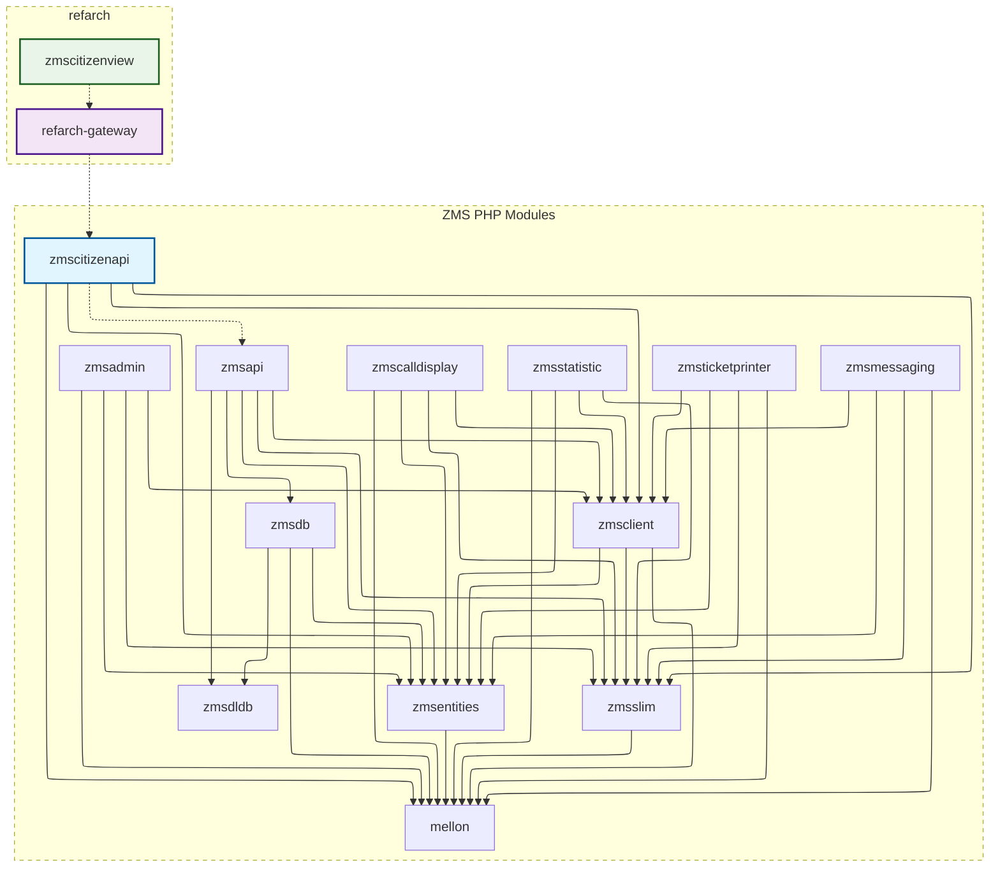
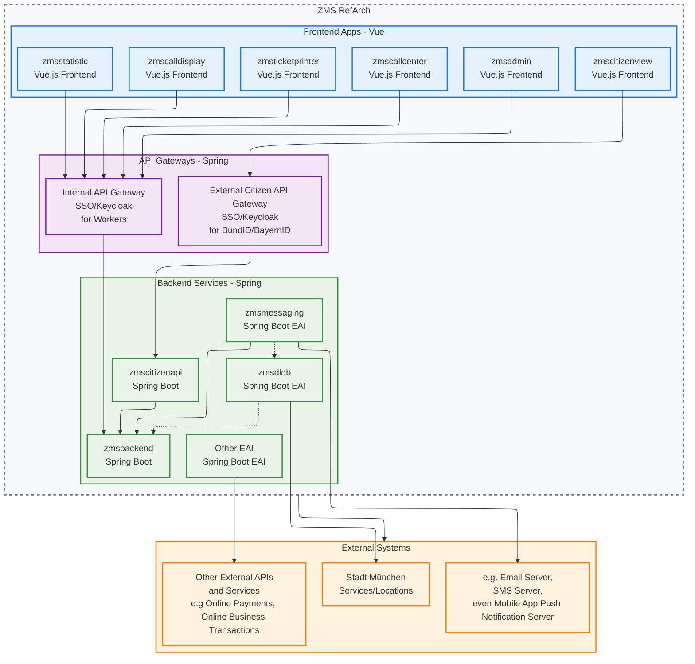

# Define Product-Oriented RefArch Roadmap: Modernize ZMS Architecture (3-5 Year Plan)

## Introduction

ZMS is evolving from a project-driven PHP stack into a long-lived, product-oriented platform. To support multi-year maintainability, faster delivery, and clearer ownership, we propose a reference architecture ([RefArch](https://refarch.oss.muenchen.de/)) that standardizes technology choices, runtime topology, and integration patterns across all modules.

https://refarch.oss.muenchen.de/

https://github.com/it-at-m/refarch
https://github.com/it-at-m/refarch-templates

This roadmap aligns business outcomes with technical execution: consolidating core capabilities into a single Spring Boot backend service (zmsbackend), introducing API Gateways for clear inbound boundaries, modernizing all frontends to Vue.js, and isolating EAI concerns (messaging, external data flows) as dedicated services. The end state reduces cognitive load, improves security and operability, and enables teams to scale work independently without fragile cross-coupling.

Key drivers:

- Product orientation and domain ownership
- Reduced tech debt and consistent developer experience
- Unified UX across internal and citizen-facing apps
- Stronger security posture at gateway boundaries
- Observability by default (logs, metrics, traces, SLOs)
- Predictable releases via automated testing and CI/CD
- Clear separation of concerns (core vs. EAI integrations)
- Long-term viability for 3–5 years with incremental migration paths
- Reusability by other cities and government entities

## Current Dependency Graph Architecture

`zmscitizenview` and `refarch-gateway` are built on top of `zmscitizenapi`, but they do not directly pull dependencies from it. Similarly, while `zmscitizenapi` sends requests to `zmsapi`, `zmsapi` is not a direct dependency of `zmscitizenapi`.

## Future Architecture (3-5 Years)

The following diagram shows the planned future architecture after refactoring to RefArch standards:

### Key Architectural Changes:

- **Frontend Modernization**: All frontend modules converted to Vue.js applications
- **API Gateway Pattern**: Separate gateways for internal and citizen-facing applications
- **Backend Refactoring**: Core services migrated to Spring Boot (zmsbackend)
- **EAI Services**: zmsmessaging and zmsdldb as dedicated Spring Boot EAI services
- **External Integration**: zmsdldb handles Stadt München services/locations mapping
- **Microservices Architecture**: Clear separation of concerns with dedicated services

### Key Architectural Changes:

- **Frontend Modernization**: All frontend modules converted to Vue.js applications
- **API Gateway Pattern**: Separate gateways for internal and citizen-facing applications
- **Backend Refactoring**: Core services migrated to Spring Boot consolidates: `zmsapi`, `zmsdb`, `zmsclient`, `zmsentities`, `zmsslim`, `mellon` -> (`zmsbackend`)
- **zmsmessaging**: Dedicated EAI service for notifications
- **zmsdldb**: EAI service for Stadt München data integration with `zmsdldbmapper`. Even possible to add other mappers for other cities.
- **Microservices Architecture**: Clear separation of concerns with dedicated services

### Key Architectural Transformations

| **Aspect**               | **Current State**        | **Target State**             | **Benefits**                        |
| ------------------------ | ------------------------ | ---------------------------- | ----------------------------------- |
| **Frontend**             | Mixed PHP/Twig templates | Vue.js SPA applications      | Modern UX, better maintainability   |
| **API Layer**            | Direct service calls     | RefArch API Gateways         | Centralized security, monitoring    |
| **Backend**              | PHP monolith             | Spring Boot microservices    | Better scalability, maintainability |
| **EAI**                  | Integrated messaging     | Dedicated EAI services       | Clear separation of concerns        |
| **External Integration** | Direct database access   | Service-oriented integration | Better data governance              |

### Implementation Effort Estimation

| **Component**                                                                       | **Task**                                      | **Estimation** | **Difficulty** |
| ----------------------------------------------------------------------------------- | --------------------------------------------- | -------------- | -------------- |
| `zmsdldbmapper`                                                                     | Open Source Stellung                          | 4 Weeks        | Medium         |
| `zmsdldbmapper`, `zmsdldb`                                                          | One Module to Spring Boot EAI                 | 8 Weeks        | Medium         |
| `zmsmessaging`                                                                      | To Spring Boot EAI                            | 4 Weeks        | Easy           |
| `zmsdeployment`                                                                     | Open Source Stellung                          | 8 Wochen       | Hard           |
| `zmscallcenter`                                                                     | Neue Vue/Vuetify UI + API Gateway mit SSO     | 8 Weeks        | Easy           |
| `zmscalldisplay`                                                                    | Refactor zu Vue/Vuetify + API Gateway         | 4 Weeks        | Easy           |
| `zmsticketprinter`                                                                  | Refactor zu Vue/Vuetify + API Gateway         | 4 Weeks        | Easy           |
| `zmsstatistic`                                                                      | Refactor zu Vue/Vuetify + API Gateway mit SSO | 8 Weeks        | Medium         |
| `zmsadmin`                                                                          | Refactor zu Vue/Vuetify + API Gateway mit SSO | 9–12 Months    | Very Hard      |
| `zmsdb`, `zmsentities`, `zmsapi`, `zmscitizenapi`, `mellon`, `zmsclient`, `zmsslim` | Backend-Refactor zu Spring Boot (RefArch)     | 18-24 Months   | Very Hard      |

\*The raw estimation for the development does not include UI/UX, Planning, Testing etc.

#### Related Issues

- [ZMSKVR-685](https://jira.muenchen.de/browse/ZMSKVR-685) - Test automation setup
- [ZMSKVR-686](https://jira.muenchen.de/browse/ZMSKVR-686) - Test automation implementation
- [ZMSKVR-795](https://jira.muenchen.de/browse/ZMSKVR-795) - CalendarView refactoring
- [#1427](https://github.com/it-at-m/eappointment/issues/1427) - Database standardization
