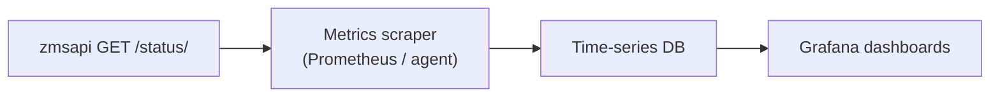

# Monitoring and status endpoint

Operations teams monitor ZMS in production using **open-source observability tools**. The City of Munich lists [Grafana](https://opensource.muenchen.de/software/grafana.html) among its approved OSS stack for visualizing metrics in real time; deployments typically pair Grafana with a metrics backend (for example Prometheus) and optional log aggregation for JSON application logs.

This page describes what ZMS exposes for that kind of monitoring and how it fits together with [Monolog logging](./monolog-logging.md).

## Status endpoint (`GET /status/`)

`zmsapi` serves operational metrics at:

```http
GET /terminvereinbarung/api/2/status/
```

(Adjust host and API base path to your environment.)

The response follows [`status.json`](https://github.com/it-at-m/eappointment/blob/main/zmsentities/schema/status.json). ReDoc: [zmsapi API reference](./api-reference.md).

### Query parameter: `includeProcessStats`

| Value         | Behaviour                                                                                        |
| ------------- | ------------------------------------------------------------------------------------------------ |
| `1` (default) | Full payload including `processes` aggregates (extra DB work)                                    |
| `0`           | Skips process aggregates — faster for simple **health checks** (DB cluster, mail queue, version) |

Use `includeProcessStats=0` for high-frequency liveness probes; use `1` for dashboards that track appointment volumes.

### Example (process stats enabled)

```bash
curl -s "https://<host>/terminvereinbarung/api/2/status/?includeProcessStats=1" | jq '.data.processes'
```

### `processes` metrics (high level)

Counts are for non-follow-up rows in `buerger` (`istFolgeterminvon` empty), same filter as the status SQL.

| Field                                                                                  | Meaning                                                           |
| -------------------------------------------------------------------------------------- | ----------------------------------------------------------------- |
| `confirmed`, `reserved`, `called`, `parked`, `missed`, `deleted`, `blocked`, `pending` | Count per `buerger.status`                                        |
| `withExternalUserId`                                                                   | Processes with OIDC / citizen `external_user_id` set (any status) |
| `confirmedWithExternalUserId`                                                          | Confirmed appointments linked to an external user (set on appointment update in `zmscitizenapi`, after reservation) |
| `sinceMidnight`, `last7days`, `lastInsert`                                             | Booking activity (not a total of all processes)                   |
| `outdated`, `outdatedOldest`, `freeSlots`, `lastCalculate`                             | Slot maintenance (added when stats are included)                  |

OIDC-linked counts help track adoption of citizen login and “my appointments” flows (`zmscitizenapi`).

### Other sections

| Section                                                                | Use in monitoring                         |
| ---------------------------------------------------------------------- | ----------------------------------------- |
| `database.nodeConnections`, `database.locks`, `database.clusterStatus` | DB pressure and cluster health            |
| `database.problems`                                                    | Configuration warnings (non-empty string) |
| `mail.queueCount`, `mail.oldestSeconds`                                | Outbound mail backlog                     |
| `sources.dldb.last`                                                    | Last DLDB import                          |
| `useraccounts.activeSessions`                                          | Logged-in admin users (when present)      |
| `version`                                                              | Deployed API version                      |

## Grafana and real-time dashboards

A typical setup:

1. **Scrape** `GET /status/` on an interval (Prometheus `json_exporter`, custom script, or agent that parses JSON).
2. **Expose** numeric fields as time series (for example `zms_processes_confirmed`, `zms_mail_queue_oldest_seconds`).
3. **Visualize** in [Grafana](https://opensource.muenchen.de/software/grafana.html) with alerts on thresholds (mail backlog, `nodeConnections`, zero `clusterStatus`, etc.).

ZMS does not ship ready-made Grafana dashboards in this repository; each environment defines targets, intervals, and alert rules. The status payload is stable JSON intended for that integration.



## Logs vs metrics

| Signal                                    | Source                            | Typical tool                         |
| ----------------------------------------- | --------------------------------- | ------------------------------------ |
| **Metrics** (counts, queues, DB load)     | `GET /status/`                    | Grafana + Prometheus (or equivalent) |
| **Structured logs** (errors, audit, cron) | `App::$log` JSON on stderr/stdout | Loki, ELK, or platform log drain     |

See [Monolog logging](./monolog-logging.md) for log levels, `DEBUGLEVEL`, and the generated log call inventory.

## Related

- [API reference](./api-reference.md) — ReDoc for `zmsapi` and `zmscitizenapi`
- [Monolog logging](./monolog-logging.md) — application logging
- Implementation: `zmsapi/src/Zmsapi/StatusGet.php`, `zmsdb/src/Zmsdb/Status.php`
