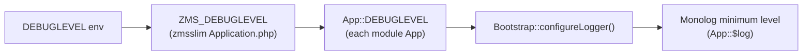

# Monolog logging (zmsslim)

ZMS applications use a single PSR-3 logger on the global `App` class: **`App::$log`**. It is configured in [`zmsslim`](https://github.com/it-at-m/eappointment/tree/main/zmsslim) by `BO\Slim\Bootstrap` and shared by all Slim-based modules (`zmsapi`, `zmsadmin`, `zmscitizenapi`, …).

The **minimum log level** is also centralized in zmsslim: you set **`DEBUGLEVEL`** once in the environment; zmsslim exposes it as **`ZMS_DEBUGLEVEL`**, and every module’s `App::DEBUGLEVEL` inherits that value for `Bootstrap::configureLogger()`.

## Quick reference

| Topic                   | Detail                                                                                |
| ----------------------- | ------------------------------------------------------------------------------------- |
| Logger property         | `App::$log` (`Monolog\Logger`, `null` before bootstrap)                               |
| Env variable            | `DEBUGLEVEL` (e.g. in `.env`, DDEV, deployment) — default `INFO`                      |
| zmsslim define          | `ZMS_DEBUGLEVEL` — set in `Application.php` from `getenv('DEBUGLEVEL')`               |
| App constant            | `App::DEBUGLEVEL` — each module inherits `ZMS_DEBUGLEVEL` from `\BO\Slim\Application` |
| Effective minimum level | Whichever of the above applies after bootstrap (`App::DEBUGLEVEL` at runtime)         |
| Web bootstrap           | `\BO\Slim\Bootstrap::init()`                                                          |
| CLI / cron              | `\BO\Slim\Bootstrap::ensureLogger()` or `initForCli()` via `script_bootstrap.php`     |
| Output                  | JSON lines to **stderr** (web) or **stdout** (CLI/cron)                               |
| Do not use              | PHP `error_log()`, `print_r()`, `echo` for application logging                        |

## Central debug level (`ZMS_DEBUGLEVEL`)

zmsslim owns the debug-level wiring for **all** Slim modules. You do not configure a separate log level per module in production; one environment variable applies everywhere that bootstraps through `\BO\Slim\Bootstrap`.



1. **Operations** set `DEBUGLEVEL` (for example `INFO` or `WARNING`) in `.env`, DDEV, or deployment config.
2. When `zmsslim/src/Slim/Application.php` is loaded, it defines **`ZMS_DEBUGLEVEL`** from that env var (default `INFO` if unset).
3. `\BO\Slim\Application` declares **`const DEBUGLEVEL = ZMS_DEBUGLEVEL`**. Each module’s `class App extends \BO\Zmsapi\Application` (etc.) inherits the same constant unless you override it locally.
4. On bootstrap, **`Bootstrap::init()`** / **`ensureLogger()`** / **`initForCli()`** call **`configureLogger(App::DEBUGLEVEL, App::IDENTIFIER)`**. The level is shared; only **`App::IDENTIFIER`** and **`App::MODULE_NAME`** differ per module in the JSON output.

So **`ZMS_DEBUGLEVEL` is the single zmsslim source of truth** for how verbose logging is across zmsapi, zmsadmin, zmscitizenapi, zmsmessaging, cron scripts, and the other Slim apps.

**What you configure:** `DEBUGLEVEL` in the environment (not a separate `ZMS_DEBUGLEVEL` env name).

**What code reads at runtime:** `App::DEBUGLEVEL` (backed by `ZMS_DEBUGLEVEL`).

**Rare override:** a module `config.php` may redefine `const DEBUGLEVEL = 'WARNING';` for local experiments only — avoid this in shared deployment config.

**CLI fallback:** if `App::DEBUGLEVEL` is not defined yet, `Bootstrap::initForCli()` reads `getenv('DEBUGLEVEL')` directly.

## Log levels

`App::DEBUGLEVEL` (from `ZMS_DEBUGLEVEL`) sets the **minimum** level written by Monolog. Messages below that level are dropped.

| `DEBUGLEVEL` env / constant | Monolog constant    | Typical use in ZMS                                   |
| --------------------------- | ------------------- | ---------------------------------------------------- |
| `DEBUG`                     | `Logger::DEBUG`     | Verbose diagnostics (mail payloads, cache details)   |
| `INFO`                      | `Logger::INFO`      | Normal operations (login, cron progress, cache hits) |
| `NOTICE`                    | `Logger::NOTICE`    | Notable but expected events                          |
| `WARNING`                   | `Logger::WARNING`   | Recoverable problems (rate limits, skipped entities) |
| `ERROR`                     | `Logger::ERROR`     | Failures that need attention                         |
| `CRITICAL`                  | `Logger::CRITICAL`  | Severe errors (unhandled exceptions in Twig handler) |
| `ALERT`                     | `Logger::ALERT`     | Rare; same scale as Monolog                          |
| `EMERGENCY`                 | `Logger::EMERGENCY` | Rare; same scale as Monolog                          |

Implementation mapping lives in `zmsslim/src/Slim/Bootstrap.php` (`$debuglevels` and `parseDebugLevel()`).

### Example configuration

```bash
# .env / deployment / DDEV — applies to all Slim modules via zmsslim
DEBUGLEVEL=INFO
```

Definition in `zmsslim/src/Slim/Application.php`:

```php
define('ZMS_DEBUGLEVEL', getenv('DEBUGLEVEL') ? getenv('DEBUGLEVEL') : 'INFO');
const DEBUGLEVEL = ZMS_DEBUGLEVEL;
```

Invalid values fall back to **DEBUG** (permissive) in `Bootstrap::parseDebugLevel()`.

## How to log

After `bootstrap.php` or `script_bootstrap.php`:

```php
\App::$log->info('Login successful', [
    'account' => $accountName,
]);

\App::$log->warning('Could not remove availability', [
    'availabilityId' => $availabilityId,
]);

\App::$log->error('SQL import failed', [
    'file' => basename($file),
    'exception' => $e->getMessage(),
]);
```

Use **lowercase** PSR-3 method names: `debug`, `info`, `notice`, `warning`, `error`, `critical`, `alert`, `emergency`.

### Context arrays

Prefer structured context (second argument) over string concatenation. The JSON processor adds standard fields:

- `time_local`, `client_ip`, `remote_addr`
- `application` (`App::IDENTIFIER`)
- `module` (`App::MODULE_NAME`)
- `cron`, `cron_name` when `ZMS_CRON_LOG` / `ZMS_CRON_NAME` are set in cron shell scripts

### Cron logging

Cron entrypoints export `ZMS_CRON_LOG=1` and `ZMS_CRON_NAME=zmsapi_hourly` (example). `Bootstrap::isCronLogging()` adds searchable `cron` / `cron_name` fields to each JSON line.

Helpers such as `zmsdb`’s `VerboseCronLogTrait` use `Bootstrap::normalizeLogLevelName()` for configurable cron verbosity.

### Libraries without full bootstrap

Shared packages (`zmsdldb`, `zmsclient`) may run without `App`. Use optional logging only when the class exists:

```php
if (class_exists('\App', false) && isset(\App::$log)) {
    \App::$log->error('…', ['context' => $value]);
}
```

Do **not** use `isset(\App::$log)` alone — PHP will fatal if `App` is not loaded.

## JSON log shape (example)

```json
{
  "time_local": "2026-05-26T12:00:00+02:00",
  "client_ip": "127.0.0.1",
  "application": "zmsapi",
  "module": "zmsapi",
  "cron": true,
  "cron_name": "zmsapi_hourly",
  "message": "Migration check finished",
  "level": "INFO",
  "context": { "pending": 0 },
  "extra": []
}
```

## Repository log inventory

The table below is **generated automatically** from `App::$log->…` calls in module PHP sources (excluding `vendor/` and `tests/`). Regenerate locally:

```bash
cd docs && npm run docs:log-inventory
```

It updates when you run `npm run docs:dev` or `docs:build` (VitePress config runs the generator first). Use the dropdown filters, search box, or **click a column header** to sort (toggle ascending/descending).

<LogInventory />

## Related

- [Monitoring and status](./monitoring-and-status.md) — `GET /status/` metrics and Grafana

## Related code

- `zmsslim/src/Slim/Application.php` — `ZMS_DEBUGLEVEL`, `DEBUGLEVEL`, `public static $log`
- `zmsslim/src/Slim/Bootstrap.php` — `configureLogger()`, `ensureLogger()`, `normalizeLogLevelName()`
- `zmsslim/README.md` — Slim bootstrap overview
