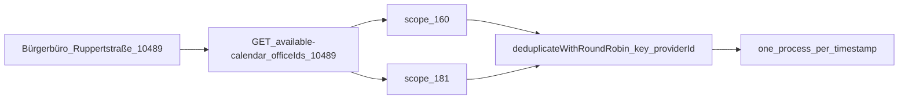
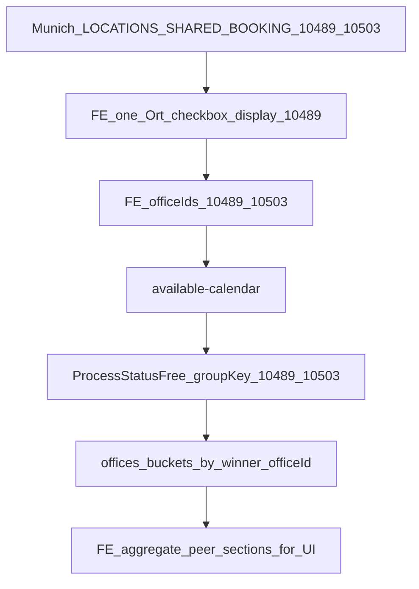
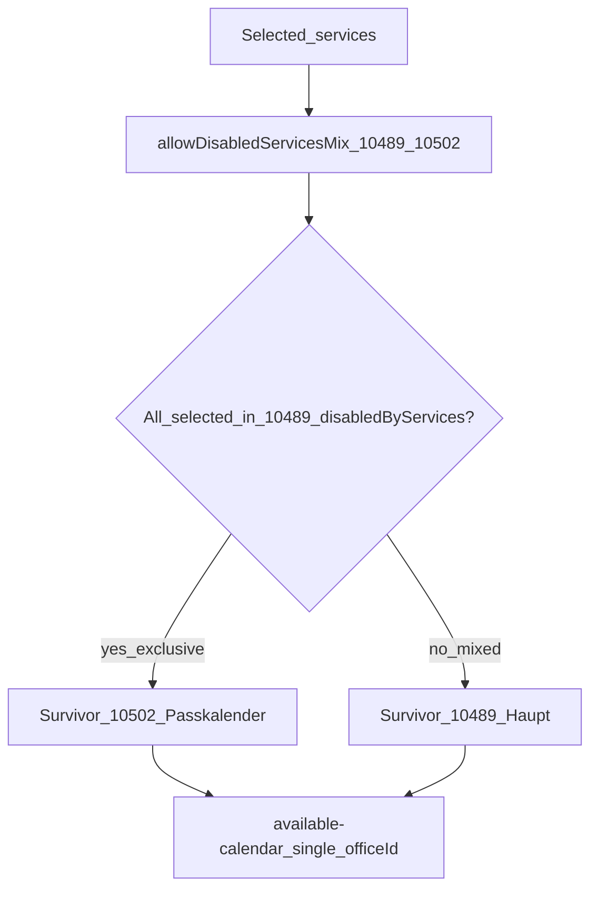
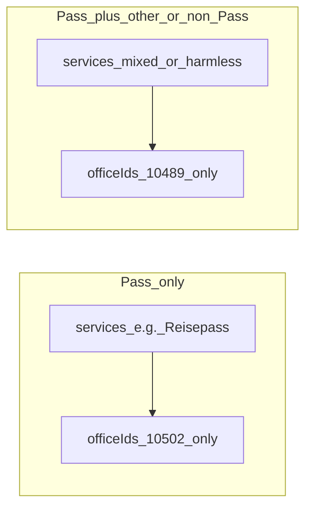
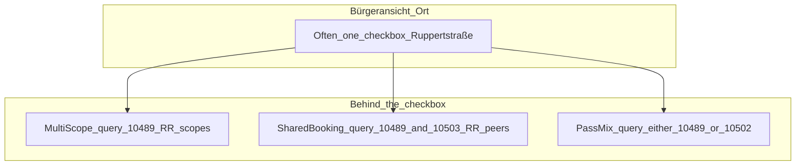

# Ruppertstraße booking variants (ZMSKVR-1046)

Citizen booking at Bürgerbüro Ruppertstraße uses three different models. They look similar in the UI (often one Ort checkbox) but differ in **which OfficeIDs are queried** and **how free slots are chosen**.

| Variant                     | OfficeIDs         | Ort UI  | Calendar `officeIds`      | Slot pick                                                                                                |
| --------------------------- | ----------------- | ------- | ------------------------- | -------------------------------------------------------------------------------------------------------- |
| Multi-scope (one office)    | `10489`           | One Ort | That OfficeID only        | Backend RR across **scopes** of the same provider                                                        |
| Shared booking (Ausbildung) | `10489` + `10503` | One Ort | **Both** peer OfficeIDs   | Backend RR across scopes of **all peers** when timestamps overlap (`sharedBookingOfficeIds`)             |
| Pass exclusive/mixed        | `10489` + `10502` | One Ort | **One** survivor OfficeID | FE picks exclusive (`10502`) vs mixed (`10489`) via `allowDisabledServicesMix` — **not** pooled capacity |

Configuration lives in [`zmsdldb/.../Munich.php`](https://github.com/it-at-m/eappointment/blob/main/zmsdldb/src/Zmsdldb/Transformers/Munich.php):

- `DONT_SHOW_LOCATION_BY_SERVICES` → `disabledByServices` (Pass services hidden on Haupt `10489`)
- `LOCATIONS_ALLOW_DISABLED_MIX` → `allowDisabledServicesMix` (`[10489, 10502]`)
- `LOCATIONS_SHARED_BOOKING` → `sharedBookingOfficeIds` (`[10489, 10503]`)

Local test data: Flyway `V19` (Ruppertstraße opening hours), `V24` (Ausbildung scope `372` / OfficeID `10503`), SADB overwrite for `10503`.

---

## Overview

```mermaid
flowchart TB
  subgraph multiScope [MultiScope_oneOffice]
    MS_Ort[Ort_10489]
    MS_Cal[available-calendar_officeIds_10489]
    MS_RR[ProcessStatusFree_RR_by_providerId]
    MS_Ort --> MS_Cal --> MS_RR
  end

  subgraph sharedBooking [SharedBooking_twoOffices]
    SB_Ort[Ort_display_10489]
    SB_Cal[available-calendar_officeIds_10489_and_10503]
    SB_RR[ProcessStatusFree_RR_by_sharedBookingOfficeIds]
    SB_UI[FE_merge_peer_buckets_for_display]
    SB_Ort --> SB_Cal --> SB_RR --> SB_UI
  end

  subgraph passMix [PassExclusiveMixed]
    PM_Ort[Ort_one_survivor]
    PM_Pick[FE_exclusive_10502_or_mixed_10489]
    PM_Cal[available-calendar_one_officeId]
    PM_Ort --> PM_Pick --> PM_Cal
  end
```

---

## 1. Multi-scope at one office (`10489`)

Haupt office `10489` has multiple scopes (e.g. WB04 `160`, WB03 `181`). The citizen still selects **one** Ort. The calendar requests that OfficeID. Free processes from several scopes that share the same wall-clock time are reduced to **one** process by backend round-robin keyed by **`providerId + timestamp`**.

**Fairness:** RR is per **scope** (sorted by scope id). More scopes under the same office → that office’s scopes appear more often in the rotation.

---

## 2. Shared booking / shared calendar (`10489` + `10503`)

Ausbildung OfficeID `10503` (local test Standort `372`) overlaps Haupt services (e.g. Wohnsitzanmeldung). Product goal: **one Ort**, **pooled capacity**.

1. DLDB sets `sharedBookingOfficeIds: [10489, 10503]` on both providers.
2. Bürgeransicht collapses peers to one checkbox (display office = lowest id, `10489`).
3. Checking that Ort expands **both** IDs into `available-calendar`.
4. Backend RR keys by sorted peer ids (`10489,10503`) + timestamp when the flag is present on provider data — overlapping times keep **one** winner office/scope.
5. Non-overlapping times still appear under different `offices[]` buckets; the UI merges those buckets into one timeslot list for display. Booking uses the officeId that owns the chosen timestamp.

**Not the same as Pass mix:** both OfficeIDs stay in the calendar request; capacity is pooled, not routed exclusively.

---

## 3. Pass calendar exclusive vs mixed (`10489` + `10502`)

Passkalender `10502` and Haupt `10489` share the Ort label but use **`allowDisabledServicesMix`**. Pass-only services are on `disabledByServices` for `10489`. The UI keeps mix peers, then picks **one** survivor:

- **Exclusive** (only Pass-disabled services selected) → `10502`
- **Mixed** (anything else / harmless combo) → `10489`

Calendar and reserve use **that one** OfficeID. The other office does not contribute slots for that booking.

---

## Comparison: what the citizen sees vs what is queried

| Question                                | Multi-scope               | Shared booking                 | Pass mix                      |
| --------------------------------------- | ------------------------- | ------------------------------ | ----------------------------- |
| Same wall-clock on two scopes/offices?  | RR keeps one scope        | RR keeps one peer office/scope | N/A — only one office queried |
| Both OfficeIDs in `available-calendar`? | No                        | Yes                            | No                            |
| FE merges `offices[]` for display?      | Usually one office bucket | Yes (peer buckets)             | No need                       |

---

## Related code

- DLDB: `zmsdldb/src/Zmsdldb/Transformers/Munich.php`
- Backend RR: `zmsbackend/.../ProcessStatusFree.php` (`resolveRoundRobinGroupKey`, `deduplicateWithRoundRobin`)
- Bürgeransicht Ort / expand / merge: `zmscitizenview/.../AppointmentSelection.vue`
- Mapping: `zmscitizenapi/.../MapperService.php`
- Contract: [DLDB Interface Documentation](./dldb-interface-documentation.md)
