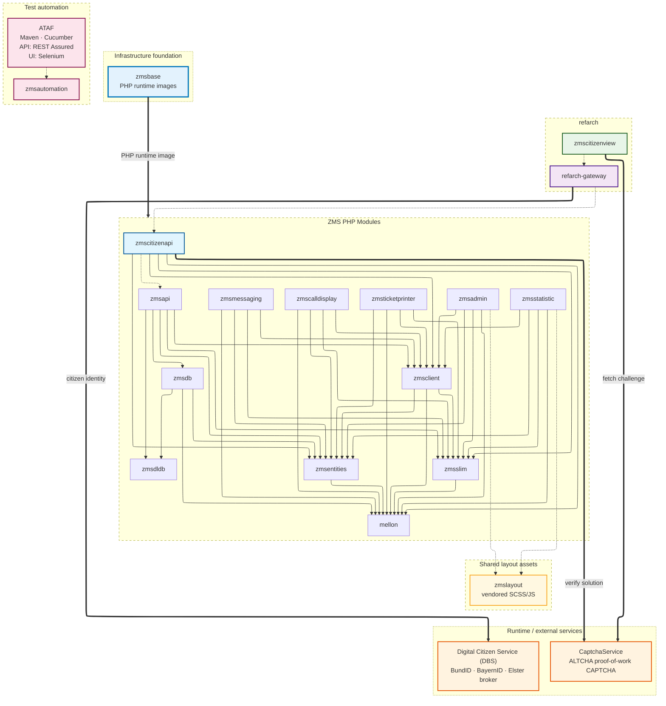

# Dependency Graph

`zmscitizenview` and `refarch-gateway` are built on top of `zmscitizenapi`, but they do not directly pull dependencies from it. Similarly, while `zmscitizenapi` sends requests to `zmsapi`, `zmsapi` is not a direct dependency of `zmscitizenapi`.

The graph also shows the runtime services every deployment depends on:

- `zmsbase` — pre-built PHP runtime images for every PHP module (see [PHP Base Images](../php-base-images)).
- `Digital Citizen Service (DBS)` — Munich's open-source citizen identity broker for BundID, BayernID and Elster, reached at the `refarch-gateway` layer (see [it-at-m/dbs](https://it-at-m.github.io/dbs/)).
- `CaptchaService` — Munich's open-source ALTCHA-based proof-of-work CAPTCHA service that gates the citizen booking flow against bot scraping. Fetched by `zmscitizenview` to render the challenge and called by `zmscitizenapi` to verify the solution (see [it-at-m/captchaservice](https://it-at-m.github.io/captchaservice/)).
- `zmsautomation` — Maven-based acceptance tests on **[ATAF](https://it-at-m.github.io/agile-test-automation-framework/)** (Agile Test Automation Framework; artifacts `de.muenchen.ataf`): Cucumber scenarios with **REST Assured** for API tests and **Selenium** (via [ATAF](https://it-at-m.github.io/agile-test-automation-framework/) web) for UI tests. Not a Composer dependency of the PHP modules; it drives HTTP/browser flows against deployed instances (see [`zmsautomation/README.md`](https://github.com/it-at-m/eappointment/blob/main/zmsautomation/README.md)).

**Reading the edges**

- Solid arrow (`A --> B`): A has B as a code dependency (composer).
- Dashed arrow (`A -.-> B`): build / integration dependency, or npm `file:` dependency (for example `zmsadmin` → `zmslayout`). A is built and deployed on top of B but does not pull it as a Composer dependency.
- Thick arrow (`A ==> B`): runtime / infrastructure dependency. A talks to B at runtime, or B provides A's runtime environment.

In the **Test automation** subgraph only, the dashed edge **`ataf -.-> zmsautomation`** reads as _framework → consumer_ ([ATAF](https://it-at-m.github.io/agile-test-automation-framework/) supplies Cucumber plus REST Assured for API and Selenium for UI to `zmsautomation`), not as the Composer-style “A built on B” rule above.

## Frontend vs Backend Modules

### Frontend

- `zmscitizenview`: Vue3 citizen-facing booking frontend built on [RefArch](https://refarch.oss.muenchen.de).
- `refarch-gateway`: frontend gateway/BFF layer used by `zmscitizenview`.
- `zmsadmin`: administration UI module (with backend/API integration).
- `zmsstatistic`: statistics/reporting UI module (with backend/API integration).
- `zmscalldisplay`: call display UI module.
- `zmsticketprinter`: ticket printer UI/runtime module.

### Shared layout assets

- `zmslayout`: vendored Berlin Online layout SCSS and JavaScript (`bo-zms-layout-js`, `bo-zms-layout-scss`), shared by `zmsadmin` and `zmsstatistic` via npm `file:` dependencies. `zmscalldisplay` and `zmsticketprinter` use their own PHP/Twig UI stacks and do not depend on `zmslayout` today. A RefArch/Vue refactor of `zmsadmin`, `zmsstatistic`, and the other internal PHP frontends (see [Product-Oriented RefArch Roadmap](/on-the-future/product-oriented-refarch-roadmap)) would replace `zmslayout` with Vue/Vuetify rather than extending it.

`zmscitizenview` follows the RefArch reference architecture patterns and uses `refarch-gateway` as its gateway layer.
This means requests from `zmscitizenview` are routed through `refarch-gateway` before they reach `zmscitizenapi`.
For gateway behavior and security/routing details, see the RefArch API Gateway docs: [RefArch API Gateway](https://refarch.oss.muenchen.de/gateway.html).

### Backend APIs and Core Services

- `zmscitizenapi`: API layer for citizen booking flows, mapping backend entities into thinned frontend DTOs.
- `zmsapi`: core backend API for process, queue, appointment, and administration flows.
- `zmsdb`: database access/query layer for providers/requests/processes.
- `zmsdldb`: importer/transformer for external DLDB/SADB sources.
- `zmsclient`: HTTP/API client abstractions used between modules.
- `zmsslim`: shared Slim framework layer/helpers.
- `zmsmessaging`: messaging/notification backend module.
- `mellon`: shared base/library dependency used by multiple backend modules.

### Shared Across Frontend-Facing and Backend PHP Modules

- `zmsentities`: shared domain/entity model used by both frontend-facing PHP modules and backend PHP modules.

### Test automation

- `zmsautomation`: Maven module; **REST Assured** for API tests and **Selenium** ([ATAF](https://it-at-m.github.io/agile-test-automation-framework/) web) for UI tests, both driven by Cucumber under **[ATAF](https://it-at-m.github.io/agile-test-automation-framework/)** (`de.muenchen.ataf`). Not part of the Composer graph — it validates running deployments (CI [`zmsautomation-workflow`](https://github.com/it-at-m/eappointment/blob/main/.github/workflows/zmsautomation-workflow.yaml), local [`zmsautomation-test`](https://github.com/it-at-m/eappointment/blob/main/zmsautomation/zmsautomation-test)). Typical targets include `zmsapi`, `zmscitizenapi`, and browser flows against `zmsadmin`, `zmscitizenview`, `zmsstatistic`, and `refarch-gateway`.

### Runtime Services and Infrastructure

These are not pulled as code dependencies but are required at deploy/runtime.

- `zmsbase`: pre-built PHP runtime images that every PHP module runs on. Detailed dependency view: [PHP Base Images](../php-base-images).
- `Digital Citizen Service (DBS)`: Munich's open-source citizen identity broker for BundID, BayernID and Elster, integrated at the `refarch-gateway` layer ahead of `zmscitizenapi` for the citizen booking flow. See [it-at-m/dbs](https://it-at-m.github.io/dbs/).
- `CaptchaService`: Munich's open-source ALTCHA-based proof-of-work CAPTCHA service. Protects the citizen booking flow against bot scraping — `zmscitizenview` fetches the challenge, `zmscitizenapi` verifies the solution before processing a booking. GDPR-compliant by design (no cookies, no tracking, no third-party calls). See [it-at-m/captchaservice](https://it-at-m.github.io/captchaservice/).
