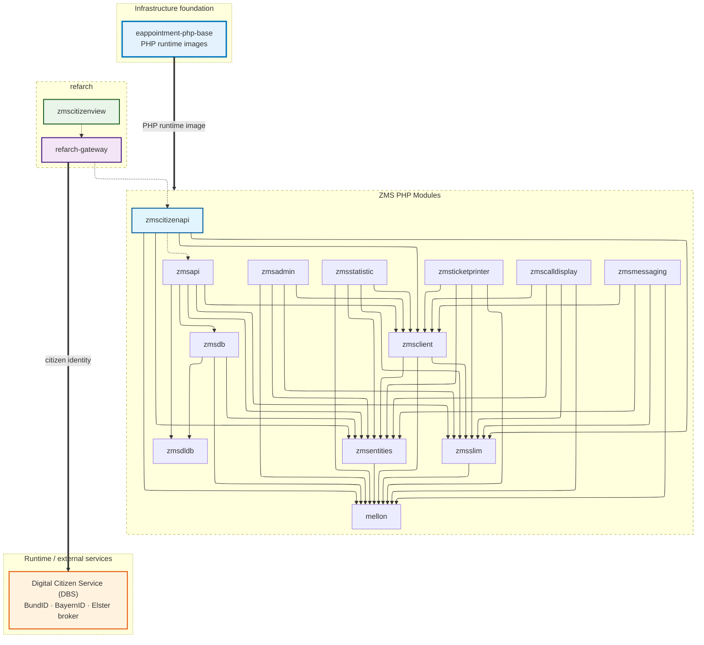

# Dependency Graph

`zmscitizenview` and `refarch-gateway` are built on top of `zmscitizenapi`, but they do not directly pull dependencies from it. Similarly, while `zmscitizenapi` sends requests to `zmsapi`, `zmsapi` is not a direct dependency of `zmscitizenapi`.

The graph also shows the runtime services every deployment depends on:

- `eappointment-php-base` — pre-built PHP runtime images for every PHP module (see [PHP Base Images](../php-base-images)).
- `Digital Citizen Service (DBS)` — Munich's open-source citizen identity broker for BundID, BayernID and Elster, reached at the `refarch-gateway` layer (see [it-at-m/dbs](https://it-at-m.github.io/dbs/)).

**Reading the edges**

- Solid arrow (`A --> B`): A has B as a code dependency (composer).
- Dashed arrow (`A -.-> B`): build / integration dependency. A is built and deployed on top of B but does not pull it as a code dependency.
- Thick arrow (`A ==> B`): runtime / infrastructure dependency. A talks to B at runtime, or B provides A's runtime environment.

## Frontend vs Backend Modules

### Frontend

- `zmscitizenview`: Vue3 citizen-facing booking frontend built on [RefArch](https://refarch.oss.muenchen.de).
- `refarch-gateway`: frontend gateway/BFF layer used by `zmscitizenview`.
- `zmsadmin`: administration UI module (with backend/API integration).
- `zmsstatistic`: statistics/reporting UI module (with backend/API integration).
- `zmscalldisplay`: call display UI module.
- `zmsticketprinter`: ticket printer UI/runtime module.

`zmscitizenview` follows the RefArch reference architecture patterns and uses `refarch-gateway` as its gateway layer.
This means requests from `zmscitizenview` are routed through `refarch-gateway` before they reach `zmscitizenapi`.
For gateway behavior and security/routing details, see the RefArch API Gateway docs: [RefArch API Gateway](https://refarch.oss.muenchen.de/gateway.html).

### Backend APIs and Core Services

- `zmscitizenapi`: API layer for citizen booking flows, mapping backend entities into thinned frontend DTOs.
- `zmsapi`: core backend API for process, queue, appointment, and administration flows.
- `zmsdb`: database access/query layer for providers/requests/processes.
- `zmsdldb`: importer/transformer for external DLDB/SADB sources.
- `zmsclient`: HTTP/API client abstractions used between modules.
- `zmsslim`: shared Slim framework layer/helpers.
- `zmsmessaging`: messaging/notification backend module.
- `mellon`: shared base/library dependency used by multiple backend modules.

### Shared Across Frontend-Facing and Backend PHP Modules

- `zmsentities`: shared domain/entity model used by both frontend-facing PHP modules and backend PHP modules.

### Runtime Services and Infrastructure

These are not pulled as code dependencies but are required at deploy/runtime.

- `eappointment-php-base`: pre-built PHP runtime images that every PHP module runs on. Detailed dependency view: [PHP Base Images](../php-base-images).
- `Digital Citizen Service (DBS)`: Munich's open-source citizen identity broker for BundID, BayernID and Elster, integrated at the `refarch-gateway` layer ahead of `zmscitizenapi` for the citizen booking flow. See [it-at-m/dbs](https://it-at-m.github.io/dbs/).
