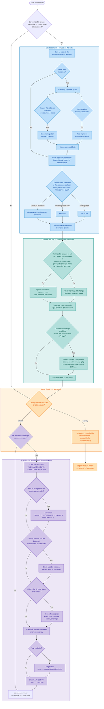

# How do I implement a user story in ZMS?

In any stack — including ZMS — start at the **bottom of the stack** and work upward. In ZMS that bottom is the backend module **`zmsbackend`**.

Before touching citizen view, admin UI, or APIs that only pass data through, ask whether the story needs a backend change at all. If it does, implement as close to the **database layer** as possible first.

## Decision tree


```mermaid
flowchart TD
  start([Start of user story]) --> backend{"Do we need to change<br/>something in the backend<br/><code>zmsbackend</code>?"}
  backend -->|No| frontendFork
  backend -->|Yes| dbLayer

  subgraph databaseLayer ["Database layer — closest to the data"]
    direction TB
    dbLayer[Start as close to the<br/>database layer as possible]
    dbLayer --> migrations{"Do we need<br/>migrations?"}
    migrations -->|No| repos
    migrations -->|Yes| migTypes[Everyday migration types]
    migTypes --> schema{"Change the database<br/>structure?<br/>new columns / tables"}
    migTypes --> data{"Add data into<br/>existing structures?"}
    schema -->|Yes| expandContract[Schema migration<br/>expand / contract]
    data -->|Yes| dataMig[Data migration<br/>in existing schema]
    expandContract --> bothNote[A story can need both]
    dataMig --> bothNote
    bothNote --> repos
    repos[Next: repository conditions<br/><code>Repository</code> folders in <code>zmsbackend</code>]
    repos --> conditions{"Do I need new conditions<br/>in the repository so I can<br/>change or build queries<br/>in the service layer?"}
    conditions -->|Structure migration| alwaysCond[Always yes — add or adapt conditions]
    conditions -->|Data migration only| maybeDataCond[Yes or no]
    conditions -->|No migration| maybeNoMigCond[Yes or no]
    alwaysCond --> serviceLayer[Then compose queries in<br/><code>Service</code> folders]
    maybeDataCond --> serviceLayer
    maybeNoMigCond --> serviceLayer
  end

  serviceLayer --> entitiesQ

  subgraph entitiesLayer ["Entities and API — schema then controllers"]
    direction TB
    entitiesQ{"Do I need to change or add<br/>the JSON schema / model in<br/><code>zmsentities</code> so I can<br/>propagate changes in the<br/>API controller response?"}
    entitiesQ -->|Yes| schemaModel[Update schema in <code>zmsentities</code><br/>later becomes the model]
    entitiesQ -->|No| maybeController[Controller may still change<br/>without a schema change]
    schemaModel --> apiController[Propagate in API controller<br/><code>Api</code> folders in <code>zmsbackend</code>]
    maybeController --> apiController
    apiController --> apiElse{"Do I need to change anything<br/>else in the <code>zmsbackend</code><br/>API layer?"}
    apiElse -->|Yes| apiMore[New controller → register in<br/><code>zmsbackend/routing.php</code><br/>plus request handling, status codes, …]
    apiElse -->|No| apiDone[API layer done for this story]
    apiMore --> apiDone
  end

  apiDone --> frontendFork

  subgraph clientsLayer ["Above the API — which path?"]
    direction TB
    frontendFork{"Legacy frontend modules<br/>or citizen stack?"}
    frontendFork -->|Legacy| legacyMods["zmsadmin · zmsstatistic<br/>zmsticketprinter · zmscalldisplay<br/>zmsmessaging"]
    frontendFork -->|Citizen| citizenApiQ
  end

  legacyMods --> laterLegacy[Legacy module details<br/>— covered in later steps]

  subgraph citizenApiLayer ["Citizen API — zmscitizenapi, still a backend"]
    direction TB
    citizenApiQ{"Do we need to change<br/><code>zmscitizenapi</code>?"}
    citizenApiQ -->|No| citizenViewLater
    citizenApiQ -->|Yes| buildsOn["Calls <code>zmsbackend</code><br/>via ZmsApiClientService<br/>no direct database access"]
    buildsOn --> citizenSchema{"New or changed citizen<br/>schema and model?"}
    citizenSchema -->|Yes| schemaFiles["Schema in<br/><code>zmsentities/schema/citizenapi/</code><br/>model in <code>Models/</code>"]
    citizenSchema -->|No| servicesQ
    schemaFiles --> servicesQ{"Change how we call the backend,<br/>map entities, or validate?"}
    servicesQ -->|Yes| services["Client, facade, mapper,<br/>domain service, validation"]
    servicesQ -->|No| errorsQ
    services --> errorsQ{"Failure the UI must show<br/>as a callout?"}
    errorsQ -->|Yes| errorCatalog["<code>ErrorMessages</code>:<br/>errorCode, message,<br/>status, errorType"]
    errorsQ -->|No| controllers
    errorCatalog --> controllers["Controller returns the model<br/>or an errors array"]
    controllers --> routeQ{"New endpoint?"}
    routeQ -->|Yes| routing["Register in<br/><code>zmscitizenapi/routing.php</code>"]
    routeQ -->|No| citizenDone
    routing --> citizenDone["Citizen API ready for<br/><code>zmscitizenview</code>"]
  end

  citizenDone --> citizenViewLater["<code>zmscitizenview</code><br/>— covered in a later step"]

  style databaseLayer fill:#e3f2fd,stroke:#0277bd,stroke-width:2px,color:#01579b
  style entitiesLayer fill:#e0f2f1,stroke:#00897b,stroke-width:2px,color:#00695c
  style clientsLayer fill:#fff3e0,stroke:#ef6c00,stroke-width:2px,color:#e65100
  style citizenApiLayer fill:#ede7f6,stroke:#5e35b1,stroke-width:2px,color:#311b92
  classDef dbNode fill:#bbdefb,stroke:#0277bd,stroke-width:1px,color:#0d47a1
  classDef entitiesNode fill:#b2dfdb,stroke:#00897b,stroke-width:1px,color:#004d40
  classDef clientsNode fill:#ffe0b2,stroke:#ef6c00,stroke-width:1px,color:#e65100
  classDef citizenApiNode fill:#d1c4e9,stroke:#5e35b1,stroke-width:1px,color:#311b92
  class dbLayer,migrations,migTypes,schema,data,expandContract,dataMig,bothNote,repos,conditions,alwaysCond,maybeDataCond,maybeNoMigCond,serviceLayer dbNode
  class entitiesQ,schemaModel,maybeController,apiController,apiElse,apiMore,apiDone entitiesNode
  class frontendFork,legacyMods,laterLegacy clientsNode
  class citizenApiQ,buildsOn,citizenSchema,schemaFiles,servicesQ,services,errorsQ,errorCatalog,controllers,routeQ,routing,citizenDone citizenApiNode
```

<div class="story-layer story-layer--database">

## Database layer

This section covers everything at or next to the data: migrations, repository conditions, and the service methods that compose those conditions into queries. Higher layers come next on this page.

### Backend first

**Question 1: Do we need to change something in the backend?**

- **No** — you leave `zmsbackend` here. The backend yes/no path **closes**, and you continue at [Above the API](#above-the-api).
- **Yes** — stay in `zmsbackend` and begin next to the data: schema and persistence before services, APIs, or frontends that depend on them.

### Migrations next

**Question 2: Do we need migrations?**

If the story changes how data is stored, structured, or seeded, start with database migration(s) before writing the code that depends on them.

How to run migrations locally is documented in [Database Migrations](/setup-and-development/database-migrations).

#### Everyday migration types

For day-to-day stories there are two kinds of migrations. One story can need **either or both**.

1. **Structure changes** — create or change tables and columns (new tables, new columns, renames, drops, and similar). These are the schema migrations you split into **expand** and **contract** when the change must stay safe during rollout. Details: [Expand and contract](/setup-and-development/database-migrations#expand-and-contract).

2. **Data in existing structures** — insert or update rows in tables that already exist (reference data, flags, seed rows, backfills that do not require a new column). The schema stays the same; only the contents change.

Ask both questions for every story that needs migrations: _Do we change the structure?_ and _Do we add or change data in existing structures?_ Then write the matching migration file(s) before moving up the stack.

### Then repositories, then services

Repositories are the **brick builders**: small reusable pieces (especially `addCondition…` methods, mappings, and joins) that know how to talk to tables. Services sit one layer up in matching `Service` folders and **compose** those bricks into the queries the story needs.

Typical layout:

- `zmsbackend/src/Zmsbackend/.../Repository/` — conditions and mapping bricks
- `zmsbackend/src/Zmsbackend/.../Service/` — builds or changes queries by chaining repository conditions

**Question 3: Do I need new conditions in the repository so I can change or build new queries in the service layer?**

| What the story did at the DB                                  | New / changed repository conditions?                                                                                       |
| ------------------------------------------------------------- | -------------------------------------------------------------------------------------------------------------------------- |
| Structure migration (new/changed columns or tables)           | **Always yes** — the service cannot select, filter, or write the new shape without repository bricks for it.               |
| Data migration only (new/updated rows in existing structures) | **Yes or no** — yes if the service must filter or join that data differently; otherwise existing conditions may be enough. |
| No migration at all                                           | **Yes or no** — the story can still need a new filter, join, or read path composed in the service.                         |

Add or adapt repository conditions first when needed, then change or add the service methods that build the query from those conditions. Continue with entities and the API next.

</div>

<div class="story-layer story-layer--entities">

## Entities and API

After the database layer can load and shape the data, decide whether the **shared contract** must change so controllers can expose it. In ZMS that contract lives in **`zmsentities`** as JSON Schema (and the typed model that grows from it). Controllers in `zmsbackend` then put that shape into the API response.

Typical layout:

- `zmsentities/schema/` — JSON Schema for entities (and related citizen API schemas)
- `zmsentities` PHP entity classes — the models that follow those schemas
- `zmsbackend/src/Zmsbackend/.../Api/` — API controllers that return those entities in responses
- `zmsbackend/routing.php` — Slim routes that wire URL paths to those controllers

**Question 4: Do I need to change or add the JSON schema / model in `zmsentities` so I can propagate the changes in my API controller response?**

- **Yes** — update or add the schema in `zmsentities` first (this is what later becomes the model), then adjust the API controller so the response carries the new or changed fields.
- **No** — you may still touch an API controller (routing, status codes, calling a different service method) without changing the entity schema.

**Question 5: Do I need to change anything else in the `zmsbackend` API layer?**

After the response shape is right, do a final pass on the API surface in `zmsbackend` (typically under `.../Api/`):

- **new controller** → you **must** register it in [`zmsbackend/routing.php`](https://github.com/it-at-m/eappointment/blob/main/zmsbackend/routing.php) (Slim route → controller class); a controller file alone is not enough
- new or changed routes / endpoints for existing controllers (also in `routing.php`)
- request parsing or validation
- which service method the controller calls
- HTTP status codes, errors, or auth/permission checks
- related controllers that must stay consistent with the same contract

- **Yes** — finish those API-layer changes (including `routing.php` when you added a controller) before leaving `zmsbackend`.
- **No** — the API layer is done for this story.

Either answer **closes** the backend path for this story. Continue at [Above the API](#above-the-api).

</div>

<div class="story-layer story-layer--clients">

## Above the API

This is where Question 1 (**backend yes/no**) and Question 5 (**API done**) meet. From here you choose which path the story needs. You are no longer deciding whether to change `zmsbackend`.

**Question 6: Legacy frontend modules, or the citizen stack?**

| Path                 | Modules                                                                          | When                                                                                                    |
| -------------------- | -------------------------------------------------------------------------------- | ------------------------------------------------------------------------------------------------------- |
| **Legacy frontends** | `zmsadmin`, `zmsstatistic`, `zmsticketprinter`, `zmscalldisplay`, `zmsmessaging` | Staff / operations UIs and related legacy PHP frontends that talk to `zmsbackend`                       |
| **Citizen stack**    | `zmscitizenapi` → `zmscitizenview`                                               | Public booking flow. Next step is still a backend: [`zmscitizenapi`](#citizen-api), then the citizen UI |

A story can touch one path, both, or neither (backend-only). Legacy module details come in a later step. The citizen path continues below.

</div>

<div class="story-layer story-layer--citizenapi">

## Citizen API

`zmscitizenapi` sits above the ZMS API and is still a backend. It does not read or write the database. It calls `zmsbackend`, maps the full entities into a smaller citizen contract, and that contract is what `zmscitizenview` renders — including the error payload behind the callout boxes.

### Builds on the backend

**Question 7: Do we need to change something in `zmscitizenapi`?**

- **No** — leave this module. Continue with `zmscitizenview` when that step is documented, or stop here if the story is already done.
- **Yes** — stay here. The bottom of this module is the HTTP call into `zmsbackend`, not a migration.

How that call is built:

- `ZmsApiClientService` performs the HTTP calls and receives full `zmsentities` such as `Process`, `Scope`, `Provider`, and `Calendar`.
- `ExceptionService` turns backend exceptions (`ProcessNotFound`, `EmailRequired`, and the others it maps) into citizen error codes. The UI never sees the backend exception class name.
- `ZmsApiFacadeService` orchestrates those calls, caches source data (offices, services, scopes), and asks the mapper for citizen models.
- `MapperService` is the translation. `processToThinnedProcess` (and the matching writers in the other direction) turns a full process into a `ThinnedProcess` that contains only what a citizen is allowed to see.

Typical layout:

- `zmscitizenapi/src/Zmscitizenapi/Services/Core/ZmsApiClientService.php` — HTTP client to `zmsbackend`
- `zmscitizenapi/src/Zmscitizenapi/Services/Core/ZmsApiFacadeService.php` — orchestration and cache
- `zmscitizenapi/src/Zmscitizenapi/Services/Core/MapperService.php` — backend entity ↔ citizen model
- `zmscitizenapi/src/Zmscitizenapi/Services/…` — domain services the controllers call (`Appointment`, `Office`, `Availability`, `Captcha`)

### Own schemas and models

These are separate from the internal entity schemas in Question 4. The citizen response has its own JSON Schema and its own PHP models.

**Question 8: Do I need to change or add a citizen JSON schema and model?**

- **Yes** — update or add the schema in `zmsentities/schema/citizenapi/` first, then the PHP model in `zmscitizenapi/src/Zmscitizenapi/Models/`. Each model extends `BO\Zmsentities\Schema\Entity`, points `public static $schema` at that file (for example `citizenapi/thinnedProcess.json`), and refuses to construct when `testValid()` fails.
- **No** — services and controllers can still change while the response shape stays the same.

A field added on a backend entity in Question 4 does not appear in the citizen response until the mapper copies it onto a citizen model whose schema allows it.

### Services, then controllers

**Question 9: Do I need to change how we call the backend, map the result, or validate the request?**

Domain services (for example `AppointmentByIdService`) are what controllers call. They validate input through `ValidationService`, call the facade, and return either a citizen model or `['errors' => […]]`.

| What the story needs                                | Where                                                                    |
| --------------------------------------------------- | ------------------------------------------------------------------------ |
| New or changed call to `zmsbackend`                 | `ZmsApiClientService`, then the facade method that uses it               |
| Different fields on the citizen response            | `MapperService`, after the schema and model from Question 8              |
| New booking, office, calendar, or captcha behaviour | Domain service under `Services/`                                         |
| Reject bad input before the backend call            | `ValidationService` — return an errors array and do not call the backend |

**Question 10: Can this fail in a way the citizen UI must show as a callout?**

`zmscitizenview` reads the first entry of the `errors` array and renders a callout (`muc-callout`). The catalog lives in `zmscitizenapi/src/Zmscitizenapi/Utils/ErrorMessages.php`. Each entry has four fields:

| Field          | Role                                                                                                                          |
| -------------- | ----------------------------------------------------------------------------------------------------------------------------- |
| `errorCode`    | Stable id. The view maps it to a translated headline and text (`apiError…Header` / `apiError…Text` in `zmscitizenview`).      |
| `errorMessage` | English text stored with the code. The sentence the citizen reads comes from the view translations, looked up by `errorCode`. |
| `statusCode`   | HTTP status. The controller responds with the highest status in the array.                                                    |
| `errorType`    | Callout kind: `error`, `warning`, or `info`. The view passes this through to the callout.                                     |

`BaseController::createJsonResponse` fills a returned error from that catalog. When the failure comes from `zmsbackend`, add or adapt the mapping in `ExceptionService` so the same catalog entry is used.

```json
{
  "errors": [
    {
      "errorCode": "appointmentNotFound",
      "errorMessage": "Maybe you have already canceled your appointment? Otherwise, please check that you have used the correct link.",
      "statusCode": 404,
      "errorType": "error"
    }
  ]
}
```

A new `errorCode` only becomes a specific callout after `zmscitizenview` knows that code (error-state map and translation keys). That wiring belongs to the citizen view step. Define the code, message, status, and `errorType` here first, so the view has a contract to bind to.

**Question 11: Do I need a new or changed controller?**

Controllers under `zmscitizenapi/src/Zmscitizenapi/Controllers/` extend `BaseController`. They validate the HTTP request, call one domain service, and return either the model or the errors array.

- **new controller** → register it in [`zmscitizenapi/routing.php`](https://github.com/it-at-m/eappointment/blob/main/zmscitizenapi/routing.php) (Slim route → controller class, with the OpenAPI block above the route). A controller file alone is not enough.
- changed route, request parsing, or status handling on an existing controller → update that controller and, when the URL or the documented response changes, the matching block in `routing.php`.

Either way, this **closes** the citizen API for the story. `zmscitizenapi` now delivers what `zmscitizenview` needs. The citizen UI step comes next.

</div>
