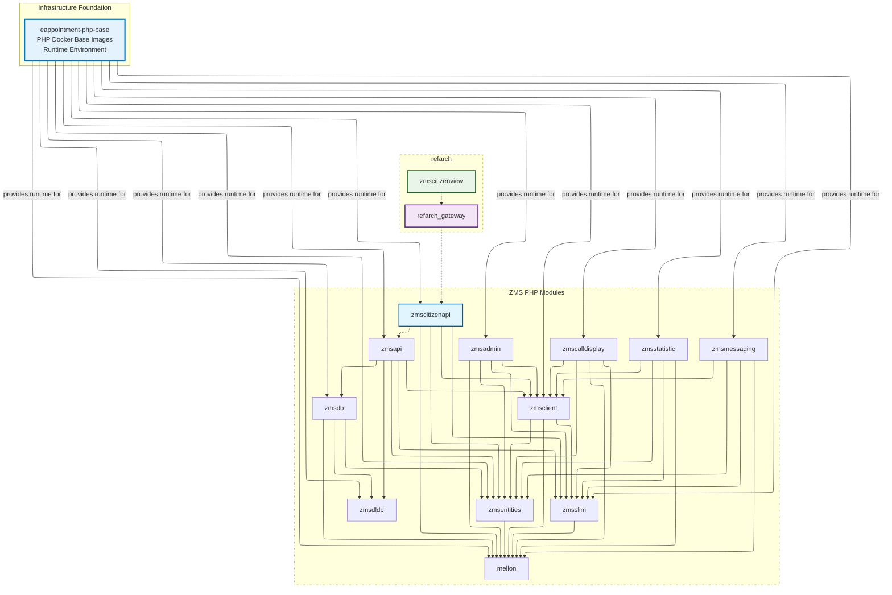

# E-Appointment PHP Base Images

Infrastructure Foundation: `eappointment-php-base` provides standardized pre-built PHP runtime environments for eappointment [build](https://github.com/it-at-m/eappointment/blob/main/.github/workflows/php-build-images.yaml#L43) via the [Containerfile](https://github.com/it-at-m/eappointment/blob/main/.resources/Containerfile).

- External Munich repository: [it-at-m/eappointment-php-base](https://github.com/it-at-m/eappointment-php-base)
- Original Berlin repository: [gitlab.com/eappointment/php-base](https://gitlab.com/eappointment/php-base)

## Image variants and usage

Based on `eappointment-php-base/.github/workflows/build-images.yaml`, the project publishes three groups of images:

- `8.4-base` and `8.4-dev` from `php84/Dockerfile`
- `8.3-base` and `8.3-dev` from `php83/Dockerfile`
- `8.3-local-amd64` and `8.3-local-arm64` from `php83-local/Dockerfile`

The role split is:

- Local images (`8.3-local-amd64`, `8.3-local-arm64`) are intended for local development and `zmsautomation`.
- Non-local images (`8.3-*`, `8.4-*`) are intended for production/runtime-aligned environments.

This dual-architecture local setup supports development on macOS Apple Silicon and other non-amd64 environments while still providing linux/amd64 compatibility.

## Local architecture support

The `php_v8_3_local` job builds single-architecture tags in a matrix:

- `linux/amd64` on `ubuntu-latest` -> `8.3-local-amd64`
- `linux/arm64` on `ubuntu-24.04-arm` -> `8.3-local-arm64`

This ensures local Linux images are available for both major architectures used in developer machines and CI execution contexts.

## Build and publish workflow behavior

The workflow runs on:

- pushes to all branches (`'*'`)
- pushes of all tags (`'*'`)
- monthly schedule (`0 0 1 * *`)

Each image job logs in to GHCR, builds image targets, validates PHP startup (`php-fpm -t` or `php -v`), and pushes resulting tags to:

- `ghcr.io/it-at-m/eappointment-php-base`

## Module dependency context

## Note

This repository may be moved into the eappointment monorepo in the near future.
