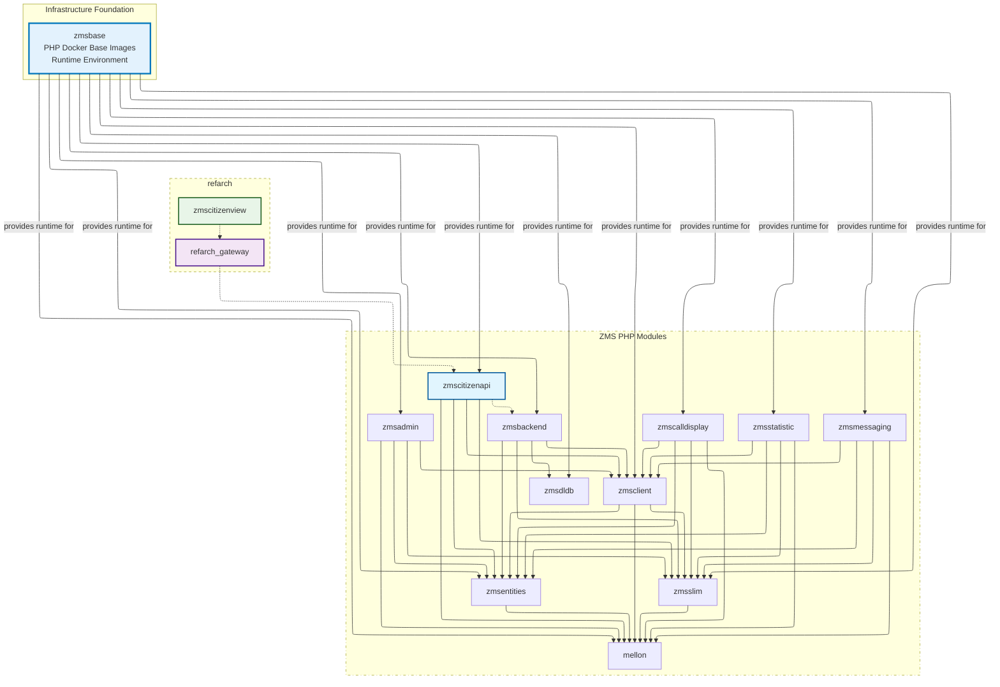

# E-Appointment PHP base images (`zmsbase`)

Infrastructure foundation: the [`zmsbase`](https://github.com/it-at-m/eappointment/tree/main/zmsbase) directory in this monorepo provides standardized, pre-built PHP runtime images for eappointment [module builds](https://github.com/it-at-m/eappointment/blob/main/.github/workflows/php-build-images.yaml) via the [Containerfile](https://github.com/it-at-m/eappointment/blob/main/.resources/Containerfile).

- Source: [`zmsbase/`](https://github.com/it-at-m/eappointment/tree/main/zmsbase) in [it-at-m/eappointment](https://github.com/it-at-m/eappointment)
- Historical standalone repo: [it-at-m/eappointment-php-base](https://github.com/it-at-m/eappointment-php-base) (superseded by `zmsbase`)
- Original Berlin repository: [gitlab.com/eappointment/php-base](https://gitlab.com/eappointment/php-base)

## Image variants and usage

Based on [`.github/workflows/zmsbase-build-images.yaml`](https://github.com/it-at-m/eappointment/blob/main/.github/workflows/zmsbase-build-images.yaml), the project publishes four groups of images:

- `8.4-base` and `8.4-dev` from `zmsbase/php84/Dockerfile`
- `8.3-base` and `8.3-dev` from `zmsbase/php83/Dockerfile`
- `8.3-local-amd64` and `8.3-local-arm64` from `zmsbase/php83-local/Dockerfile`
- `8.4-local-amd64` and `8.4-local-arm64` from `zmsbase/php84-local/Dockerfile`

The role split is:

- Local images (`8.3-local-*`, `8.4-local-*`) are intended for local development and `zmsautomation`. Devcontainer/DDEV default to `8.3-local-*` via `ZMS_PHP_BASE_TAG`.
- Non-local images (`8.3-*`, `8.4-*` without `-local`) are intended for production/runtime-aligned environments.

This dual-architecture local setup supports development on macOS Apple Silicon and other non-amd64 environments while still providing linux/amd64 compatibility.

## Local architecture support

The `php_v8_3_local` and `php_v8_4_local` jobs build single-architecture tags in a matrix:

- `linux/amd64` on `ubuntu-latest` -> `8.3-local-amd64` / `8.4-local-amd64`
- `linux/arm64` on `ubuntu-24.04-arm` -> `8.3-local-arm64` / `8.4-local-arm64`

Devcontainer and DDEV set `ZMS_PHP_BASE_TAG` via [`.devcontainer/scripts/sync-php-base-tag.sh`](https://github.com/it-at-m/eappointment/blob/main/.devcontainer/scripts/sync-php-base-tag.sh).

## Build and publish workflow behavior

Workflow: [🐳 Build ZMS base images](https://github.com/it-at-m/eappointment/blob/main/.github/workflows/zmsbase-build-images.yaml) (`zmsbase-build-images.yaml`).

It runs on:

- weekly schedule on `main` (Mondays `0 3 * * 1` UTC ≈ 05:00 Europe/Berlin in summer; GitHub runs scheduled workflows on the default branch only)
- manual `workflow_dispatch` on any branch (use after changing `zmsbase/` on a feature branch before CI needs new images)

Each image job logs in to GHCR, builds image targets, validates PHP startup (`php-fpm -t` or `php -v`), and pushes resulting tags to:

- `ghcr.io/it-at-m/eappointment/zmsbase`

## Module dependency context

