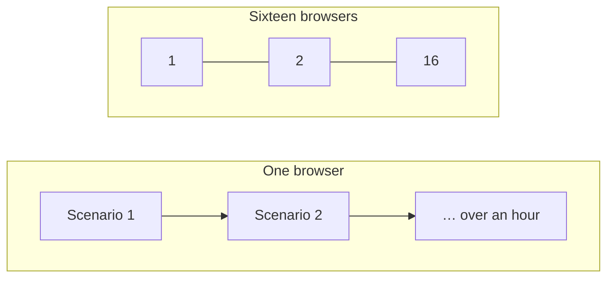
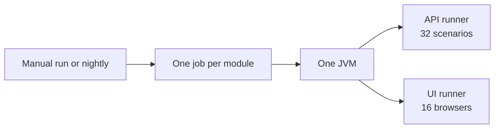
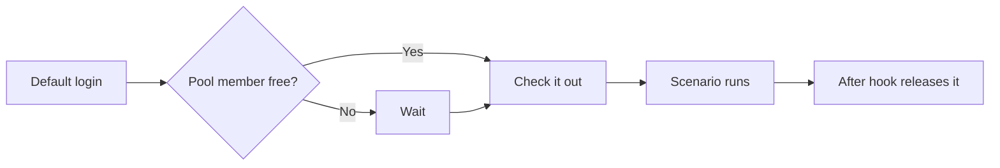
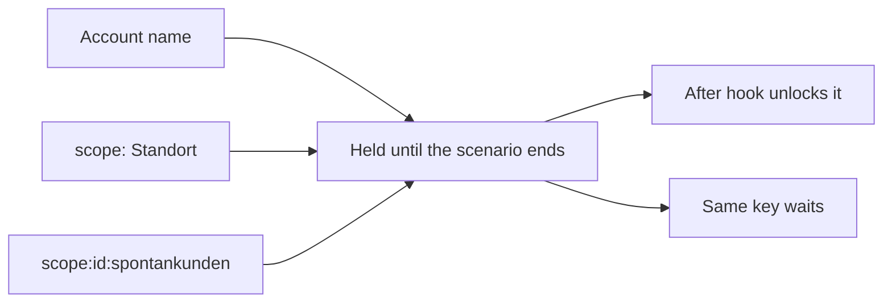
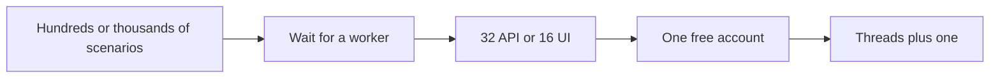
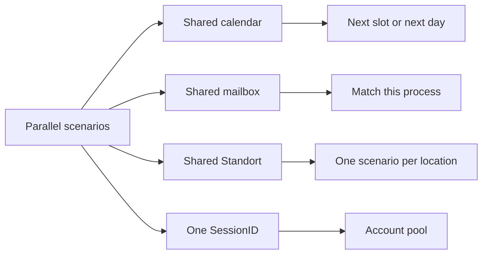

# How We Parallelized zmsautomation

25 September 2026

Scenarios inside one module job now run together. An API job runs 32 scenarios at a time. A UI job runs 16 browsers at a time. The commands and the log format are in [zmsautomation Documentation](./zmsautomation.md).

A full UI pass used to take over an hour, because one browser walked every scenario in order. Sixteen browsers bring that same pass down to a much shorter run. The parallel run is also closer to the counters: several people book, call the next customer, and sign in at the same time. A one-by-one suite never meets those collisions, so it stays green while the shared calendar, the shared queue, and the shared login are already wrong.



## ATAF already supported parallel

[ATAF](https://it-at-m.github.io/agile-test-automation-framework/) 0.3.4 ships `ParallelTestNGRunner`. `ApiTestRunner` and `UiTestRunner` extend that class. Cucumber scenarios are TestNG data rows, and Surefire's `dataproviderthreadcount` is how many of those rows start at once. The `ataf-api` profile sets 32. The `ataf-ui` profile sets 16. A `-Ddataproviderthreadcount` on the command line replaces the profile value. If the property is missing, TestNG's own default is 10.

Nothing in ATAF was forked for this. The work was to make the ZMS scenarios safe to share one JVM.

One local UI command is one JVM over every UI module, still capped at 16 browsers. In GitHub Actions each module shard is its own JVM with the same cap. The workflow's job parallelism is a separate knob: it decides how many module stacks run at once, and each of those stacks still uses the Cucumber thread count above. `-Pataf-api` and `-Pataf-ui` are two Maven runs, one after the other.



## One login could not be shared

A ZMS workstation user has one `SessionID`. Login runs `UPDATE nutzer SET SessionID = SHA2(?, 256) WHERE Name = ?`. The next request from the previous session is `401 UserAccountMissingLogin`. Superuser, admin, statistic, and the mail account `_system_messenger` all follow that rule. Two scenarios that sign in as `ataf` at the same time kick each other out.

Citizen login is a Bearer token, so a second token does not replace the first. Appointments are still loaded by the external user id. Two scenarios signed in as `citizen` therefore see and change the same bookings.

`AccountCheckout` takes a fair lock on the account at login and holds it until the scenario ends. The release runs in an `@After` hook. A second scenario that needs the same account waits at its login step.



The default names take a free member of a pool. The pool is the thread count plus one spare, so a scenario can finish its logout while the next one already needs an account:

| Pool        | Accounts                               | Sized for      |
| ----------- | -------------------------------------- | -------------- |
| Superuser   | `ataf` through `ataf_17`               | 16 UI browsers |
| Workstation | `agent_queue` through `agent_queue_33` | 32 API threads |
| Messenger   | `_system_messenger` through `_33`      | 32 API threads |
| Citizen     | `citizen` through `citizen_33`         | 32 API threads |

An explicit other name stays pinned to that name and waits for it. The spare users live in the existing Keycloak migration `.resources/keycloak/migration/11_add-parallel-test-users.yml` and in Flyway `V28__GH-3281_parallel_login_pool.sql`. Citizens are Keycloak users only. Mail login posts the raw id `_system_messenger`, which is a different `nutzer` row from `_system_messenger@keycloak`.

The pool today is copies of the same roles: superuser, workstation, messenger, and citizen. A later suite may need a pool of users in different roles, sized the same way, once two scenarios have to hold two different permissions at once.

Queue and customer-call scenarios type a counter. A spare superuser adds `100` times its pool index to that counter, so `ataf` keeps the counter written in the feature and `ataf_2` sits 100 higher. The waiting list itself is per Standort, so a different desk does not split the queue.

Every lock is one key held until the scenario ends. The `@After` hook unlocks it. A second scenario that asks for the same key waits. Login locks the account name. Entering a Standort, opening its Öffnungszeiten, or forwarding an appointment there locks `scope:` plus that location name. Creating or deleting Spontankunden opening hours locks `scope:` plus the scope id plus `:spontankunden`, which is a different key from the location name.

The lock is `AccountCheckout` in `zmsautomation/src/test/java/zms/ataf/helpers/AccountCheckout.java`. `AccountCheckoutHook` releases every key the scenario holds. The Standort key is taken in `AdminPage.selectLocation`, `AuthoritiesAndLocationsPage.clickOnOpeningHoursEntryBy`, and `ProcessingStationSection.selectLocationForAppointmentForwarding`. The Spontankunden key is taken in `ZmsApiSteps` when those opening hours are created or deleted.



## Hundreds or thousands of scenarios

The suite can grow to hundreds or thousands of scenarios on the same 32 API threads and 16 browsers. A scenario waits for a free worker, then takes one free account at login. The pool covers the threads that are actually running, plus one spare. It does not grow with the number of scenarios. Wall-clock time follows the scenario count divided by how many run at once. One browser made that time the sum of every scenario, which already passed an hour for the UI suite.

Raising how many run at once is a separate step: set `dataproviderthreadcount` and add the extra users in the same Keycloak and Flyway files.



## Other races

These showed up once more than one scenario was in progress. Each one passed when the suite ran one scenario at a time.



- **One calendar.** Booking tests asked for the first free slot, and a neighbour had just taken it. Citizen API, citizen view, and the admin intern reserve walk to the next free slot or process. The citizen calendar's **Später** button only moves inside the open day, so an empty evening grid uses the next calendar day. A timeslot that can no longer be highlighted is skipped so the same loop can continue.
- **One mailbox.** The newest preconfirmation mail belonged to another scenario. Fetch now matches the process id, or the contact email when the process id is not known yet. Each booking also gets its own mailinator address from the generated contact name. Dozens of live appointments on one address return `406 tooManyAppointmentsWithSameMail`.
- **One Standort queue.** "Aufruf nächster Kunde" takes the oldest person waiting at that location. The location lock stops two scenarios from standing in the queue together. The previous scenario can still leave people behind, so the parking test marks those leftovers as not appeared before it calls its own customer.
- **Ticketprinter scope 127.** One scenario turned Spontankunden hours on while another expected the button to be disabled. That scope is checked out for the scenario. The hours run from `00:05` to `23:55`: the API rejects a midnight start, a `01:00` start left the scope closed just after midnight, and an end of `23:00` was already in the past on a late run.
- **A short opening-hours window.** Less than three hours left in the day left the shared Ruppertstraße calendar with a single timestamp on one office. Migrations V19 and V24 roll that window to the next day, `00:05`–`03:05`.
- **The logged-in callout.** The Kontakt page already showed "Sie sind angemeldet." The text was split across the shadow tree, so the search returned false. The walker now includes slots, assigned nodes, and same-origin frames.
- **Opening-hours save.** The first `button-save` only hides the form. The confirm dialog opens after the footer button **Alle Änderungen aktivieren**.
- **State on the wrong thread.** The last API response, the booking, and the cached mail key have to stay on the scenario thread. TestNG reuses the worker, so that cache is cleared before the next scenario starts.

Log lines from those threads are interleaved. Each line starts with the worker in brackets, for example `[29]`. Lines with the same number belong to one scenario until that thread logs `Starting scenario`.

## The workflow option

The manual run of [`.github/workflows/zmsautomation-workflow.yaml`](https://github.com/it-at-m/eappointment/blob/next/.github/workflows/zmsautomation-workflow.yaml) has a checkbox **Don't run scenarios in parallel** (`serial_scenarios`). It is off by default. When it is on, every job adds `-Ddataproviderthreadcount=1` and the run name ends with `| serial scenarios`. The nightly schedule leaves the input empty, so the night run stays at 32 API threads and 16 UI browsers.

**Run the full suite in one sequential job** (`run_all_in_one_job`) is a different switch. It puts the checked modules into one job. It does not change how many scenarios that job runs at once.

## One scenario at a time

Locally, pass the property. It wins over the profile default:

```bash
./zmsautomation/zmsautomation-test -Pataf-ui -Ddataproviderthreadcount=1
./zmsautomation/zmsautomation-test -Pataf-api -Ddataproviderthreadcount=1
```

In GitHub Actions, check **Don't run scenarios in parallel** on the manual run. A run that has already started keeps the thread count it started with.

## What the runs show

Parallel runs and removing the faulty hook compressed the time. That hook is `CitizenViewSteps.captureBookingProcessBeforeCleanup`. It ran after every UI scenario and waited up to three minutes for a Bürgeransicht window, including in modules that never open that window. It now runs only for `@zmscitizenview`. The left table is the [nightly run on `next`](https://github.com/it-at-m/eappointment/actions/runs/36100716568), one scenario at a time. The right table is the [latest run of this branch](https://github.com/it-at-m/eappointment/actions/runs/36124810974). Durations are the Chrome job, rounded to the nearest minute. Firefox on that night finished within about two minutes of Chrome.

<div class="duration-compare">
<div>
<h3>Before</h3>
<table>
<thead><tr><th>Shard</th><th>Layer</th><th>Typical duration</th></tr></thead>
<tbody>
<tr><td>zmsadmin</td><td>UI</td><td>1 h 50 min</td></tr>
<tr><td>zmscitizenview</td><td>UI</td><td>31 min</td></tr>
<tr><td>zmsstatistic</td><td>UI</td><td>10 min</td></tr>
<tr><td>zmsticketprinter</td><td>UI</td><td>11 min</td></tr>
<tr><td>zmsapi</td><td>API</td><td>7 min</td></tr>
<tr><td>zmscitizenapi</td><td>API</td><td>18 min</td></tr>
</tbody>
</table>
</div>
<div>
<h3>After</h3>
<table>
<thead><tr><th>Shard</th><th>Layer</th><th>Typical duration</th></tr></thead>
<tbody>
<tr><td>zmsadmin</td><td>UI</td><td>16 min</td></tr>
<tr><td>zmscitizenview</td><td>UI</td><td>12 min</td></tr>
<tr><td>zmsstatistic</td><td>UI</td><td>8 min</td></tr>
<tr><td>zmsticketprinter</td><td>UI</td><td>4 min</td></tr>
<tr><td>zmsapi</td><td>API</td><td>7 min</td></tr>
<tr><td>zmscitizenapi</td><td>API</td><td>9 min</td></tr>
</tbody>
</table>
</div>
</div>
