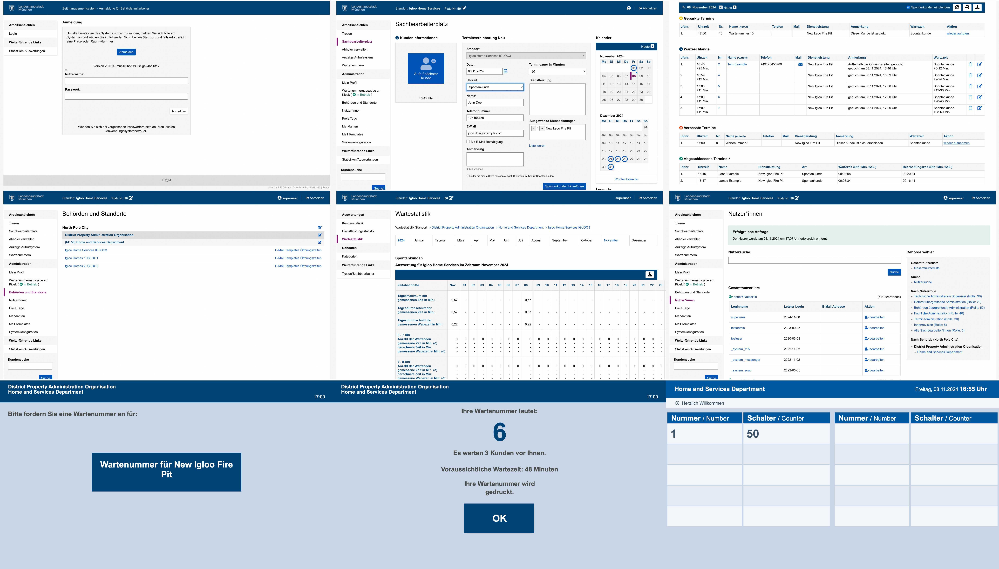
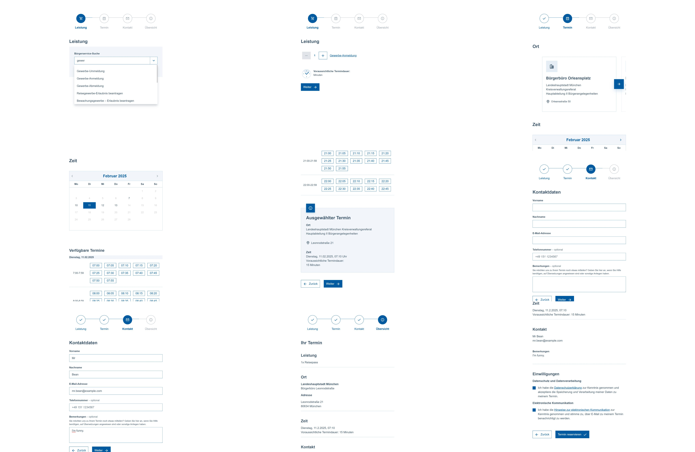

# eAppointment Documentation

This handbook is the main entry point on [GitHub Pages](https://it-at-m.github.io/eappointment/). It is versioned with the repository (`main`).

- **GitHub Repository** (manual): [https://github.com/it-at-m/eappointment/](https://github.com/it-at-m/eappointment/)

**Coverage and API HTML** from CI are published on the same host; see [Unit Testing in ZMS](./testing-unit.md), [Unit Test Coverage](./testing-coverage.md), and [API reference](./api-reference.md).

## Quick Links

- [Project History](./project-history.md)
- [Getting Started](./getting-started.md)
- [Local Database and Cache Operations](./local-database-and-cache-operations.md)
- [Dependency Upgrade Check](./dependency-upgrade-check.md)
- [PHP Base Images](./php-base-images.md)
- [Unit Testing in ZMS](./testing-unit.md)
- [Unit Test Coverage](./testing-coverage.md)
- [API reference](./api-reference.md) — ReDoc and diagrams
- [Operations](./operations.md)
- [Module READMEs](./module-readmes.md)
- [DLDB Interface Documentation](./dldb-interface-documentation.md)

## Repository Scope

This monorepo contains Munich-specific adaptations of the original Berlin eAppointment software:
[https://gitlab.com/eappointment/eappointment](https://gitlab.com/eappointment/eappointment)

Public E-Appointment is a software for online booking of appointments and processing of queues such as calling appointment numbers and collecting statistics on services provided.

The software has been used in public administration in the German capital Berlin for more than 20 years and has been redeveloped under a new license since 2016. This allows the software to be re-released under the EUPL, an open source license recognized by OSI.

It is planned to release the software as open source in the course of 2022/2024. This requires a number of adjustments, so that step by step the individual components of the software will be published here. On the one hand, the documentation of the software is published in this repository, on the other hand, new ideas and further developments are planned here, which apply across the board for the other repositories.

The ZMS system is intended to manage human waiting queues. It has the following features:

* make appointments via a calender and initiate a process to manage an appointment
* import requests (services) and providers (locations) from external sources
* manage scopes for appointments, including a four level hierarchy of owner->organisation->department->scope
* manage opening hours including closed days
* city worker login-system with different access levels
* ticketprinter support for customers without appointments (authenticated, lockable, timeable)
* calldisplay support
* collecting statistics like waiting time or served clients per day
* emergency call for employees
* citizen booking system with support for citizen login

## Contact
[Overview](https://opensource.muenchen.de/software/zeitmanagementsystem.html)

Munich Contact: it@M - opensource@muenchen.de

BerlinOnline Stadtportal GmbH & Co KG and it@M.

<table border="0" cellpadding="0" cellspacing="0">
  <tr>
    <td></td>
    <td style="padding-right: 30px;"></td>
    <td></td>
    <td></td>
  </tr>
</table>

## Screenshot

