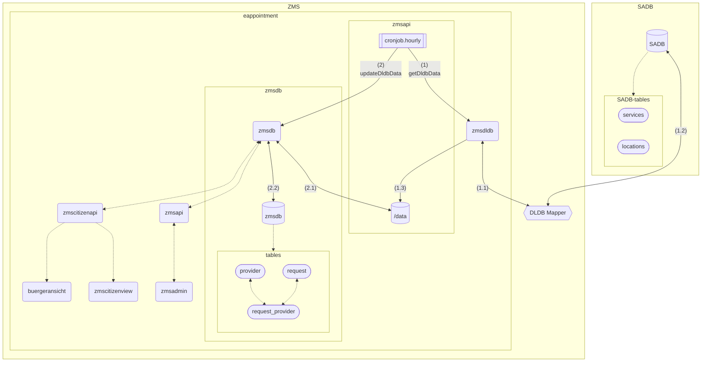

# zmsdldb

This page contains Munich-specific DLDB/SADB mapping documentation for `zmsdldb`.

## Local Mapping Parity

For local development and automated testing with `zmsautomation`, `zmsdldb/src/Zmsdldb/Transformers/Munich.php` provides the same Munich SADB mapping behavior as the internal DLDB mapper pipeline.

In particular, the transformer applies the same overwrite concept used by the internal mapper, so local imports and test fixtures stay aligned with production-like mapping results.

## Overwriting Data

JSON overwrite files can be used to adjust original SADB exports before final mapping.
For Munich parity in `zmsdldb`, the external overwrite file `zmsdldb/resources/munich_sadb_overwrite.json` is applied by the transformer merge step.
Entries are merged by `id` (including service-reference arrays), so targeted location/service fixes can be shipped without changing upstream SADB exports.

## Schema Validation

`zmsdldb` focuses on fetch/transform and overwrite application.
When troubleshooting malformed SADB payloads, validate source JSON before import and confirm overwrite structure in `zmsdldb/resources/munich_sadb_overwrite.json`.

## Two Local DLDB Sources

Local setup supports two source endpoints in `.devcontainer/.env.template`:

- `ZMS_SOURCE_DLDB_BERLIN=https://service.berlin.de`
- `ZMS_SOURCE_DLDB_MUNICH=https://stadt.muenchen.de/service/info/zms/index/`

This allows running imports against either Berlin-format or Munich-format exports during development.

## Munich SADB Example Payloads

This section replaces the old Berlin-centric format examples with Munich-oriented examples based on:

- raw export: `https://stadt.muenchen.de/service/doc/-/zms/20260428-145500-zms-export.json`
- local overwrite payload shape: `zmsdldb/resources/munich_sadb_overwrite.json`

### Service example (raw Munich export)

```json
{
  "name": "Gewerbe-Anmeldung",
  "fields": [
    { "name": "GEBUEHRENRAHMEN", "type": "TEXT", "value": "<p>50 bis 60 Euro ...</p>" },
    { "name": "TERMINVEREINBARUNG", "id": "sf30", "type": "BOOLEAN", "value": true },
    { "name": "ZMS_DAUER", "id": "sf31", "type": "INTEGER", "value": 20 },
    { "name": "ZMS_MAX_ANZAHL", "id": "sf32", "type": "INTEGER", "value": 3 }
  ],
  "id": "1063423",
  "leikaId": "99050012104000",
  "public": true
}
```

### Service example with forms links (raw Munich export)

```json
{
  "name": "Anmeldung fabrikneues Fahrzeug oder Tageszulassung",
  "fields": [
    {
      "name": "FORMULARE_INFORMATIONEN",
      "type": "LINK",
      "values": [
        { "label": "Vollmacht", "uri": "https://stadt.muenchen.de/.../Zulassungsvollmacht" },
        { "label": "Datenschutzgrundverordnung", "uri": "https://stadt.muenchen.de/infos/dsgvo-datenschutzgrundverordnung.html" }
      ],
      "multiValue": true
    }
  ],
  "id": "1063425",
  "public": true
}
```

### Location + relation visibility example (Munich overwrite structure)

```json
{
  "id": "10502",
  "altname1": "KVR-II/221",
  "altname2": "Bürgerbüro Ruppertstraße",
  "organisation": "Landeshauptstadt München",
  "orgUnit": "Kreisverwaltungsreferat",
  "public": true,
  "extendedServiceReferences": [
    {
      "refId": "1063453",
      "public": true,
      "fields": [{ "name": "ZMS_INTERN", "type": "BOOLEAN", "value": false }]
    }
  ]
}
```

These examples show the key SADB input variables consumed by the Munich transformer (`ZMS_DAUER`, `ZMS_MAX_ANZAHL`, `ZMS_INTERN`, `TERMINVEREINBARUNG`, `FORMULARE_INFORMATIONEN`) before normalization into `zmsapi/data` and `zmsdb`.

## Mapped Output in `zmsapi/data`

After import + transformation (internal mapper and/or Munich transformer path), the normalized output is written to:

- `zmsapi/data/locations_de.json`
- `zmsapi/data/services_de.json`

From there, the update/import step writes the normalized entities into `zmsdb`, primarily into these database tables:

- `provider`: offices/locations (for example Bürgerbüro or department locations, including location visibility and metadata)
- `request`: services/anliegen (for example service name and service-level additional data)
- `request_provider`: join table between services and locations (relation-level bookability data such as slots, visibility, and max quantity)

Operationally, providers are also linked to a scope (`standort`) by superusers/admins when creating new scopes from DLDB (Dienstleistungsdatenbank) data in zmsadmin.

Representative examples:

- In `locations_de.json`, location entries contain normalized address/contact/meta and embedded service references, e.g. location `10546` with service link entries like `1063423` and appointment fields (`link`, `slots`, `allowed`, `external`).
- In `services_de.json`, service entries contain normalized metadata and booking properties, e.g. service `1063423` (`name`, `meta`, `appointment.link`, `maxQuantity`, `duration`, `fees`), plus optional combinability arrays on other services.

Together, these two generated files are the local canonical snapshots consumed by API/UI/tests and used as the source for database synchronization.

## Constants in `Munich.php`

`zmsdldb/src/Zmsdldb/Transformers/Munich.php` contains several rule constants that shape how Munich SADB data is normalized:

- `EXCLUSIVE_LOCATIONS`: list of location IDs where `showAlternativeLocations` is forced to `false` (office should be treated as exclusive in UI flows).
- `LOCATION_PRIO_BY_DISPLAY_NAME`: map of office display names to numeric priority (`prio`) used to rank/sort specific offices (for example Bürgerbüros and Feuerwachen).
- `DONT_SHOW_LOCATION_BY_SERVICES`: per-location service blacklist rules written to `dontShowByServices` so certain services are hidden at selected offices.
- `LOCATIONS_ALLOW_DISABLED_MIX`: groups of equivalent office IDs that get `allowDisabledServicesMix`, enabling "exclusive vs mixed" disabled-service behavior across linked offices (for JumpIn auto-selection parity).
- `DONT_SHOW_SERVICE_ON_START_PAGE`: list of service IDs that set `showOnStartPage=false` during service mapping.
- `SERVICE_COMBINATIONS`: booking-combination matrix; each row starts with a base service ID and defines which services can be booked together. Used by `getServiceCombinations()` to populate `combinable`.

These constants are part of the Munich parity layer and mirror the business-rule intent from the internal mapper setup.

## How `zmscitizenapi` Consumes the Mapping

`zmscitizenapi/src/Zmscitizenapi/Services/Core/MapperService.php` is the API-facing mapper that consumes the normalized provider/request data produced by DLDB imports (including Munich transformer output).

### Office mapping (`mapOfficesWithScope`)

The office mapper reads provider data and forwards Munich-specific normalized fields into API offices:

- `provider->data['showAlternativeLocations']` -> `Office.showAlternativeLocations`
- `provider->data['dontShowByServices']` -> `Office.disabledByServices`
- `provider->data['allowDisabledServicesMix']` -> `Office.allowDisabledServicesMix` (normalized to int array)
- `provider->data['prio']` -> `Office.priority`
- `provider->data['slotTimeInMinutes']` -> `Office.slotTimeInMinutes`

### Service mapping (`mapServicesWithCombinations`)

The service mapper reads request additional data and relation/provider intersections:

- `request.additionalData['showOnStartPage']` -> `Service.showOnStartPage`
- `request.additionalData['combinable']` is used to build `Service.combinable` (intersected with providers that actually offer both services)
- `request.additionalData['maxQuantity']` -> `Service.maxQuantity`

### Constant-to-API field flow

The constants in `zmsdldb/src/Zmsdldb/Transformers/Munich.php` are not only internal rules; they directly shape fields consumed by `MapperService.php`:

- `EXCLUSIVE_LOCATIONS` -> `showAlternativeLocations` -> `Office.showAlternativeLocations`
- `LOCATION_PRIO_BY_DISPLAY_NAME` -> `prio` -> `Office.priority`
- `DONT_SHOW_LOCATION_BY_SERVICES` -> `dontShowByServices` -> `Office.disabledByServices`
- `LOCATIONS_ALLOW_DISABLED_MIX` -> `allowDisabledServicesMix` -> `Office.allowDisabledServicesMix`
- `DONT_SHOW_SERVICE_ON_START_PAGE` -> `showOnStartPage` -> `Service.showOnStartPage`
- `SERVICE_COMBINATIONS` -> `combinable` -> `Service.combinable`

This is the end-to-end mapping contract used by local development, UI behavior, and automated tests.

## ZMS-Specific SADB Export Variables

Munich SADB exports carry service/reference `fields` entries that include ZMS-relevant variables.
In `zmsdldb/src/Zmsdldb/Transformers/Munich.php`, these are read by `field['name']` and mapped into normalized output consumed downstream.

### `ZMS_MAX_ANZAHL`

- **Source in SADB export:** `service.fields[].name = "ZMS_MAX_ANZAHL"` and `extendedServiceReferences[].fields[].name = "ZMS_MAX_ANZAHL"`
- **Transformer mapping (`Munich.php`):**
  - service-level -> `mappedService.maxQuantity`
  - location service-ref level -> `serviceRef.maxQuantity`
- **Flow to `zmscitizenapi`:**
  - carried as request additional data -> `MapperService::mapServicesWithCombinations()` -> `Service.maxQuantity`
  - relation-level max quantity is also mapped via `MapperService::mapRelations()` -> `OfficeServiceRelation.maxQuantity`

### `ZMS_DAUER`

- **Source in SADB export:** `service.fields[].name = "ZMS_DAUER"` and `extendedServiceReferences[].fields[].name = "ZMS_DAUER"`
- **Transformer mapping (`Munich.php`):**
  - service-level -> `mappedService.duration`
  - location service-ref level -> `serviceRef.duration`
  - location-level slot derivation -> `appointment.slots` and `slotTimeInMinutes` (via common divisor calculation)
- **Flow to `zmscitizenapi`:**
  - slot timing effects propagate through provider/request relations (used for booking behavior)
  - `slotTimeInMinutes` is read in `MapperService::mapOfficesWithScope()` -> `Office.slotTimeInMinutes`

### `ZMS_INTERN`

- **Source in SADB export:** `service.fields[].name = "ZMS_INTERN"` and `extendedServiceReferences[].fields[].name = "ZMS_INTERN"`
- **Transformer mapping (`Munich.php`):**
  - inverted to public flag (`public = !ZMS_INTERN`) on service and service-ref entries
- **Flow to `zmscitizenapi`:**
  - unpublished/private filtering is applied in `MapperService` (`showUnpublished` gates, relation visibility checks, and service/provider public checks)
  - result: internal services/offices are excluded from public API payloads unless explicitly requested

### `GEBUEHRENRAHMEN`

- **Source in SADB export:** `service.fields[].name = "GEBUEHRENRAHMEN"`
- **Transformer mapping (`Munich.php`):**
  - service-level -> `mappedService.fees`
- **Flow to `zmscitizenapi`:**
  - preserved in normalized service data, but not currently exposed by the thinned `Service` mapping in `MapperService::mapServicesWithCombinations()`

### `FORMULARE_INFORMATIONEN`

- **Source in SADB export:** `service.fields[].name = "FORMULARE_INFORMATIONEN"`
- **Transformer mapping (`Munich.php`):**
  - entries mapped into `mappedService.forms[]` and `mappedService.links[]`
- **Flow to `zmscitizenapi`:**
  - preserved in normalized service payloads, but not currently surfaced by the thinned `Service` DTO mapping in `MapperService`

### `TERMINVEREINBARUNG` (example id `sf30`, type `BOOLEAN`)

- **Source in SADB export:** `fields[].name = "TERMINVEREINBARUNG"` with boolean value (for example `true`).
- **Current transformer handling (`Munich.php`):**
  - this field is currently **not explicitly read**.
  - appointment flags in service/location references are set by default logic (`allowed=true`, `external=false`) instead of being derived from `TERMINVEREINBARUNG`.
- **Flow to `zmscitizenapi`:**
  - no dedicated direct mapping for `TERMINVEREINBARUNG` at the moment.
  - downstream behavior is driven by normalized appointment/public/relation data produced by the transformer and relation visibility filtering in `MapperService`.

If explicit handling of `TERMINVEREINBARUNG` is required, it should be added in `Munich.php` where service fields are parsed and mapped to appointment visibility fields.

In short: these SADB variables are interpreted in the Munich transformer first, then selectively exposed in `zmscitizenapi` depending on what `MapperService` includes in `Office`, `Service`, and relation DTOs.

## Public vs Internal (Actual Rule Path)

This is the effective decision path for visibility in the Munich flow.

### 1) Service-level visibility

Raw SADB export has both:

- top-level service flag: `service.public`
- ZMS field: `fields[].name = "ZMS_INTERN"` (boolean)

In `Munich.php`, service visibility is derived from `ZMS_INTERN` when present:

- `ZMS_INTERN = true` -> `mappedService.public = false`
- `ZMS_INTERN = false` -> `mappedService.public = true`
- if `ZMS_INTERN` is missing, default remains public

So, for services, `ZMS_INTERN` is the authoritative internal/public switch in transformer logic.

### 2) Location-level visibility

In `Munich.php`, location visibility is taken from export location public flag:

- `mappedLocation.public = location.public ?? true`

This controls provider-level publication downstream.

### 3) Service-at-location (relation) visibility

For each `extendedServiceReferences` entry:

- initial relation/public value comes from reference `public` if set
- if reference fields include `ZMS_INTERN`, it overrides by setting:
  - `serviceRef.public = !ZMS_INTERN`

So relation-level internal flags can hide a service-office combination even when service or location is otherwise public.

### 4) What `zmscitizenapi` actually filters

`MapperService.php` applies publication filters unless `showUnpublished=true`:

- offices: drops providers where `provider->data['public'] === false`
- relations: drops relation rows where `relation->isPublic() === false`
- services: drops services where `additionalData['public'] === false`

Net effect: public API payloads only include items that survive provider, service, and relation publication checks.

### 5) Observation from provided raw export (`20260428-145500-zms-export`)

- multiple services contain `ZMS_INTERN=true` while top-level `public` is still `true`
- therefore, relying only on raw `public` is not sufficient for service visibility
- in current transformer logic, `ZMS_INTERN` is what marks those services/internal relations as non-public

### 6) Local/domain override for unpublished data

In `.devcontainer/.env.template`, `ACCESS_UNPUBLISHED_ON_DOMAIN` controls a domain-based override in `zmscitizenapi`:

- when `HTTP_HOST` or `X-Forwarded-Host` contains the configured substring, unpublished services/relations can still be returned
- default template value is `ACCESS_UNPUBLISHED_ON_DOMAIN=localhost`
- this is useful for local/debug access to entries that became non-public after import (for example `ZMS_INTERN=true`)

Operational notes from template:

- use one substring only (no comma-separated list support)
- be careful with public gateway domains, otherwise unpublished/internal data may be exposed unintentionally

## Basic System Overview



## SADB Index Proxy (`/sadb-index/`)

Browsers may block cross-origin reads of SADB index hosts.
The mapper exposes `/sadb-index/`, which server-fetches `SADB_INDEX_URL` and returns the same plain text the index page uses.

