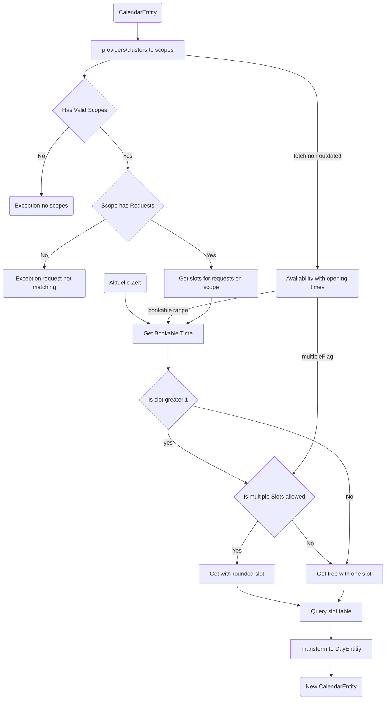

# New appointments

## Find free appointments

```mermaid

graph TD

    calender("CalendarEntity") --> resolveScope["providers/clusters to scopes"]
    
    resolveScope --> hasScope{Has Valid Scopes}

    hasScope -- No --> exceptionScope("Exception no scopes")

    hasScope -- Yes --> hasRequest{Scope has Requests}

    hasRequest -- No --> exceptionRequest("Exception request not matching")

    hasRequest -- Yes --> getSlots["Get slots for requests on scope"]

    now("Aktuelle Zeit") --> getBookable["Get Bookable Time"]

    resolveScope -- fetch non outdated --> availability("Availability with opening times")

    availability -- bookable range --> getBookable

    getSlots --> getBookable

    getBookable --> isGreater{"Is slot greater 1"}
    
    isGreater -- yes --> isMultiple{"Is multiple Slots allowed"}

    availability -- multipleFlag --> isMultiple 

    isMultiple -- No --> singleSlot["Get free with one slot"]

    isGreater -- No --> singleSlot

    isMultiple -- Yes --> multiSlot["Get with rounded slot"]

    multiSlot --> query["Query slot table"]

    singleSlot --> query

    query --> toDay["Transform to DayEntitiy"]

    toDay --> newCalendar("New CalendarEntity")

```