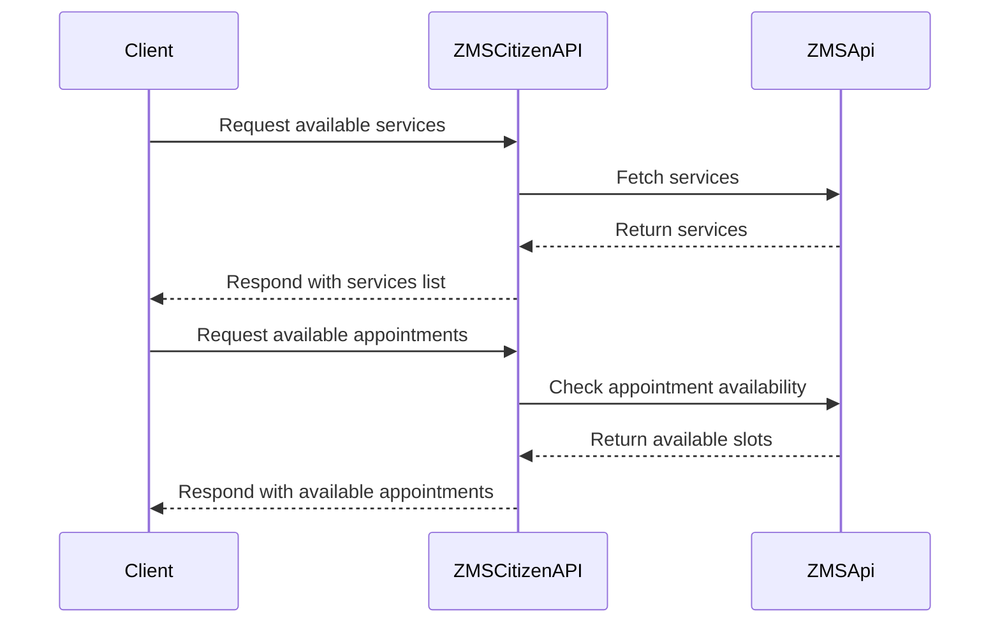
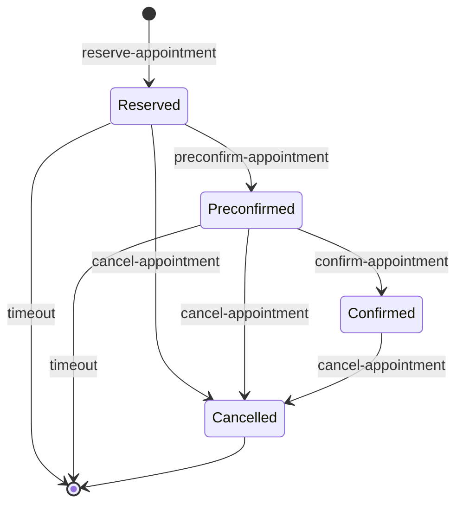
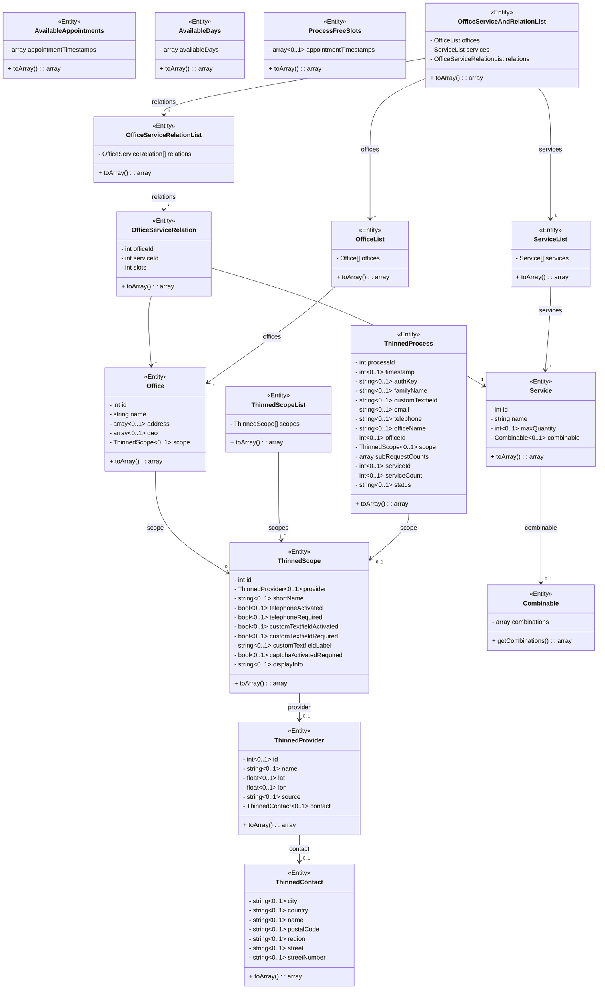
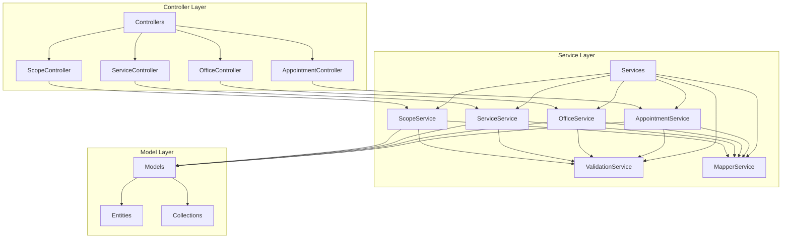
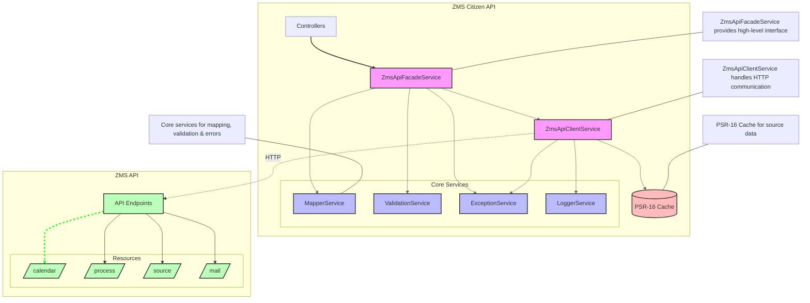
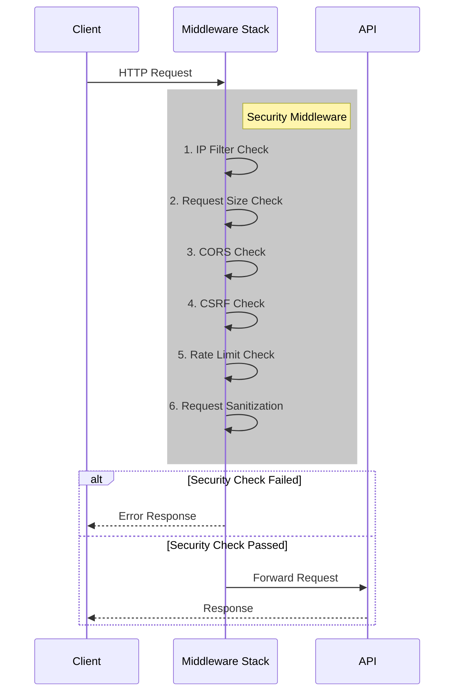
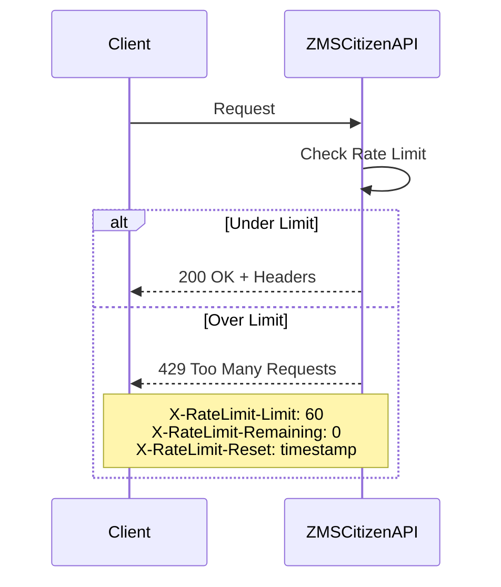
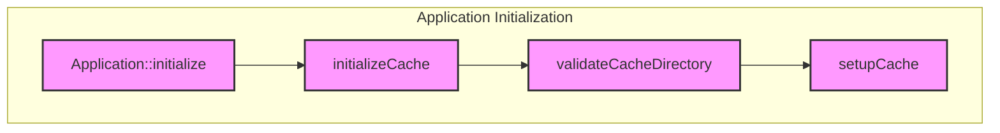
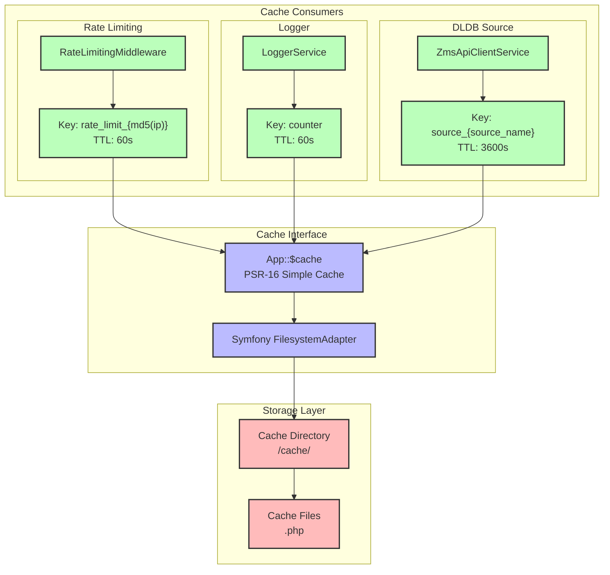

# ZMSCITIZENAPI

A REST-like interface that provides appointment booking and management capabilities for citizens. Part of the eAppointment system.

## Walkthrough
This pull request introduces a comprehensive new module called `zmscitizenapi` to the project, which provides a streamlined REST-like interface for citizen interactions with a queuing management system. The changes span multiple configuration files, middleware, controllers, services, models, and test cases, establishing a robust and secure API for appointment-related functionalities.

The ZMS Citizen API offers endpoints for:

* Discovering available services and offices
* Checking appointment availability
* Booking, confirming, and canceling appointments
* Managing appointment details

## Changes

| File | Change Summary |
|------|----------------|
| `.ddev/.env.template` | Added `CORS` environment variable with multiple localhost and domain origins |
| `.ddev/config.yaml` | Updated host HTTPS and web server ports from `59002`/`59001` to `8091`/`8090` |
| `.github/workflows/build-images.yaml` | Added `zmscitizenapi` module with PHP 8.0 |
| `.github/workflows/unit-tests.yaml` | Added `zmscitizenapi` module to matrix configuration |
| `.htaccess` | Added routing rules for `zmscitizenapi` module |
| `cli` | Added `zmscitizenapi` to modules list |

## Environment Variables

| Variable | Description | Default |
|----------|-------------|---------|
| ZMS_API_URL | Backend API URL | https://localhost/terminvereinbarung/api/2 |
| MAINTENANCE_MODE_ENABLED | Enable maintenance mode | false |
| CORS | Allowed CORS origins | http://localhost:8080,... |
| CAPTCHA_ENABLED | Global enable captcha | true, false |
| FRIENDLY_CAPTCHA_SECRET_KEY | Friendly Captcha | **** |
| FRIENDLY_CAPTCHA_SITE_KEY | Friendly Captcha | **** |
| FRIENDLY_CAPTCHA_ENDPOINT | Friendly Captcha | https://eu-api.friendlycaptcha.eu/api/v1/siteverify |
| FRIENDLY_CAPTCHA_ENDPOINT_PUZZLE | https://eu-api.friendlycaptcha.eu/api/v1/puzzle | **** |
| CACHE_LIFETIME | Cache lifetime limit | 3600 |
| CACHE_DIR | Store cache | /cache |

## Appointment State Machine:

## Core Logic

### Domain Models

### Controller-Service-Model Architecture**

Key aspects of the architecture:

1. **Layered Design**:
   - Controllers interact only with ZmsApiFacadeService
   - ZmsApiFacadeService orchestrates operations using core services
   - ZmsApiClientService handles raw API communication

2. **Core Services**:
   - MapperService: Transforms between API and domain models
   - ValidationService: Validates requests and responses
   - ExceptionService: Centralizes error handling
   - LoggerService: Manages logging

3. **Caching Strategy**:
   - Source data cached for 1 hour
   - Cache implemented using PSR-16 interface
   - Cache key pattern: `source_{source_name}`

4. **API Communication**:
   - Configurable API URL via environment variable
   - HTTP client abstraction through App::$http
   - Support for GET, POST, DELETE methods

5. **Error Handling**:
   - Consistent error mapping across layers
   - Domain-specific exceptions
   - Standardized error responses

## Security

### Middleware Security Models

```mermaid
classDiagram
    class RequestHandlerInterface {
        <<interface>>
        +handle(request: ServerRequestInterface): ResponseInterface
    }

    class MiddlewareInterface {
        <<interface>>
        +process(request: ServerRequestInterface, handler: RequestHandlerInterface): ResponseInterface
    }
    
    class LoggerService {
        +logError(exception: Throwable, request: ServerRequestInterface)
        +logInfo(message: string, context: array)
    }

    class MaintenanceMiddleware {
        -HTTP_UNAVAILABLE: int = 503
        -ERROR_UNAVAILABLE: string = 'serviceUnavailable'
        +__invoke(request: ServerRequestInterface, next: RequestHandlerInterface): ResponseInterface|array
    }

    class RequestLoggingMiddleware {
        -logger: LoggerService
        +process()
    }

    class SecurityHeadersMiddleware {
        -securityHeaders: array
        -logger: LoggerService
        +process()
    }

    class CorsMiddleware {
        -whitelist: array
        -logger: LoggerService
        +process()
        -isOriginAllowed(origin: string): bool
    }

    class CsrfMiddleware {
        -TOKEN_LENGTH: int
        -logger: LoggerService
        +process()
        +getToken(): string
        -validateToken(token: string): bool
    }

    class RateLimitingMiddleware {
        -MAX_REQUESTS: int
        -TIME_WINDOW: int
        -cache: CacheInterface
        -logger: LoggerService
        +process()
        -checkAndIncrementLimit(key: string): bool
    }

    class RequestSanitizerMiddleware {
        -MAX_RECURSION_DEPTH: int
        -logger: LoggerService
        +process()
        -sanitizeRequest(request: ServerRequestInterface): ServerRequestInterface
    }

    class RequestSizeLimitMiddleware {
        -MAX_SIZE: int
        -logger: LoggerService
        +process()
    }

    class IpFilterMiddleware {
        -logger: LoggerService
        +process()
        -isIpInRange(ip: string, range: string): bool
    }

    class ErrorMessages {
        <<static>>
        +get(key: string): array
    }

    RequestHandlerInterface <|.. MaintenanceMiddleware
    MiddlewareInterface <|.. RequestLoggingMiddleware
    MiddlewareInterface <|.. SecurityHeadersMiddleware
    MiddlewareInterface <|.. CorsMiddleware
    MiddlewareInterface <|.. CsrfMiddleware
    MiddlewareInterface <|.. RateLimitingMiddleware
    MiddlewareInterface <|.. RequestSanitizerMiddleware
    MiddlewareInterface <|.. RequestSizeLimitMiddleware
    MiddlewareInterface <|.. IpFilterMiddleware

    RequestLoggingMiddleware --> LoggerService
    SecurityHeadersMiddleware --> LoggerService
    CorsMiddleware --> LoggerService
    CsrfMiddleware --> LoggerService
    RateLimitingMiddleware --> LoggerService
    RequestSanitizerMiddleware --> LoggerService
    RequestSizeLimitMiddleware --> LoggerService
    IpFilterMiddleware --> LoggerService

    RateLimitingMiddleware --> "1" CacheInterface

    MaintenanceMiddleware ..> ErrorMessages
    RequestLoggingMiddleware ..> ErrorMessages
    SecurityHeadersMiddleware ..> ErrorMessages
    CorsMiddleware ..> ErrorMessages
    CsrfMiddleware ..> ErrorMessages
    RateLimitingMiddleware ..> ErrorMessages
    RequestSizeLimitMiddleware ..> ErrorMessages
    IpFilterMiddleware ..> ErrorMessages

    note for RequestHandlerInterface "PSR-15 Handler Interface"
    note for MiddlewareInterface "PSR-15 Middleware Interface"
    note for LoggerService "Centralized Logging"
    note for ErrorMessages "Error Message Registry"
    note for MaintenanceMiddleware "Uses __invoke pattern\nReturns array for maintenance mode\nor delegates to next handler"
```

### Security and Rate Limiting Flow**

### Rate Limiting

Headers returned:
- `X-RateLimit-Limit`: Requests allowed per minute
- `X-RateLimit-Remaining`: Requests remaining in window
- `X-RateLimit-Reset`: Timestamp when limit resets

## Caching
The PSR-16 Simple Cache is the core caching interface in zmscitizenapi. What I labeled as "File System Cache" is actually just the storage backend for PSR-16, implemented using Symfony's FilesystemAdapter.

Here's how it works:

1. **PSR-16 Setup**:
   - Application initializes one PSR-16 cache instance using Symfony's FilesystemAdapter
   - Cache directory and lifetime (default 3600s) configurable via env vars
   - All services use this single cache instance through `App::$cache`

2. **How the three caches use PSR-16**:
   - **Rate Limiting Cache**:
     - Key pattern: `rate_limit_{md5(ip)}`
     - TTL: 60 seconds
     - Stores request counts per IP
     - The rate limit cache tracks request counts per IP address using a distributed locking mechanism to prevent race conditions. Each IP is allowed 60 requests per minute, with the counter auto-resetting after the TTL expires.
   
   - **Logger Cache**:
     - Key pattern: Uses counter key
     - TTL: 60 seconds
     - Tracks log rate limiting
     - The rate limit cache tracks request counts per IP address using a distributed locking mechanism to prevent race conditions. Each IP is allowed 60 requests per minute, with the counter auto-resetting after the TTL expires.
   
   - **DLDB Source Cache**:
     - Key pattern: `source_{source_name}`
     - TTL: 3600 seconds (1 hour)
     - Caches API responses
     - The DLDB source cache stores API responses for source data with a 1-hour TTL. 

Each "cache" is really just a different usage pattern of the same PSR-16 interface, with its own key namespace and TTL, but all data is stored in the same filesystem backend.

